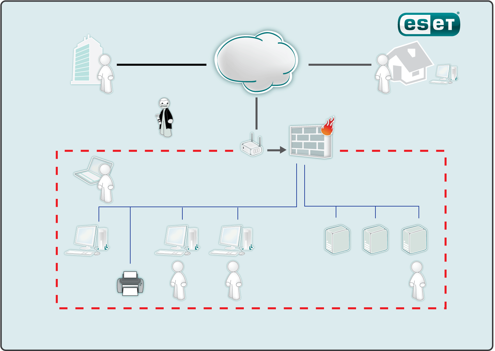
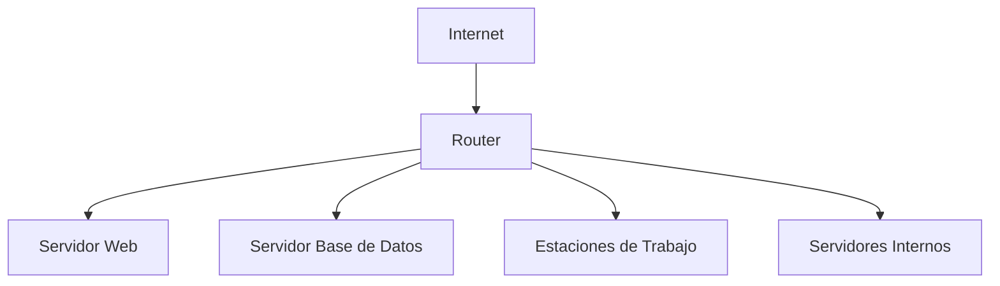
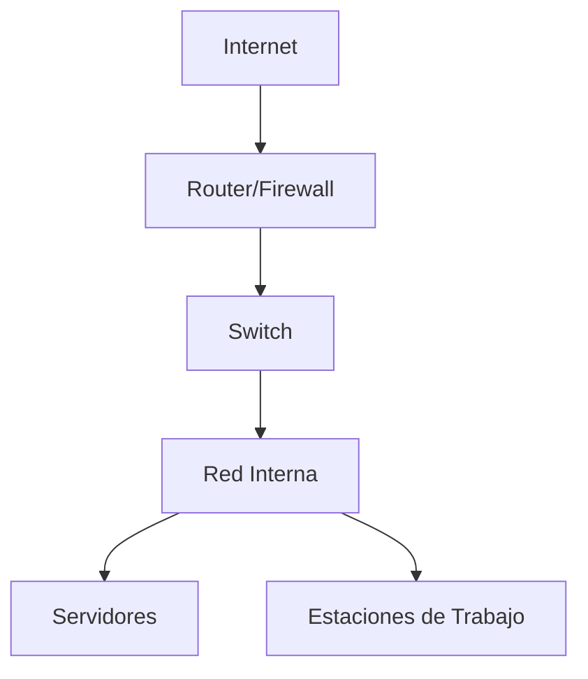
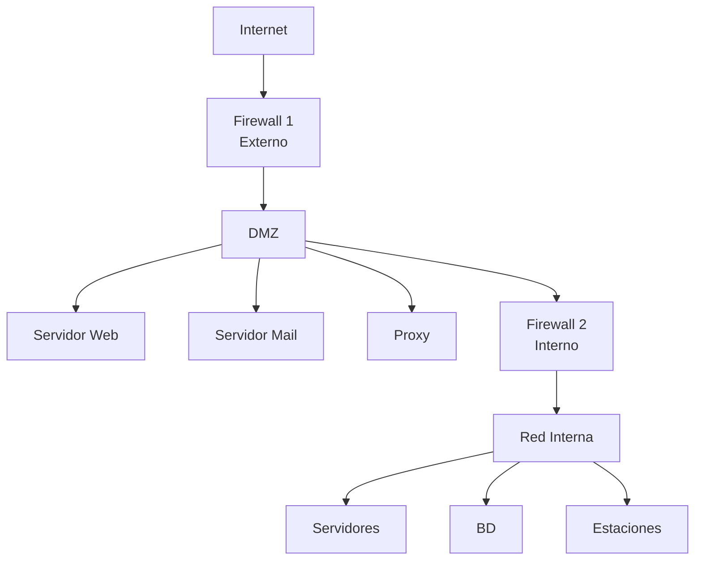
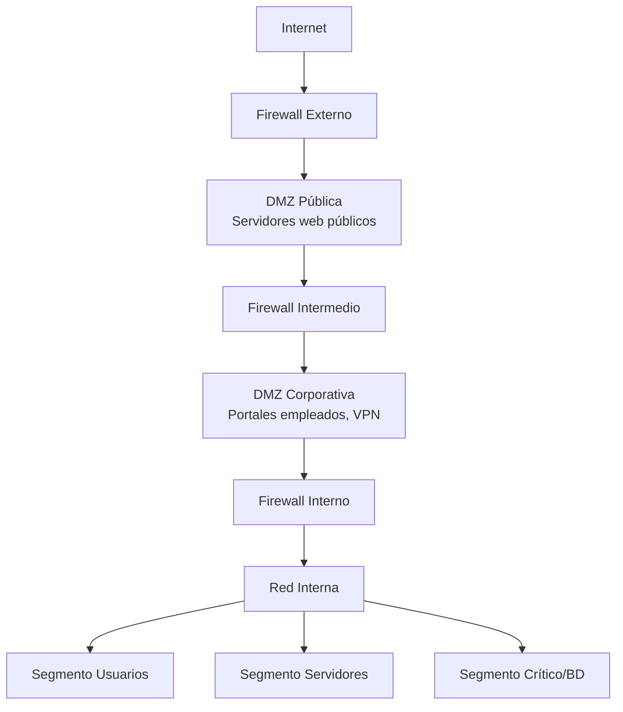
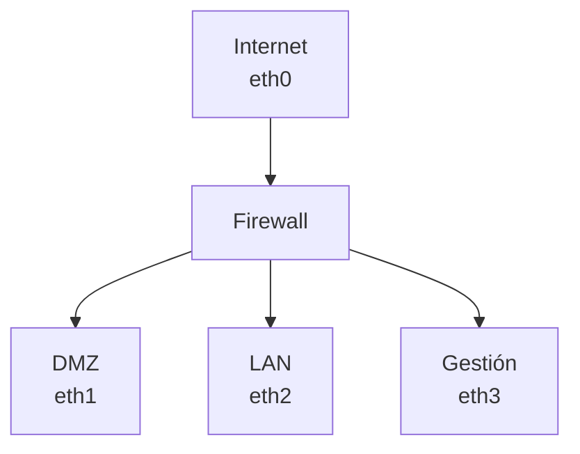
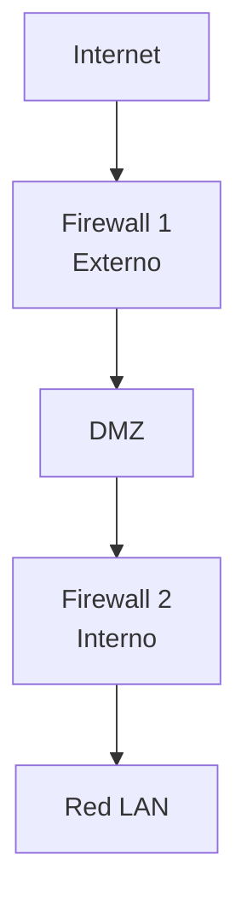
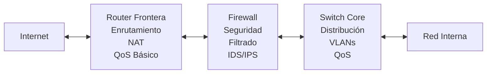
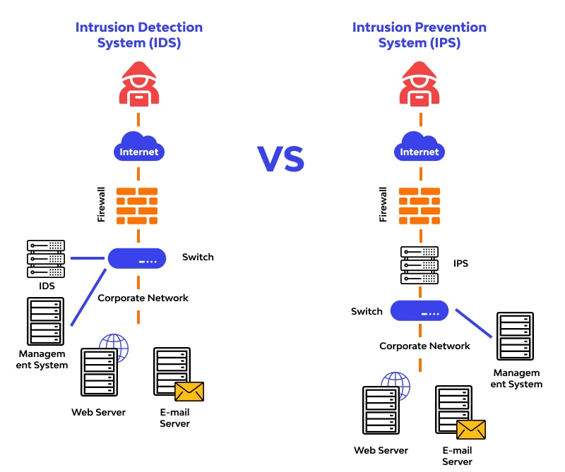

# Elementos Básicos de la Seguridad Perimetral

La seguridad perimetral es el conjunto de medidas, tecnologías y prácticas diseñadas para proteger los límites de una red empresarial frente a amenazas externas. Actúa como la primera línea de defensa entre la red interna de una organización y redes no confiables como Internet.

En un mundo cada vez más conectado, donde las organizaciones dependen de servicios en la nube, trabajo remoto y comunicaciones globales, establecer y mantener un perímetro de seguridad robusto es fundamental para proteger los activos digitales, la información sensible y garantizar la continuidad del negocio.

## Concepto de Perímetro de Red

El **perímetro de red** se define como el límite lógico y físico que separa la red interna de una organización (red privada o de confianza) de las redes externas no confiables, principalmente Internet. Este concepto es análogo a las murallas que protegían las ciudades medievales, donde todo lo que estaba dentro era considerado seguro y lo que estaba fuera representaba una amenaza potencial.



### Componentes del Perímetro

Un perímetro de red típico está compuesto por varios elementos que trabajan conjuntamente:

1. **Red Interna (LAN - Local Area Network)**:
   - Contiene los recursos corporativos: servidores, estaciones de trabajo, bases de datos
   - Se considera zona de confianza
   - Usuarios autenticados con acceso regulado por políticas internas
   - Direccionamiento IP privado (RFC 1918: 10.0.0.0/8, 172.16.0.0/12, 192.168.0.0/16)

2. **Red Externa (Internet)**:
   - Red pública no confiable
   - Origen de la mayoría de amenazas: malware, ataques DoS, intrusiones
   - Acceso público sin autenticación
   - Direccionamiento IP público

3. **Dispositivos de Frontera**:
   - Routers, firewalls, proxies, gateways
   - Implementan políticas de seguridad
   - Filtran y controlan el tráfico bidireccional
   - Realizan traducción de direcciones (NAT)

### Evolución del Concepto de Perímetro

Tradicionalmente, el perímetro de red era claramente definido: todo estaba dentro o fuera de la organización. Sin embargo, este modelo ha evolucionado debido a:

- **Movilidad**: Empleados trabajando desde ubicaciones remotas
- **Cloud Computing**: Servicios y datos alojados fuera de las instalaciones físicas
- **BYOD (Bring Your Own Device)**: Dispositivos personales accediendo a recursos corporativos
- **IoT (Internet of Things)**: Proliferación de dispositivos conectados

Esto ha dado lugar al concepto de **perímetro difuso** o **perímetro dinámico**, donde el enfoque "confianza cero" (Zero Trust) complementa las estrategias perimetrales tradicionales. Bajo este modelo, no se confía automáticamente en ningún usuario o dispositivo, incluso si está dentro del perímetro tradicional.

:::info Zero Trust - Confianza Cero
El modelo Zero Trust opera bajo el principio de "nunca confíes, siempre verifica". A diferencia del enfoque perimetral tradicional, Zero Trust asume que las amenazas pueden estar tanto dentro como fuera de la red, por lo que cada acceso debe ser autenticado, autorizado y cifrado, independientemente de su origen.

Principios clave:
- **Verificación explícita**: Autenticar y autorizar basándose en todos los puntos de datos disponibles
- **Acceso de mínimo privilegio**: Limitar el acceso con políticas adaptativas Just-In-Time y Just-Enough-Access (JIT/JEA)
- **Asumir brechas**: Minimizar el radio de explosión y segmentar el acceso, verificar cifrado end-to-end
:::

## Escenarios con Conexión a Redes Públicas

Las organizaciones modernas necesitan conectarse a Internet para proporcionar servicios, permitir el acceso remoto y facilitar las comunicaciones. Esta conexión introduce riesgos significativos que deben ser gestionados mediante arquitecturas de seguridad adecuadas.

### Escenario 1: Red Básica sin Segmentación

En el escenario más básico (y menos seguro), todos los sistemas están en la misma red y comparten la misma conexión a Internet sin ninguna segmentación.



**Problemas**:
- Sin segregación de servicios públicos y privados
- Compromiso de un sistema puede afectar toda la red
- Exposición directa de sistemas internos
- Dificulta la implementación de políticas de seguridad específicas

**Riesgos**:
- Ataques directos desde Internet a cualquier sistema
- Propagación lateral de malware
- Exfiltración de datos sin control
- Imposibilidad de monitorizar tráfico interno vs externo

### Escenario 2: Red con Firewall Básico

Introduce un firewall entre Internet y la red interna, estableciendo un punto de control centralizado.



**Ventajas**:
- Control centralizado del tráfico entrante y saliente
- Filtrado básico basado en IP, puertos y protocolos
- Registro de eventos de seguridad
- Traducción de direcciones (NAT) oculta la topología interna

**Limitaciones**:
- Servicios públicos comparten red con sistemas internos
- Compromiso de un servidor público expone la red interna
- Dificultad para aplicar políticas granulares

### Escenario 3: Arquitectura con DMZ (Recomendado)

Implementa una **Zona Desmilitarizada (DMZ)** que segrega los servicios públicos de la red interna.



**Características**:
- **Triple-homed firewall**: Un único firewall con tres interfaces (Internet, DMZ, LAN interna)
- **Dual firewall**: Dos firewalls independientes proporcionan defensa en profundidad
- Servicios de cara al público aislados de la red interna
- Control granular de flujos de tráfico

**Flujos de tráfico típicos**:
- Internet → DMZ: Permitido para servicios públicos (HTTP/HTTPS, SMTP)
- DMZ → Internet: Permitido para respuestas y actualizaciones
- Internet → Red Interna: **Denegado por defecto**
- Red Interna → DMZ: Permitido para administración y consultas a BD
- DMZ → Red Interna: **Altamente restringido** (solo conexiones específicas a BD, LDAP)
- Red Interna → Internet: Permitido con filtrado (proxy)

:::tip Mejores Prácticas en DMZ
1. **Regla de oro**: Un servidor comprometido en la DMZ no debe poder acceder libremente a la red interna
2. **Mínimo privilegio**: Solo permitir conexiones estrictamente necesarias
3. **Monitorización**: Todos los accesos desde DMZ a red interna deben ser registrados y analizados
4. **Hardening**: Los servidores en DMZ deben estar especialmente endurecidos (mínimos servicios, actualizaciones, sin datos sensibles)
5. **Segmentación adicional**: Considerar múltiples DMZ para diferentes niveles de confianza
:::

### Escenario 4: Arquitectura Multi-DMZ

Para organizaciones con requisitos complejos, se pueden implementar múltiples DMZ con diferentes niveles de seguridad.



**Ventajas**:
- Segregación de servicios por nivel de confianza
- Defensa en profundidad multinivel
- Políticas de seguridad específicas por segmento
- Contención mejorada de incidentes

**Casos de uso**:
- DMZ pública: Sitios web corporativos, APIs públicas
- DMZ corporativa: Portales de empleados, acceso VPN, servicios B2B
- DMZ de partners: Servicios compartidos con socios de negocio
- DMZ de desarrollo: Entornos de prueba con datos no sensibles

## Zonas Desmilitarizadas (DMZ)

La **Zona Desmilitarizada (DMZ)**, también conocida como **red perimetral**, es un segmento de red que actúa como buffer de seguridad entre Internet y la red interna de una organización. El término proviene del concepto militar de zona neutral entre dos territorios hostiles.

### Objetivo de la DMZ

El propósito principal de una DMZ es proporcionar servicios accesibles desde Internet sin exponer directamente la red interna. Esto se logra mediante:

1. **Aislamiento**: Los servidores de la DMZ están aislados tanto de Internet como de la red interna
2. **Control de acceso**: Políticas estrictas regulan qué tráfico puede fluir hacia/desde la DMZ
3. **Contención**: Si un servidor en la DMZ es comprometido, el atacante no tiene acceso directo a la red interna
4. **Monitorización**: Todo el tráfico hacia/desde la DMZ puede ser inspeccionado y registrado

### Diseños de DMZ

#### DMZ de Tres Patas (Single Firewall)

Utiliza un único firewall con tres interfaces de red:



**Ventajas**:
- Menor coste (un solo dispositivo)
- Administración centralizada
- Simplicidad en la configuración

**Desventajas**:
- Punto único de fallo
- Si el firewall es comprometido, toda la seguridad se pierde
- Mayor carga en un solo dispositivo
- Menos adecuado para entornos críticos

**Configuración típica**:
```bash
# Ejemplo de reglas de firewall (iptables)

# 1. Política por defecto: denegar todo
iptables -P INPUT DROP
iptables -P FORWARD DROP
iptables -P OUTPUT ACCEPT

# 2. Permitir Internet -> DMZ (HTTP/HTTPS)
iptables -A FORWARD -i eth0 -o eth1 -p tcp --dport 80 -m state --state NEW,ESTABLISHED -j ACCEPT
iptables -A FORWARD -i eth0 -o eth1 -p tcp --dport 443 -m state --state NEW,ESTABLISHED -j ACCEPT

# 3. Permitir respuestas desde DMZ
iptables -A FORWARD -i eth1 -o eth0 -m state --state ESTABLISHED,RELATED -j ACCEPT

# 4. Permitir LAN -> DMZ (administración)
iptables -A FORWARD -i eth2 -o eth1 -p tcp --dport 22 -m state --state NEW,ESTABLISHED -j ACCEPT

# 5. DENEGAR DMZ -> LAN por defecto (excepto conexiones específicas)
iptables -A FORWARD -i eth1 -o eth2 -j DROP

# 6. Permitir DMZ -> Internet para actualizaciones
iptables -A FORWARD -i eth1 -o eth0 -p tcp --dport 80 -j ACCEPT
iptables -A FORWARD -i eth1 -o eth0 -p tcp --dport 443 -j ACCEPT
```

#### DMZ de Doble Firewall (Dual Firewall)

Implementa dos firewalls independientes para mayor seguridad:



**Ventajas**:
- **Defensa en profundidad**: Dos capas de protección independientes
- **Diversidad**: Se pueden usar diferentes fabricantes/tecnologías (reduce vulnerabilidades comunes)
- **Redundancia**: Fallo de un firewall no compromete toda la seguridad
- **Segregación de políticas**: Cada firewall puede tener políticas específicas

**Desventajas**:
- Mayor coste (dos dispositivos)
- Mayor complejidad administrativa
- Dos puntos de configuración a mantener sincronizados

**Políticas típicas**:

*Firewall Externo (Internet ↔ DMZ)*:
- Permitir conexiones entrantes a servicios públicos (80, 443, 25)
- Denegar todo tráfico directo a red interna
- Permitir respuestas de DMZ
- Permitir DMZ → Internet (actualizaciones, DNS)
- Inspección profunda de paquetes (DPI)
- Prevención de intrusiones (IPS)

*Firewall Interno (DMZ ↔ LAN)*:
- Permitir conexiones específicas DMZ → BD (puerto 3306 solo desde IP web server)
- Permitir conexiones específicas DMZ → LDAP/AD (puerto 389/636)
- Permitir administración LAN → DMZ (SSH/RDP desde IPs específicas)
- Denegar por defecto DMZ → LAN
- Permitir LAN → Internet a través de proxy
- Autenticación de usuarios para salida a Internet

### Servicios Típicos en una DMZ

Los servicios que comúnmente se ubican en una DMZ incluyen:

#### Servidores Web (HTTP/HTTPS)
- **Puerto**: 80 (HTTP), 443 (HTTPS)
- **Función**: Alojar sitios web corporativos, aplicaciones web de cara al público
- **Consideraciones de seguridad**:
  - Certificados SSL/TLS válidos y actualizados
  - Headers de seguridad (HSTS, CSP, X-Frame-Options)
  - WAF (Web Application Firewall) para protección contra ataques web
  - Separación de contenido estático y dinámico
  - Sin credenciales hardcodeadas
  - Conexión a BD en red interna mediante canal cifrado y autenticado

#### Servidores de Correo (SMTP, IMAP, POP3)
- **Puertos**: 25 (SMTP), 587 (SMTP con auth), 993 (IMAPS), 995 (POP3S)
- **Función**: Gateway de correo, relay, filtrado de spam
- **Consideraciones de seguridad**:
  - SPF, DKIM, DMARC configurados
  - Filtros anti-spam y anti-malware
  - TLS obligatorio para conexiones entrantes/salientes
  - Rate limiting para prevenir ataques de fuerza bruta
  - Relay authentication obligatoria

#### Servidores DNS Públicos
- **Puerto**: 53 (UDP/TCP)
- **Función**: Resolución de nombres públicos de la organización
- **Consideraciones de seguridad**:
  - Split-brain DNS (DNS público vs DNS interno)
  - DNSSEC para autenticidad de respuestas
  - Rate limiting para prevenir DDoS
  - Responder solo a consultas legítimas
  - No revelar información de red interna

#### Servidores Proxy Inverso
- **Puerto**: 80, 443
- **Función**: Intermediario entre clientes externos y servidores web internos
- **Ventajas**:
  - Oculta arquitectura interna
  - Balanceo de carga
  - Caché de contenido
  - Terminación SSL/TLS
  - Protección contra ataques (WAF integrado)
  - Compresión y optimización

#### VPN Gateway
- **Puertos**: 1194 (OpenVPN), 500/4500 (IPSec), 443 (SSL VPN)
- **Función**: Punto de acceso para usuarios remotos
- **Consideraciones de seguridad**:
  - Autenticación multifactor obligatoria
  - Certificados cliente
  - Perfiles de acceso según rol
  - Logs detallados de conexiones
  - IDS/IPS en tráfico VPN

#### Servidores FTP/SFTP
- **Puertos**: 21 (FTP), 22 (SFTP), 990 (FTPS)
- **Función**: Intercambio de archivos con terceros
- **Consideraciones de seguridad**:
  - **Preferir SFTP o FTPS** en lugar de FTP sin cifrar
  - Usuarios enjaulados (chroot)
  - Logs de todas las transferencias
  - Escaneo antivirus de archivos subidos
  - Cuotas de almacenamiento

:::warning Servidores en DMZ: Principio de Mínimo Privilegio
Los servidores en DMZ deben:
- Ejecutar solo servicios estrictamente necesarios
- Mantener actualizaciones de seguridad al día
- No almacenar credenciales de acceso a red interna
- Usar cuentas de servicio específicas con permisos limitados
- Tener deshabilitadas todas las funciones administrativas innecesarias
- Ser monitorizados 24/7 con alertas automatizadas
:::

### Hardening de Servidores en DMZ

Dado que los servidores en DMZ están expuestos a Internet, requieren un nivel adicional de endurecimiento:

#### Nivel de Sistema Operativo

1. **Instalación mínima**: Instalar solo paquetes necesarios
2. **Actualizaciones automáticas**: Configurar actualizaciones de seguridad automáticas
3. **Deshabilitar servicios innecesarios**: Telnet, FTP, RPC, etc.
4. **Configuración de firewall local**: iptables/nftables (Linux), Windows Firewall
5. **SELinux/AppArmor**: Habilitar políticas de control de acceso obligatorio
6. **Fail2ban/DenyHosts**: Protección contra ataques de fuerza bruta
7. **Auditoría**: Logs detallados en syslog/SIEM

#### Nivel de Aplicación

1. **Versiones actualizadas**: Mantener software al día (Apache, Nginx, PHP, etc.)
2. **Configuración segura**: Deshabilitar listado de directorios, información de versiones
3. **Límites de recursos**: Prevenir DoS mediante límites de conexiones/memoria
4. **Validación de entrada**: Sanitización estricta de datos de usuario
5. **Separación de privilegios**: Ejecutar procesos con usuarios no privilegiados

#### Nivel de Red

1. **Segmentación**: VLANs para diferentes servicios
2. **IDS/IPS**: Snort, Suricata monitorizando tráfico
3. **Cifrado obligatorio**: TLS 1.2+ para todas las comunicaciones
4. **Autenticación**: Certificados cliente, API keys rotadas
5. **Rate limiting**: Límites de conexiones por IP

## Router Frontera

El **router frontera** (también llamado **border router** o **edge router**) es el dispositivo de red que actúa como puerta de entrada entre la red de una organización e Internet. Es el primer punto de contacto con el mundo exterior y, por tanto, un componente crítico en la arquitectura de seguridad perimetral.

### Funciones del Router Frontera

#### 1. Enrutamiento de Tráfico

La función principal es dirigir el tráfico entre la red interna y externa:

- **Tabla de rutas**: Mantiene rutas hacia Internet (ruta por defecto) y hacia redes internas
- **Protocolos de enrutamiento**: BGP para conexión con ISP, OSPF/EIGRP para rutas internas
- **Redundancia**: Configuración de múltiples ISPs (multihoming) para alta disponibilidad
- **Balanceo de carga**: Distribución de tráfico entre múltiples enlaces WAN

```bash
# Ejemplo de rutas en un router frontera (Linux)
ip route add default via 203.0.113.1 dev eth0          # ISP principal
ip route add default via 198.51.100.1 dev eth1 metric 10  # ISP backup

# Ruta específica para red interna
ip route add 192.168.0.0/16 via 10.0.0.1 dev eth2
```

#### 2. Traducción de Direcciones (NAT)

El router frontera típicamente implementa **NAT (Network Address Translation)** para:

- **Conservar direcciones IPv4 públicas**: Múltiples dispositivos internos comparten una o pocas IPs públicas
- **Ocultar topología interna**: Las IPs privadas no son visibles desde Internet
- **Seguridad adicional**: Dificulta ataques directos a sistemas internos

**Tipos de NAT**:

*NAT Estático (Static NAT)*:
- Mapeo 1:1 entre IP privada e IP pública
- Usado para servidores que deben ser accesibles desde Internet
```
IP Pública 203.0.113.10 ←→ IP Privada 192.168.1.50 (Servidor Web)
```

*NAT Dinámico (Dynamic NAT)*:
- Pool de IPs públicas asignadas dinámicamente
- Cuando un dispositivo interno accede a Internet, obtiene una IP del pool

*PAT (Port Address Translation) o NAT Overload*:
- Múltiples dispositivos comparten una única IP pública
- Se diferencian por número de puerto
- Tipo más común en redes empresariales pequeñas

```
192.168.1.10:45123 → 203.0.113.5:45123
192.168.1.15:52341 → 203.0.113.5:52341
192.168.1.20:60512 → 203.0.113.5:60512
```

*NAT de destino (Destination NAT / Port Forwarding)*:
- Redirige tráfico entrante a un puerto específico hacia un servidor interno
- Usado para publicar servicios

```bash
# Ejemplo con iptables
# Redirigir puerto 80 público al servidor web interno
iptables -t nat -A PREROUTING -i eth0 -p tcp --dport 80 -j DNAT --to-destination 192.168.1.50:80

# Redirigir puerto 443 al mismo servidor
iptables -t nat -A PREROUTING -i eth0 -p tcp --dport 443 -j DNAT --to-destination 192.168.1.50:443
```

:::info IPv6 y NAT
Con IPv6, cada dispositivo puede tener una dirección IP pública única, eliminando técnicamente la necesidad de NAT. Sin embargo, muchas organizaciones implementan **NPTv6 (Network Prefix Translation)** por razones de privacidad y seguridad, similar a NAT64 para transición IPv4/IPv6.
:::

#### 3. Filtrado Básico de Tráfico

Aunque el firewall realiza el filtrado principal, el router frontera puede implementar listas de control de acceso (ACLs) para:

- **Bloqueo geográfico**: Denegar tráfico de países específicos
- **Filtrado de protocolos**: Bloquear protocolos no utilizados (ICMP, UDP específicos)
- **Anti-spoofing**: Rechazar paquetes con IPs origen inválidas (RFC 1918 desde Internet, IPs propias desde exterior)
- **Rate limiting**: Limitar tráfico ICMP, conexiones por segundo

```bash
# Ejemplo de ACL anti-spoofing (Cisco)
access-list 100 deny ip 10.0.0.0 0.255.255.255 any
access-list 100 deny ip 172.16.0.0 0.15.255.255 any
access-list 100 deny ip 192.168.0.0 0.0.255.255 any
access-list 100 deny ip 203.0.113.0 0.0.0.255 any  # Nuestro rango público
access-list 100 permit ip any any

interface GigabitEthernet0/0
 ip access-group 100 in
```

#### 4. QoS (Quality of Service)

Priorización de tráfico crítico:

- **Clasificación de tráfico**: VoIP, videoconferencia, datos críticos, navegación web
- **Priorización**: Garantizar ancho de banda mínimo para servicios críticos
- **Limitación**: Restringir tráfico no crítico (streaming, descargas P2P)

```bash
# Ejemplo de QoS (Linux tc - Traffic Control)
# Priorizar VoIP (SIP/RTP)
tc qdisc add dev eth0 root handle 1: htb default 30
tc class add dev eth0 parent 1: classid 1:1 htb rate 100mbit
tc class add dev eth0 parent 1:1 classid 1:10 htb rate 10mbit prio 1  # VoIP
tc class add dev eth0 parent 1:1 classid 1:20 htb rate 50mbit prio 2  # Crítico
tc class add dev eth0 parent 1:1 classid 1:30 htb rate 40mbit prio 3  # Normal

# Marcar tráfico VoIP
tc filter add dev eth0 protocol ip parent 1:0 prio 1 u32 match ip dport 5060 0xffff flowid 1:10
tc filter add dev eth0 protocol ip parent 1:0 prio 1 u32 match ip sport 5060 0xffff flowid 1:10
```

#### 5. Logging y Monitorización

El router frontera debe mantener logs detallados:

- **Tráfico denegado**: Intentos de acceso bloqueados
- **Cambios de configuración**: Auditoría de modificaciones
- **Estado de enlaces**: Caídas de conexión, cambios de ISP
- **Métricas de rendimiento**: Uso de ancho de banda, latencia, pérdida de paquetes

**Herramientas comunes**:
- **NetFlow/sFlow**: Exportación de estadísticas de flujos de red
- **SNMP**: Monitorización del estado del router
- **Syslog**: Envío de logs a servidor centralizado (SIEM)

### Hardening del Router Frontera

Dado su papel crítico, el router frontera requiere configuración de seguridad rigurosa:

#### Acceso Administrativo

1. **Deshabilitar servicios innecesarios**:
   ```bash
   # Cisco IOS
   no ip http server
   no ip http secure-server
   no service finger
   no service pad
   no cdp run  # Cisco Discovery Protocol
   ```

2. **Autenticación fuerte**:
   - Contraseñas robustas cifradas
   - Autenticación AAA (RADIUS/TACACS+)
   - Certificados para acceso SSH
   - Autenticación multifactor

3. **Acceso remoto seguro**:
   - SSH versión 2 únicamente (deshabilitar Telnet)
   - Limitar IPs de administración
   - Timeout de sesiones inactivas
   
   ```bash
   # Configuración SSH segura
   ip ssh version 2
   ip ssh time-out 60
   ip ssh authentication-retries 3
   
   # ACL para administración
   access-list 10 permit 192.168.100.10  # Estación de administración
   line vty 0 4
    access-class 10 in
    transport input ssh
    exec-timeout 5 0
   ```

4. **Contraseña de consola**:
   ```bash
   line console 0
    password 7 [contraseña-cifrada]
    login
    exec-timeout 5 0
   ```

#### Protección del Plano de Control

1. **CoPP (Control Plane Policing)**: Proteger CPU del router de ataques DoS
2. **Autenticación de protocolos de enrutamiento**: MD5 para BGP/OSPF
3. **TTL Security**: Verificar TTL de paquetes de control para prevenir ataques remotos

```bash
# Autenticación BGP
router bgp 65001
 neighbor 203.0.113.1 password 7 [contraseña-cifrada]
 neighbor 203.0.113.1 ttl-security hops 1
```

#### Actualizaciones y Respaldos

1. **Firmware actualizado**: Parches de seguridad aplicados
2. **Respaldo de configuración**: Backups automatizados diarios
3. **Cambios documentados**: Log de cambios y procedimientos de rollback

### Router Frontera vs Firewall

Es importante entender las diferencias y relaciones entre estos dispositivos:

| Característica | Router Frontera | Firewall |
|----------------|-----------------|----------|
| **Función Principal** | Enrutamiento de tráfico entre redes | Control de acceso y filtrado de tráfico |
| **Capa OSI** | Capa 3 (Red) | Capas 3-7 (Red a Aplicación) |
| **Inspección** | Básica (headers IP) | Profunda (contenido, aplicación, estado) |
| **Performance** | Optimizado para throughput | Balance entre seguridad y rendimiento |
| **Políticas** | ACLs simples basadas en IP/puerto | Reglas complejas con contexto y estado |
| **NAT** | Sí (función común) | Sí (también implementa NAT) |
| **VPN** | Básico (GRE, IPSec simple) | Avanzado (SSL VPN, IPSec con políticas) |
| **IDS/IPS** | No | Sí (en firewalls de próxima generación) |
| **Filtrado de contenido** | No | Sí (antivirus, anti-spam, URL filtering) |

**Arquitectura típica**:


**Ventajas de separar Router y Firewall**:
- **Especialización**: Cada dispositivo optimizado para su función
- **Defensa en profundidad**: Dos capas de protección
- **Escalabilidad**: Actualizar uno sin afectar al otro
- **Redundancia**: Fallo de uno no compromete completamente la seguridad

**Arquitectura convergente** (Firewall con capacidades de routing):
- Algunos firewalls de próxima generación incluyen capacidades de routing avanzadas
- Reduce número de dispositivos y simplifica administración
- Adecuado para SMB o sucursales, pero puede ser limitante en entornos grandes

## Introducción a Firewalls

Un **firewall** (cortafuegos) es un sistema de seguridad de red que monitoriza y controla el tráfico entrante y saliente basándose en reglas de seguridad predeterminadas. Actúa como una barrera entre una red interna confiable y redes no confiables como Internet.


### Tipos de Firewalls

#### 1. Firewalls de Filtrado de Paquetes (Packet Filtering)

El tipo más básico, opera en la **capa 3 (Red)** y **capa 4 (Transporte)** del modelo OSI.

**Funcionamiento**:
- Inspecciona cada paquete individualmente
- Compara contra reglas basadas en:
  - Dirección IP origen/destino
  - Puerto origen/destino
  - Protocolo (TCP, UDP, ICMP)
  - Interfaz de entrada/salida
- Decisión: PERMITIR o DENEGAR

**Ventajas**:
- Rápido y eficiente
- Bajo consumo de recursos
- Transparente para los usuarios

**Desventajas**:
- No mantiene estado de conexiones
- No inspecciona contenido
- Vulnerable a ataques de fragmentación
- No entiende protocolos de capa superior

**Ejemplo de reglas**:
```bash
# iptables (Linux)
# Permitir HTTP y HTTPS desde cualquier origen
iptables -A INPUT -p tcp --dport 80 -j ACCEPT
iptables -A INPUT -p tcp --dport 443 -j ACCEPT

# Permitir SSH solo desde red de administración
iptables -A INPUT -p tcp -s 192.168.100.0/24 --dport 22 -j ACCEPT

# Denegar todo lo demás
iptables -P INPUT DROP
```

#### 2. Firewalls de Inspección con Estado (Stateful Inspection)

Evolución del anterior, mantiene **tablas de estado** de las conexiones activas.

**Funcionamiento**:
- Rastrea el estado de las conexiones TCP (SYN, ACK, FIN)
- Permite tráfico de retorno automáticamente si pertenece a conexión establecida
- Detecta intentos de conexión inválidos

**Tabla de estado típica**:
```
Origen IP:Puerto    Destino IP:Puerto    Estado       Protocolo
192.168.1.10:45123  203.0.113.50:80     ESTABLISHED  TCP
192.168.1.15:52341  203.0.113.60:443    ESTABLISHED  TCP
192.168.1.20:60512  8.8.8.8:53          ESTABLISHED  UDP
```

**Ventajas**:
- Más seguro que filtrado simple
- Configuración más sencilla (no necesitas reglas de retorno explícitas)
- Protección contra ataques de sesión (TCP hijacking)
- Mejor rendimiento que inspección profunda

**Desventajas**:
- Mayor consumo de memoria (tabla de estado)
- Puede ser engañado con fragmentación avanzada
- No inspecciona contenido de capa aplicación

**Ejemplo de reglas con estado**:
```bash
# iptables con conntrack
# Permitir conexiones establecidas y relacionadas
iptables -A INPUT -m conntrack --ctstate ESTABLISHED,RELATED -j ACCEPT

# Permitir nuevas conexiones HTTP/HTTPS
iptables -A INPUT -p tcp --dport 80 -m conntrack --ctstate NEW -j ACCEPT
iptables -A INPUT -p tcp --dport 443 -m conntrack --ctstate NEW -j ACCEPT

# Las respuestas se permiten automáticamente por la primera regla
```

#### 3. Firewalls de Aplicación (Application Layer Firewalls / Proxy)

Operan en la **capa 7 (Aplicación)** del modelo OSI, inspeccionando el contenido de los paquetes.

**Funcionamiento**:
- Actúa como intermediario (proxy) entre cliente y servidor
- Comprende protocolos de aplicación (HTTP, FTP, SMTP, DNS)
- Inspecciona contenido, no solo headers
- Puede modificar/filtrar contenido

**Tipos**:
- **Proxy explícito**: Clientes configurados para usar el proxy
- **Proxy transparente**: Intercepta tráfico sin configuración en cliente
- **Proxy inverso**: Protege servidores, recibe peticiones de clientes externos

**Ventajas**:
- Máxima granularidad de control
- Protección contra ataques de capa aplicación (SQL injection, XSS, etc.)
- Caché de contenido
- Autenticación de usuarios
- Filtrado de contenido (URLs, virus, malware)
- Logging detallado

**Desventajas**:
- Mayor latencia (procesamiento adicional)
- Mayor consumo de recursos
- Puede requerir configuración en clientes
- Un proxy por protocolo (HTTP, FTP, SMTP)

**Ejemplo de configuración (Squid Proxy)**:
```bash
# /etc/squid/squid.conf
# ACL para red interna
acl localnet src 192.168.1.0/24

# ACL para dominios bloqueados
acl blocked_domains dstdomain .facebook.com .youtube.com .twitter.com

# ACL para extensiones peligrosas
acl blocked_files urlpath_regex -i \.exe$ \.bat$ \.com$

# Reglas
http_access deny blocked_domains
http_access deny blocked_files
http_access allow localnet
http_access deny all

# Puerto de escucha
http_port 3128

# Caché
cache_dir ufs /var/spool/squid 10000 16 256
```

#### 4. Firewalls de Próxima Generación (NGFW - Next-Generation Firewall)

Integran múltiples funciones de seguridad en un único dispositivo.

**Capacidades**:
- Inspección profunda de paquetes (DPI - Deep Packet Inspection)
- IPS (Intrusion Prevention System) integrado
- Filtrado de aplicaciones y control de aplicaciones
- Filtrado de contenido web y URL
- Antivirus y anti-malware integrados
- Prevención de fuga de datos (DLP)
- VPN SSL/IPSec avanzada
- Sandboxing para archivos sospechosos
- Inteligencia de amenazas integrada

**Características avanzadas**:
- **Visibilidad de aplicaciones**: Identifica aplicaciones independientemente del puerto (ej. detectar Skype aunque use puerto 80)
- **Identificación de usuarios**: Integración con AD/LDAP para políticas por usuario
- **Segmentación de red**: Microsegmentación y políticas dinámicas
- **Cloud management**: Gestión centralizada basada en cloud

**Principales fabricantes**:
- Palo Alto Networks (pioneros en NGFW)
- Fortinet FortiGate
- Cisco Firepower
- Check Point
- Sophos XG

**Ejemplo de política NGFW**:
```
Regla 1: Usuarios "Marketing" pueden acceder a Facebook y Twitter
         - Origen: Grupo AD "Marketing"
         - Aplicaciones: Facebook-base, Twitter
         - Acción: Permitir
         - IPS: Activado

Regla 2: Bloquear torrents y P2P para toda la organización
         - Origen: Cualquiera
         - Aplicaciones: BitTorrent, eMule, Gnutella
         - Acción: Denegar
         - Log: Registrar evento

Regla 3: Permitir Office 365 con inspección SSL
         - Origen: Cualquiera
         - Aplicaciones: office365-*
         - Acción: Permitir
         - SSL Inspection: Sí
         - Antivirus: Escanear archivos adjuntos
```

**Ventajas de NGFW**:
- **Consolidación**: Múltiples funciones en un dispositivo
- **Visibilidad mejorada**: Contexto completo de amenazas
- **Respuesta automatizada**: Bloqueo automático de amenazas conocidas
- **Gestión simplificada**: Interfaz unificada

**Desventajas**:
- **Coste elevado**: Licencias por funcionalidades
- **Complejidad**: Requiere administración especializada
- **Rendimiento**: Inspección profunda puede afectar throughput
- **Vendor lock-in**: Dependencia de un fabricante

:::warning Más sobre Firewalls
Veremos más detalles sobre firewalls en temas posteriores, incluyendo configuración avanzada, integración con SIEM, y casos prácticos de implementación en redes empresariales.
:::

## Introducción a Sistemas de Detección de Intrusos (IDS)

Un **Sistema de Detección de Intrusos (IDS)** es una herramienta de seguridad que monitoriza el tráfico de red o la actividad del sistema en busca de comportamientos maliciosos o violaciones de políticas de seguridad. A diferencia de un firewall que **previene** accesos no autorizados, un IDS **detecta** y **alerta** sobre actividades sospechosas.

### IDS vs IPS

| Característica | IDS (Intrusion Detection System) | IPS (Intrusion Prevention System) |
|----------------|-----------------------------------|-----------------------------------|
| **Modo de operación** | Pasivo (monitorización) | Activo (inline) |
| **Acción principal** | Detecta y alerta | Detecta, alerta y bloquea |
| **Ubicación en red** | Fuera del flujo de tráfico (modo promiscuo) | En línea con el tráfico |
| **Impacto en rendimiento** | Mínimo (no procesa en tiempo real) | Mayor (todo el tráfico pasa por él) |
| **Falsos positivos** | Menos críticos (solo alertas) | Críticos (pueden bloquear tráfico legítimo) |
| **Uso típico** | Monitorización, forense, cumplimiento | Protección activa, respuesta automatizada |



### Tipos de IDS

#### 1. NIDS (Network-based IDS)

Monitoriza el tráfico de red en busca de patrones sospechosos.

**Ubicación**:
- Conectado a un puerto SPAN/mirror del switch
- Interfaz en modo promiscuo (captura todo el tráfico)
- Múltiples sensores en diferentes segmentos de red

**Métodos de detección**:

*Detección basada en firmas (Signature-based)*:
- Compara tráfico contra base de datos de firmas conocidas
- Similar a antivirus: busca patrones específicos de ataques
- Efectivo contra amenazas conocidas
- No detecta ataques nuevos (zero-day)

*Detección basada en anomalías (Anomaly-based)*:
- Establece línea base de comportamiento "normal"
- Alerta sobre desviaciones estadísticas significativas
- Detecta ataques desconocidos
- Mayor tasa de falsos positivos

**Ejemplo de reglas Snort (IDS popular)**:
```bash
# Detectar escaneo de puertos
alert tcp any any -> $HOME_NET any (flags:S; msg:"Possible Port Scan"; threshold: type both, track by_src, count 10, seconds 60;)

# Detectar SQL Injection
alert tcp any any -> $HTTP_SERVERS $HTTP_PORTS (msg:"SQL Injection Attempt"; content:"UNION"; nocase; content:"SELECT"; nocase; sid:1000001;)

# Detectar tráfico de comando y control de botnet conocida
alert tcp $HOME_NET any -> $EXTERNAL_NET $HTTP_PORTS (msg:"Possible Botnet C2 Communication"; content:"GET"; http_method; content:"bot_id"; http_uri; sid:1000002;)
```

#### 2. HIDS (Host-based IDS)

Monitoriza la actividad en un host individual.

**Funcionamiento**:
- Agente instalado en servidor o estación de trabajo
- Monitoriza:
  - Llamadas al sistema
  - Logs del sistema
  - Modificaciones de archivos (integridad)
  - Procesos en ejecución
  - Conexiones de red del host

**Ventajas**:
- Visibilidad de tráfico cifrado (monitoriza antes de cifrar/después de descifrar)
- Detecta ataques locales (no visibles en red)
- Contexto del host (usuario, aplicación)

**Desventajas**:
- Consumo de recursos del host
- Administración compleja (agente por host)
- Puede ser deshabilitado si el host es comprometido

**Herramientas populares**:
- **OSSEC**: IDS open-source multiplataforma
- **Tripwire**: Monitorización de integridad de archivos
- **Samhain**: Verificación de integridad y detección de rootkits

**Ejemplo de reglas OSSEC**:
```xml
<!-- Detectar intentos de escalada de privilegios -->
<rule id="100001" level="10">
  <if_sid>5501</if_sid>
  <match>^su: pam_unix(su:auth): authentication failure</match>
  <description>Multiple failed su attempts (possible privilege escalation)</description>
</rule>

<!-- Detectar modificación de archivos críticos -->
<rule id="100002" level="7">
  <if_sid>550</if_sid>
  <match>/etc/passwd</match>
  <description>/etc/passwd modified</description>
</rule>
```

### Ubicación del IDS en la Red

La efectividad de un IDS depende de su ubicación estratégica:

```
                          Internet
                             |
                        [Firewall]
                             |
                +------------+------------+
                |                         |
              [IDS 1]                   [DMZ]
          (Exterior)              Servidores Públicos
                                        |
                                   [Firewall]
                                        |
                                   [IDS 2]
                                   (Interno)
                                        |
                                  [Red Interna]
                                        |
                           +------------+------------+
                           |                         |
                      [IDS 3]                   Servidores
                   (Segmento                    Críticos
                    Crítico)
```

**IDS 1 (Externo)**: 
- Detecta ataques desde Internet bloqueados por firewall
- Identifica tendencias de ataque
- No genera muchas alertas críticas (firewall ya bloqueó)

**IDS 2 (Interno)**:
- Monitoriza tráfico que pasó el firewall
- Detecta amenazas internas
- Alertas más críticas

**IDS 3 (Segmento Crítico)**:
- Protección adicional para activos críticos
- Detección granular
- Correlación de eventos específicos

### Gestión de Alertas y Respuesta

Un IDS puede generar miles de alertas diarias. La gestión efectiva requiere:

#### 1. Clasificación de Alertas

- **Criticidad alta**: Explotación confirmada, acceso no autorizado
- **Criticidad media**: Intento de ataque, comportamiento anómalo
- **Criticidad baja**: Escaneos, tráfico inusual

#### 2. Correlación de Eventos

- **SIEM (Security Information and Event Management)**: Centraliza logs de múltiples fuentes
- Identifica patrones complejos de ataque
- Reduce falsos positivos mediante contexto
- Herramientas: Splunk, ELK Stack, IBM QRadar, ArcSight

#### 3. Respuesta Automatizada

- **Bloqueo temporal**: Agregar IP atacante a firewall
- **Aislamiento de host**: Desconectar sistema comprometido de la red
- **Notificación**: Alertas a equipo de seguridad (email, SMS, ticket)

**Ejemplo de integración IDS-Firewall (Snort + iptables)**:
```bash
#!/bin/bash
# Script activado por alerta Snort
# Bloquear IP atacante automáticamente

ATTACKER_IP=$1
BLOCK_TIME=3600  # 1 hora

# Agregar regla de bloqueo
iptables -I INPUT -s $ATTACKER_IP -j DROP

# Registrar en log
echo "$(date): Blocked $ATTACKER_IP for $BLOCK_TIME seconds" >> /var/log/ids-blocks.log

# Programar desbloqueo
(sleep $BLOCK_TIME && iptables -D INPUT -s $ATTACKER_IP -j DROP) &
```

### Mejores Prácticas para IDS

1. **Actualización regular de firmas**: Al menos semanalmente
2. **Tuning continuo**: Ajustar reglas para reducir falsos positivos
3. **Segmentación**: IDS en cada segmento crítico
4. **Cifrado**: Capacidad de inspeccionar tráfico cifrado (SSL/TLS inspection)
5. **Correlación**: Integrar con SIEM para análisis holístico
6. **Respaldo de logs**: Almacenar alertas en ubicación segura (forense)
7. **Pruebas**: Ejecutar ataques simulados para validar detección
8. **Documentación**: Procedimientos de respuesta ante cada tipo de alerta

:::tip Herramientas Open Source de IDS/IPS
- **Snort**: IDS/IPS más utilizado, reglas comunitarias extensas
- **Suricata**: IDS/IPS multihilo, alto rendimiento, compatible con reglas Snort
- **Zeek (antes Bro)**: Análisis de tráfico de red, logs detallados
- **OSSEC**: HIDS, monitorización de integridad, análisis de logs
- **Security Onion**: Distribución Linux con Suricata, Zeek, ELK integrados
:::

## Resumen de sección

La seguridad perimetral es un componente fundamental de la estrategia de defensa de cualquier organización. La implementación adecuada de:

- **Perímetro de red bien definido** con segmentación clara
- **Zonas desmilitarizadas (DMZ)** para aislar servicios públicos
- **Router frontera** configurado de forma segura con filtrado y NAT
- **Firewalls** de próxima generación con capacidades avanzadas
- **Sistemas de detección/prevención de intrusos** para monitorización continua

Proporciona una defensa en profundidad que protege los activos críticos de la organización. Sin embargo, es importante recordar que la seguridad perimetral debe complementarse con:

- Seguridad de endpoints (antivirus, EDR)
- Gestión de identidades y accesos (IAM)
- Cifrado de datos en reposo y en tránsito
- Concienciación y formación de usuarios
- Planes de respuesta a incidentes
- Auditorías y pruebas de penetración regulares

El modelo de **Zero Trust** está ganando relevancia, complementando las estrategias perimetrales tradicionales con verificación continua y acceso basado en el principio de mínimo privilegio, adaptándose mejor a las realidades de la computación moderna con cloud, movilidad e IoT.

---

## Referencias y Recursos

### Documentación Oficial y Estándares

- **NIST SP 800-41 Rev. 1**: *Guidelines on Firewalls and Firewall Policy*
    - [https://csrc.nist.gov/publications/detail/sp/800-41/rev-1/final](https://csrc.nist.gov/publications/detail/sp/800-41/rev-1/final)
    - Guía completa del NIST sobre implementación y gestión de firewalls

- **NIST SP 800-94**: *Guide to Intrusion Detection and Prevention Systems (IDPS)*
    - [https://csrc.nist.gov/publications/detail/sp/800-94/final](https://csrc.nist.gov/publications/detail/sp/800-94/final)
    - Recomendaciones para selección, implementación y gestión de IDS/IPS

- **NIST Cybersecurity Framework**
    - [https://www.nist.gov/cyberframework](https://www.nist.gov/cyberframework)
    - Marco de referencia para gestión de riesgos de ciberseguridad

- **CIS Controls v8**
    - [https://www.cisecurity.org/controls](https://www.cisecurity.org/controls)
    - Controles prioritarios de ciberseguridad, incluyendo seguridad perimetral

### Herramientas y Proyectos Open Source

- **pfSense**
    - [https://www.pfsense.org/](https://www.pfsense.org/)
    - Firewall y router open source basado en FreeBSD

- **OPNsense**
    - [https://opnsense.org/](https://opnsense.org/)
    - Fork de pfSense con interfaz moderna y características adicionales

- **Snort**
    - [https://www.snort.org/](https://www.snort.org/)
    - Sistema de detección y prevención de intrusiones líder

- **Suricata**
    - [https://suricata.io/](https://suricata.io/)
    - IDS/IPS/NSM de alto rendimiento

- **Security Onion**
    - [https://securityonionsolutions.com/](https://securityonionsolutions.com/)
    - Distribución Linux con herramientas de monitorización de seguridad integradas

- **Zeek (Bro)**
    - [https://zeek.org/](https://zeek.org/)
    - Framework para análisis de tráfico de red y monitorización de seguridad

### Recursos Educativos

- **SANS Institute - Perimeter Defense Resources**
    - [https://www.sans.org/](https://www.sans.org/)
    - Artículos, whitepapers y cursos sobre seguridad perimetral

- **Cisco Network Security**
    - [https://www.cisco.com/c/en/us/products/security/](https://www.cisco.com/c/en/us/products/security/)
    - Documentación técnica y guías de configuración

- **Palo Alto Networks - Cyberpedia**
    - [https://www.paloaltonetworks.com/cyberpedia](https://www.paloaltonetworks.com/cyberpedia)
    - Enciclopedia de ciberseguridad con conceptos y tecnologías

- **OWASP - Web Application Firewall**
    - [https://owasp.org/www-community/Web_Application_Firewall](https://owasp.org/www-community/Web_Application_Firewall)
    - Guía sobre WAF y protección de aplicaciones web

### Cursos y Certificaciones

- **Certified Network Defender (CND)**
    - [https://www.eccouncil.org/programs/certified-network-defender-cnd/](https://www.eccouncil.org/programs/certified-network-defender-cnd/)
    - Certificación enfocada en defensa de redes

- **Cisco CCNA Security**
    - [https://www.cisco.com/c/en/us/training-events/training-certifications/certifications/associate/ccna-security.html](https://www.cisco.com/c/en/us/training-events/training-certifications/certifications/associate/ccna-security.html)
    - Certificación de seguridad de redes de Cisco

- **CompTIA Security+**
    - [https://www.comptia.org/certifications/security](https://www.comptia.org/certifications/security)
    - Certificación fundamental de ciberseguridad

### Laboratorios y Práctica

- **Hack The Box**
    - [https://www.hackthebox.com/](https://www.hackthebox.com/)
    - Plataforma de práctica con laboratorios de pentesting y defensa

- **TryHackMe**
    - [https://tryhackme.com/](https://tryhackme.com/)
    - Rutas de aprendizaje guiadas con laboratorios prácticos

- **CyberDefenders**
    - [https://cyberdefenders.org/](https://cyberdefenders.org/)
    - Retos de blue team y análisis forense

- **GNS3**
    - [https://www.gns3.com/](https://www.gns3.com/)
    - Simulador de redes para diseñar y probar arquitecturas

- **EVE-NG**
    - [https://www.eve-ng.net/](https://www.eve-ng.net/)
    - Plataforma de emulación de redes para laboratorios

### Vulnerabilidades y Threat Intelligence

- **CVE - Common Vulnerabilities and Exposures**
    - [https://cve.mitre.org/](https://cve.mitre.org/)
    - Base de datos de vulnerabilidades conocidas

- **NVD - National Vulnerability Database**
    - [https://nvd.nist.gov/](https://nvd.nist.gov/)
    - Base de datos de NIST con información detallada de vulnerabilidades

- **MITRE ATT&CK Framework**
    - [https://attack.mitre.org/](https://attack.mitre.org/)
    - Marco de referencia de tácticas y técnicas de adversarios

- **Shodan**
    - [https://www.shodan.io/](https://www.shodan.io/)
    - Motor de búsqueda para dispositivos conectados a Internet

- **Threatpost**
    - [https://threatpost.com/](https://threatpost.com/)
    - Noticias y análisis de amenazas de ciberseguridad
