# Redes Privadas Virtuales (VPN)

Las **Redes Privadas Virtuales (VPN - Virtual Private Network)** son tecnologías que permiten establecer conexiones seguras a través de redes públicas no confiables, como Internet. Crean un "túnel" cifrado entre dos puntos, garantizando la confidencialidad, integridad y autenticidad de las comunicaciones, como si los dispositivos estuvieran conectados directamente a una red privada.

En el contexto empresarial moderno, donde el trabajo remoto, las sucursales distribuidas y la movilidad son la norma, las VPN se han convertido en una herramienta fundamental para:

- Permitir el acceso seguro de empleados remotos a recursos corporativos
- Conectar oficinas geográficamente distribuidas
- Proteger las comunicaciones en redes públicas (WiFi de aeropuertos, hoteles)
- Extender la red corporativa de forma segura hacia la nube

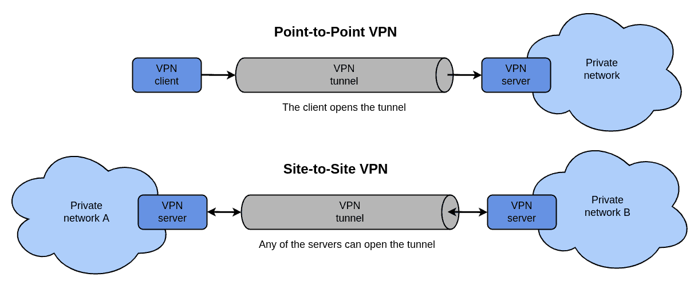

## Concepto de VPN

Una VPN establece una conexión lógica segura sobre una infraestructura de red física no confiable. El término "virtual" se refiere a que no existe un cable físico dedicado entre los puntos de conexión, sino que se utiliza Internet u otra red compartida. El término "privada" indica que solo los participantes autorizados pueden acceder a la comunicación.

### Principios Fundamentales

#### 1. Túnel (Tunneling)

El **tunneling** es el proceso de encapsular un paquete de datos completo dentro de otro paquete para su transmisión a través de una red.

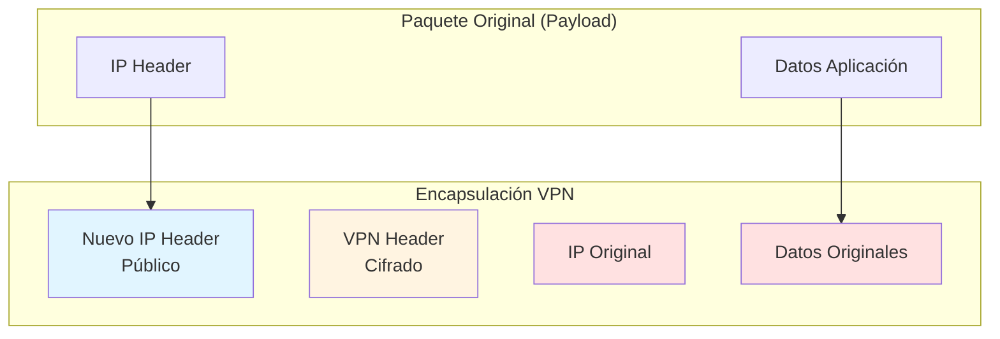

**Proceso**:
1. **Encapsulación**: El paquete original se envuelve con cabeceras VPN adicionales
2. **Cifrado**: El contenido se cifra para garantizar confidencialidad
3. **Transmisión**: El paquete cifrado viaja por Internet
4. **Desencapsulación**: El extremo receptor elimina las cabeceras VPN
5. **Descifrado**: Se recupera el paquete original

#### 2. Cifrado

El cifrado protege el contenido de los datos durante la transmisión. Algoritmos comunes:

- **AES (Advanced Encryption Standard)**: 
  - AES-128, AES-192, AES-256
  - Estándar actual, muy seguro y eficiente
  - Usado por la mayoría de VPN modernas

- **3DES (Triple Data Encryption Standard)**:
  - Triple cifrado DES
  - Considerado obsoleto, más lento que AES
  - En proceso de deprecación

- **ChaCha20**:
  - Alternativa moderna a AES
  - Excelente rendimiento en dispositivos sin aceleración hardware
  - Usado por WireGuard

**Longitud de clave y seguridad**:
```
AES-128: 2^128 combinaciones posibles (~3.4 × 10^38)
AES-256: 2^256 combinaciones posibles (~1.1 × 10^77)
```

:::info Cifrado Simétrico vs Asimétrico en VPN
Las VPN utilizan **cifrado híbrido**:
- **Asimétrico (RSA, ECDH)**: Para el intercambio inicial de claves y autenticación
- **Simétrico (AES, ChaCha20)**: Para el cifrado del tráfico de datos (más rápido)

Este enfoque combina la seguridad del cifrado asimétrico con la eficiencia del simétrico.
:::

#### 3. Autenticación

Verifica la identidad de los participantes en la conexión VPN. Métodos:

**Autenticación de usuarios**:
- Contraseñas
- Certificados digitales (X.509)
- Tokens de hardware (RSA SecurID)
- Autenticación multifactor (MFA)
- Biometría

**Autenticación de dispositivos**:
- Certificados de máquina
- Pre-shared keys (PSK)
- Claves públicas/privadas

**Protocolos de autenticación**:
- **EAP (Extensible Authentication Protocol)**: Framework flexible
- **MS-CHAPv2**: Microsoft Challenge Handshake (obsolescente)
- **PAP/CHAP**: Protocolos básicos (no recomendados)

#### 4. Integridad

Garantiza que los datos no han sido modificados durante la transmisión. Se implementa mediante funciones hash:

- **HMAC-SHA256**: Hash-based Message Authentication Code con SHA-256
- **HMAC-SHA384/512**: Variantes con mayor seguridad
- **MD5**: Obsoleto, no recomendado (vulnerable a colisiones)

**Funcionamiento**:
```
Emisor:
1. Calcula hash del mensaje: H = HMAC(mensaje, clave_secreta)
2. Envía mensaje + H

Receptor:
3. Recalcula hash: H' = HMAC(mensaje_recibido, clave_secreta)
4. Compara H con H'
   - Si coinciden: mensaje íntegro
   - Si difieren: mensaje alterado (descartado)
```

### Componentes de una VPN

Una arquitectura VPN típica incluye:

#### 1. Cliente VPN

Software instalado en el dispositivo del usuario final:
- **Windows**: Cisco AnyConnect, OpenVPN GUI, Windows VPN nativo
- **macOS/iOS**: Cliente integrado, Tunnelblick, Viscosity
- **Linux**: OpenVPN, NetworkManager con plugins VPN, WireGuard
- **Android**: OpenVPN for Android, WireGuard

**Funciones**:
- Iniciar y terminar conexiones VPN
- Autenticación del usuario
- Configuración de rutas (split-tunneling)
- Gestión de credenciales

#### 2. Servidor VPN / Gateway VPN

Dispositivo o software que acepta conexiones VPN entrantes:
- **Hardware dedicado**: Cisco ASA, Fortinet FortiGate, Palo Alto
- **Software**: OpenVPN Server, WireGuard, strongSwan (IPSec)
- **Appliances virtuales**: pfSense, OPNsense
- **Soluciones cloud**: AWS VPN Gateway, Azure VPN Gateway

**Funciones**:
- Autenticar clientes
- Establecer túneles cifrados
- Asignar direcciones IP a clientes
- Enrutar tráfico entre VPN y red interna
- Aplicar políticas de seguridad
- Logging y auditoría

#### 3. Túnel VPN

Conexión lógica cifrada entre cliente y servidor:
- **Parámetros negociados**:
  - Algoritmo de cifrado (AES-256)
  - Algoritmo de hash (SHA-256)
  - Protocolo de intercambio de claves (Diffie-Hellman)
  - Tiempo de vida de las claves (rekeying)
  
- **Modos de operación**:
  - **Modo túnel completo**: Todo el tráfico del cliente pasa por la VPN
  - **Split-tunneling**: Solo tráfico destinado a red corporativa usa VPN, resto va directo a Internet

```bash
# Ejemplo de rutas con split-tunneling
# Antes de conectar VPN
ip route show
default via 192.168.1.1 dev wlan0

# Después de conectar VPN con split-tunneling
ip route show
default via 192.168.1.1 dev wlan0                    # Internet directo
10.0.0.0/8 dev tun0 via 10.8.0.1                    # Red corporativa por VPN
172.16.0.0/12 dev tun0 via 10.8.0.1                 # Recursos internos por VPN
```

:::warning Split-Tunneling: Consideraciones de Seguridad
El **split-tunneling** mejora el rendimiento al no sobrecargar la VPN con tráfico de Internet, pero introduce riesgos:

**Ventajas**:
- Menor latencia para servicios de Internet
- Reduce carga en servidor VPN
- Mejor experiencia de usuario (streaming, videoconferencias)

**Riesgos**:
- El dispositivo está simultáneamente en red corporativa e Internet
- Malware desde Internet puede acceder a recursos corporativos
- Exfiltración de datos sin pasar por controles corporativos
- Dificulta auditoría y monitorización

**Recomendación**: Desactivar split-tunneling para usuarios con acceso a recursos críticos. Si se usa, implementar controles en el endpoint (antivirus, firewall local, EDR).
:::

#### 4. Servidor de Autenticación

Sistema centralizado que valida credenciales:
- **Active Directory / LDAP**: Integración con directorio corporativo
- **RADIUS**: Remote Authentication Dial-In User Service
- **TACACS+**: Terminal Access Controller Access-Control System Plus
- **OAuth/SAML**: Integración con proveedores de identidad (Okta, Azure AD)

#### 5. Infraestructura de Clave Pública (PKI)

Para VPN basadas en certificados:
- **CA (Certificate Authority)**: Emite y revoca certificados
- **Certificados de servidor**: Autentican el gateway VPN
- **Certificados de cliente**: Autentican usuarios/dispositivos
- **CRL/OCSP**: Lista de revocación de certificados

## Beneficios de las VPN

### 1. Seguridad y Privacidad

**Cifrado end-to-end**:
- Protege datos confidenciales durante la transmisión
- Evita interceptación por terceros (man-in-the-middle)
- Esencial en WiFi públicas no seguras

**Ocultación de tráfico**:
- ISP no puede ver contenido ni destinos específicos
- Protección contra análisis de tráfico
- Bypass de censura y geo-restricciones

**Ejemplo de interceptación sin VPN**:
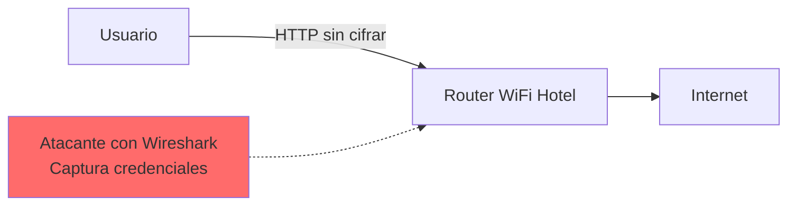

**Con VPN**:
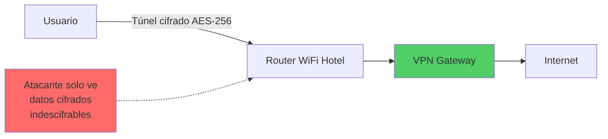

### 2. Acceso Remoto Seguro

**Teletrabajo**:
- Empleados acceden a recursos corporativos desde casa
- Conexión como si estuvieran en la oficina
- Acceso a servidores internos, aplicaciones, archivos compartidos

**Movilidad**:
- Trabajar desde cualquier ubicación (aeropuertos, cafeterías, hoteles)
- Mantener productividad fuera de la oficina
- Acceso seguro desde dispositivos móviles

**Ejemplo de caso de uso**:
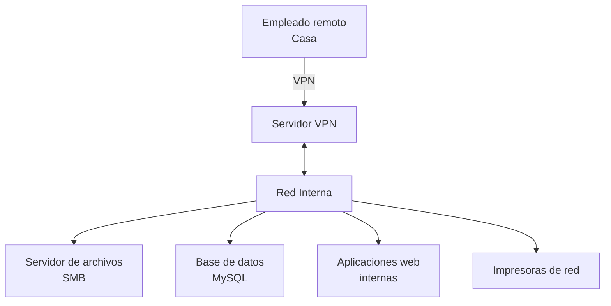

### 3. Conectividad entre Sedes

**Site-to-Site VPN**:
- Conecta oficinas remotas como si estuvieran en la misma LAN
- Comparte recursos entre ubicaciones
- Alternativa económica a líneas dedicadas (MPLS)

**Ventajas vs Líneas Dedicadas**:
| Aspecto | VPN sobre Internet | Línea Dedicada (MPLS) |
|---------|-------------------|------------------------|
| **Coste** | Bajo (usa Internet existente) | Alto (circuito dedicado) |
| **Implementación** | Rápida (horas/días) | Lenta (semanas/meses) |
| **Escalabilidad** | Fácil añadir sedes | Requiere provisión ISP |
| **Ancho de banda** | Variable (depende Internet) | Garantizado (SLA) |
| **Seguridad** | Requiere cifrado | Circuito privado |
| **Latencia** | Variable | Baja y predecible |

### 4. Reducción de Costes

**Ahorro en infraestructura**:
- No requiere líneas dedicadas punto a punto
- Usa infraestructura de Internet existente
- Reduce necesidad de hardware costoso

**Ahorro operativo**:
- Menos desplazamientos (soporte remoto)
- Oficinas remotas sin necesidad de servidores locales
- Reducción de costes de telecomunicaciones

**Ejemplo de coste comparativo**:
```
Escenario: Conectar 5 oficinas remotas a sede central

Opción A - Líneas MPLS dedicadas:
5 líneas × 500€/mes = 2.500€/mes = 30.000€/año

Opción B - VPN sobre Internet:
5 conexiones Internet × 50€/mes = 250€/mes
1 Firewall VPN = 2.000€ (compra única)
Total año 1: 5.000€ (ahorro de 25.000€)
```

### 5. Flexibilidad y Escalabilidad

**Fácil expansión**:
- Añadir usuarios remotos sin inversión significativa
- Nuevas oficinas se conectan rápidamente
- Soporta crecimiento orgánico de la empresa

**Soporte multi-plataforma**:
- Windows, macOS, Linux, iOS, Android
- BYOD (Bring Your Own Device)
- Compatibilidad con múltiples dispositivos por usuario

### 6. Cumplimiento Normativo

**Regulaciones que requieren cifrado de datos**:
- **GDPR** (Reglamento General de Protección de Datos): Protección de datos personales
- **HIPAA** (Health Insurance Portability): Datos médicos en USA
- **PCI DSS**: Datos de tarjetas de crédito
- **SOX**: Datos financieros
- **ENS** (Esquema Nacional de Seguridad): Administraciones públicas en España

**VPN como control técnico**:
- Cifrado en tránsito (control obligatorio)
- Logs de acceso para auditorías
- Segregación de acceso por roles
- Autenticación fuerte

## Desventajas y Limitaciones de las VPN

### 1. Rendimiento y Latencia

**Overhead del cifrado**:
- El proceso de cifrado/descifrado consume CPU
- Reduce throughput efectivo (10-30% típico)
- Mayor impacto en dispositivos con CPUs débiles

**Latencia adicional**:
- Encapsulación y desencapsulación añade retardo
- Rutas no optimizadas (tráfico pasa por gateway VPN)
- Problemas para aplicaciones sensibles a latencia (VoIP, videoconferencia, juegos)

**Mediciones típicas**:
```bash
# Sin VPN
$ ping google.com
64 bytes from 142.250.184.206: icmp_seq=1 ttl=117 time=15.2 ms

# Con VPN
$ ping google.com
64 bytes from 142.250.184.206: icmp_seq=1 ttl=117 time=45.8 ms
(+30ms de latencia adicional)
```

**Reducción de throughput**:
```
Conexión sin VPN: 100 Mbps
Conexión con VPN: 70-85 Mbps (debido a overhead de cifrado)
```

:::tip Optimización de Rendimiento VPN
Para minimizar impacto en rendimiento:
1. **Hardware con aceleración AES**: CPUs modernas con AES-NI (Intel) o equivalente
2. **Protocolos eficientes**: WireGuard vs OpenVPN (3-4x más rápido)
3. **Algoritmos optimizados**: ChaCha20 en dispositivos móviles sin AES-NI
4. **Split-tunneling**: Solo tráfico corporativo por VPN
5. **Múltiples gateways**: Distribución geográfica para reducir latencia
6. **Balanceo de carga**: Distribuir conexiones entre varios servidores
:::

### 2. Complejidad de Configuración y Gestión

**Configuración inicial**:
- Requiere conocimientos técnicos especializados
- Configuración de certificados, claves, políticas
- Integración con infraestructura existente (AD, LDAP, firewalls)

**Mantenimiento continuo**:
- Actualizaciones de software/firmware
- Gestión de certificados (renovación, revocación)
- Monitorización de conexiones y rendimiento
- Resolución de problemas de conectividad

**Soporte a usuarios**:
- Instalación de clientes en dispositivos variados
- Troubleshooting de problemas de conexión
- Gestión de credenciales olvidadas
- Compatibilidad con diferentes versiones de SO

### 3. Punto Único de Fallo

**Dependencia del gateway VPN**:
- Si el servidor VPN falla, todos los usuarios remotos pierden acceso
- Crítico para organizaciones con teletrabajo intensivo

**Mitigaciones**:
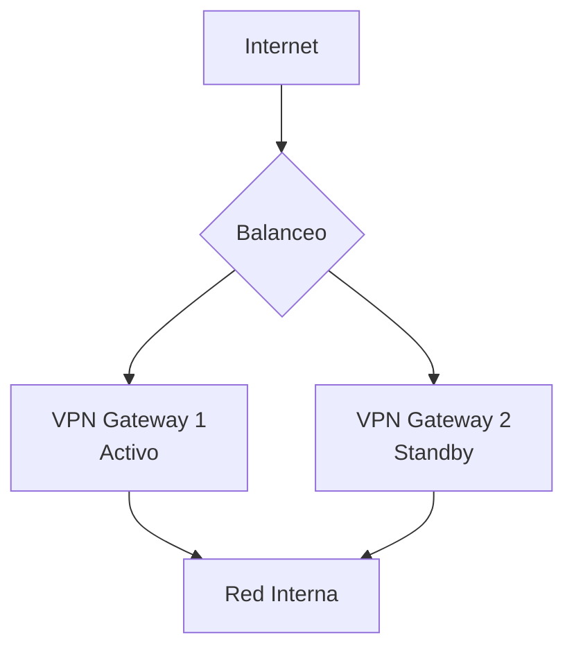

**Alta disponibilidad**:
- **Activo-Pasivo**: Servidor backup toma control si el principal falla
- **Activo-Activo**: Ambos servidores procesan conexiones (balanceo de carga)
- **Clustering**: Múltiples nodos con IP virtual compartida
- **Geo-redundancia**: Gateways en diferentes ubicaciones geográficas

### 4. Seguridad del Endpoint

**El eslabón más débil**:
- VPN protege el tránsito, pero no el dispositivo cliente
- Dispositivo comprometido tiene acceso a red corporativa
- Malware en laptop remota puede propagarse internamente

**Vectores de ataque**:
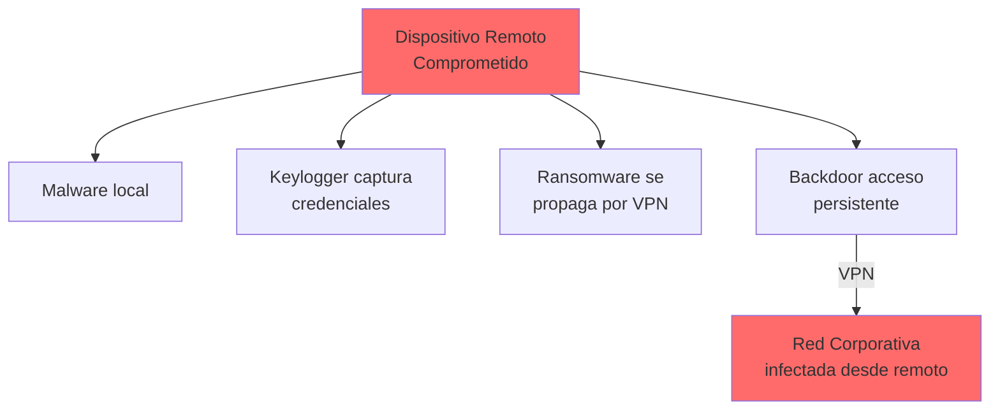

**Controles necesarios**:
- **Antivirus/EDR obligatorio**: Verificación pre-conexión (NAC)
- **Actualizaciones del SO**: Políticas de patch management
- **Firewall personal activado**: Protección contra ataques laterales
- **Disk encryption**: Protección en caso de robo de dispositivo
- **MDM (Mobile Device Management)**: Control de dispositivos móviles
- **Posture Assessment**: Verificar estado de seguridad antes de permitir conexión

### 5. Compatibilidad y Interoperabilidad

**Problemas comunes**:
- **NAT traversal**: VPN IPSec puede tener problemas detrás de NAT
- **Firewalls corporativos**: Puertos VPN bloqueados en algunas redes
- **Incompatibilidades de protocolo**: Cliente y servidor de diferentes fabricantes
- **Versiones de software**: Clientes antiguos no soportan configuraciones modernas

**Soluciones**:
- **SSL VPN**: Usa puerto 443 (HTTPS), raramente bloqueado
- **NAT-T (NAT Traversal)**: Extensión IPSec para funcionar con NAT
- **Protocolos estándar**: OpenVPN, IPSec, WireGuard (open source, multi-plataforma)
- **Modo fallback**: Múltiples protocolos configurados (IPSec principal, SSL backup)

### 6. Coste de Licenciamiento

**Modelos de coste**:
- **Por usuario concurrente**: Pago por número de conexiones simultáneas
- **Por usuario nombrado**: Pago por cada usuario autorizado (use o no)
- **Ilimitado**: Licencia sin límite de usuarios (más cara)
- **Suscripción anual**: Renovación periódica con soporte incluido

**Ejemplo de costes**:
```
VPN comercial (Cisco AnyConnect):
- Licencia base (50 usuarios): 2.000€
- 100 usuarios adicionales: 4.000€
- Soporte anual (20%): 1.200€
Total 3 años: 9.600€

Alternativa open source (OpenVPN Access Server):
- 2 conexiones: Gratis
- 10 conexiones: 150€/año
- 100 conexiones: 1.500€/año
Total 3 años: 4.500€ (ahorro 53%)
```

### 7. Riesgos de Privacidad (VPN Comerciales Públicas)

**VPN como servicio (VPN providers)**:
- Prometen anonimato pero algunos registran actividad
- Jurisdicciones sin protección de privacidad
- Posible venta de datos de navegación
- Riesgo de inyección de anuncios o malware

**Casos conocidos**:
- HolaVPN: Vendía ancho de banda de usuarios
- VPN gratuitas: Muchas monetizan con publicidad invasiva
- Proveedores que colaboran con gobiernos

:::warning VPN Comerciales vs VPN Corporativas
Este apartado de riesgos aplica principalmente a **VPN comerciales públicas** (NordVPN, ExpressVPN, etc.) usadas para privacidad personal.

Las **VPN corporativas** (tema de este módulo) son gestionadas internamente por la organización, sin estos riesgos de privacidad, pero con las otras desventajas mencionadas (rendimiento, complejidad, coste).
:::

### 8. Falsa Sensación de Seguridad

**Limitaciones que los usuarios desconocen**:
- VPN no protege contra phishing o ingeniería social
- No detecta malware en descargas
- No previene acceso no autorizado si credenciales son robadas
- No protege datos almacenados, solo en tránsito

**Educación necesaria**:
```
VPN ≠ Antivirus
VPN ≠ Firewall
VPN ≠ Protección completa

VPN = Cifrado de tránsito + Autenticación de acceso
```

Los usuarios deben entender que VPN es **una capa más** de seguridad, no una solución completa.

## Tipos de VPN

Las VPN se clasifican según diferentes criterios: propósito, alcance, protocolo y arquitectura. A continuación, se detallan los principales tipos.

### Clasificación por Alcance

#### 1. VPN de Acceso Remoto (Remote Access VPN)

**Descripción**:
Conecta usuarios individuales (clientes) a una red corporativa desde ubicaciones remotas.

**Arquitectura**:
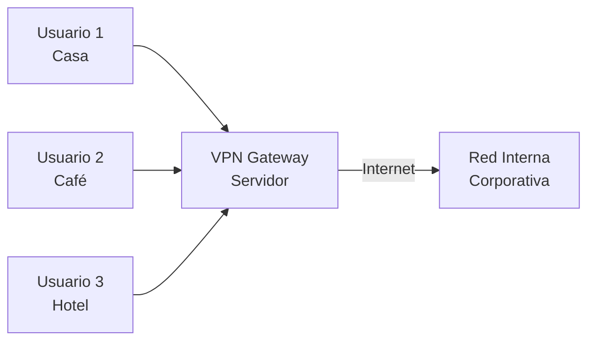

**Características**:
- Conexiones temporales (usuario conecta/desconecta)
- Autenticación individual de usuarios
- Asignación dinámica de IP desde pool
- Políticas de acceso basadas en usuario/grupo
- Soporte multi-plataforma (Windows, macOS, Linux, iOS, Android)

**Casos de uso**:
- Teletrabajo: Empleados trabajando desde casa
- Movilidad: Acceso desde laptops, tablets, smartphones
- Contratistas: Acceso temporal para trabajadores externos
- Soporte técnico: Administradores conectándose remotamente

**Ventajas**:
- Flexibilidad para usuarios móviles
- Fácil de escalar (añadir usuarios)
- No requiere configuración en ubicación remota
- Soporta dispositivos personales (BYOD)

**Desventajas**:
- Requiere cliente VPN instalado
- Rendimiento depende de conexión Internet del usuario
- Mayor superficie de ataque (muchos puntos de acceso)
- Gestión compleja con muchos usuarios

**Protocolos típicos**:
- SSL VPN / TLS VPN (navegador o cliente ligero)
- IPSec VPN (cliente robusto)
- OpenVPN (multi-plataforma)
- WireGuard (moderno, eficiente)

#### 2. VPN Sitio a Sitio (Site-to-Site VPN)

**Descripción**:
Conecta redes completas entre diferentes ubicaciones físicas, creando una única red lógica extendida.

**Arquitectura**:
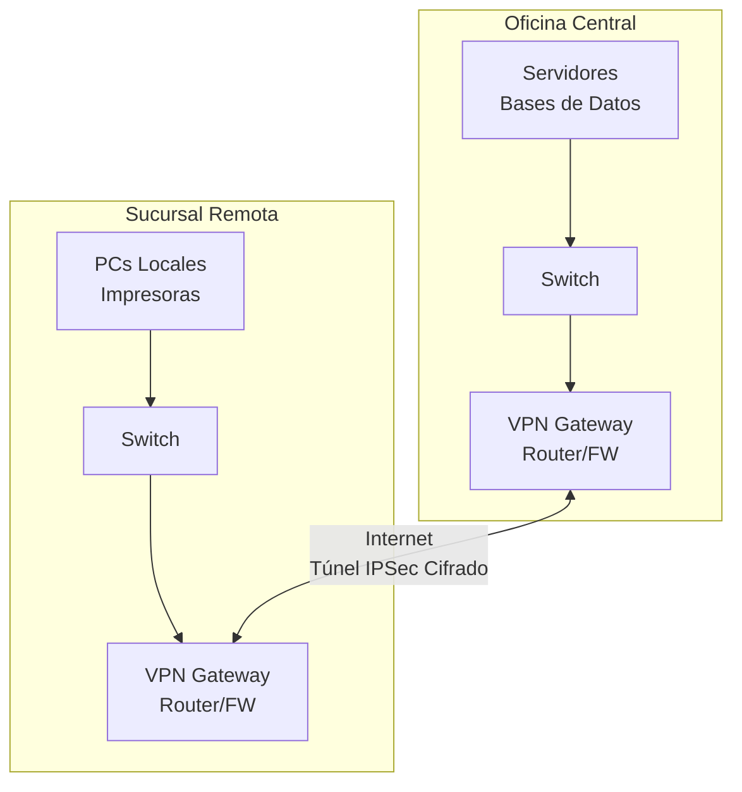

**Características**:
- Conexiones permanentes (always-on)
- Autenticación de dispositivos (no usuarios individuales)
- Redes completas se comunican transparentemente
- Usuarios no requieren cliente VPN (transparente)
- Configuración estática en ambos extremos

**Casos de uso**:
- Conectar oficinas regionales a sede central
- Integrar empresas tras fusión/adquisición
- Extender red a centro de datos externo
- Conectar con partners de negocio (extranet)

**Tipos**:

*Intranet VPN*:
- Conecta ubicaciones de la misma organización
- Todas las sedes confían entre sí
- Acceso completo entre redes

*Extranet VPN*:
- Conecta organizaciones diferentes (empresa y proveedor)
- Acceso controlado y limitado
- Solo recursos específicos compartidos

**Ventajas**:
- Transparente para usuarios finales
- Alta disponibilidad (conexión permanente)
- Mejor rendimiento (hardware dedicado)
- Menos complejidad de gestión de usuarios

**Desventajas**:
- Requiere hardware en ambos extremos
- Configuración más compleja
- Menos flexible para cambios frecuentes
- Coste inicial más elevado

**Protocolos típicos**:
- IPSec (modo túnel)
- GRE sobre IPSec
- MPLS VPN (proveedor de servicios)

**Ejemplo de configuración básica (Cisco IOS)**:
```
! Definir parámetros de cifrado (IKE Phase 1)
crypto isakmp policy 10
 encryption aes 256
 hash sha256
 authentication pre-share
 group 14
 lifetime 86400

! Definir clave compartida
crypto isakmp key MySecretKey123! address 203.0.113.50

! Definir parámetros de túnel (IKE Phase 2)
crypto ipsec transform-set MYSET esp-aes 256 esp-sha256-hmac
 mode tunnel

! Definir tráfico interesante (qué se cifra)
access-list 100 permit ip 10.0.0.0 0.0.0.255 10.1.0.0 0.0.0.255

! Crear mapa de cifrado
crypto map VPNMAP 10 ipsec-isakmp
 set peer 203.0.113.50
 set transform-set MYSET
 match address 100

! Aplicar a interfaz externa
interface GigabitEthernet0/0
 crypto map VPNMAP
```

#### 3. VPN Extranet

**Descripción**:
Caso especial de site-to-site VPN que conecta la red de una organización con redes de partners externos, proveedores o clientes, con acceso controlado y limitado.

**Arquitectura**:
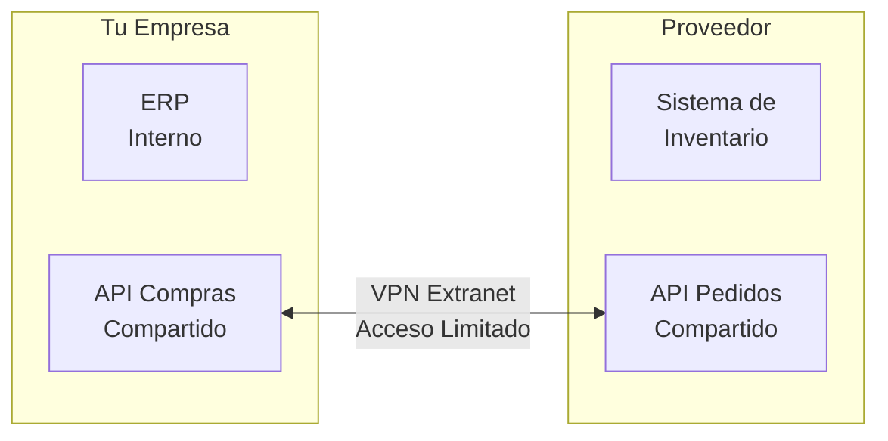

**Características diferenciadoras**:
- **Permisos granulares**: Solo acceso a recursos específicos
- **Segmentación estricta**: DMZ o VLAN dedicada para recursos compartidos
- **Autenticación reforzada**: Certificados, no solo pre-shared keys
- **Auditoría exhaustiva**: Logs de todo el acceso externo
- **Acuerdos legales**: Contratos de confidencialidad (NDA), SLA

**Casos de uso**:
- **Integración B2B**: Intercambio automatizado de pedidos, facturas
- **Supply chain**: Proveedor consulta inventario en tiempo real
- **Partners tecnológicos**: Acceso a APIs, webhooks
- **Soporte de terceros**: Proveedor de software accede para mantenimiento

**Políticas de seguridad típicas**:
```
Firewall Extranet:

# Permitir proveedor A acceder solo a API de pedidos
access-list extranet-in permit tcp 198.51.100.0/24 host 10.10.10.50 eq 8443
access-list extranet-in deny ip 198.51.100.0/24 10.0.0.0/8

# Permitir proveedor B acceder a servidor FTP específico
access-list extranet-in permit tcp 203.0.113.0/24 host 10.10.10.60 eq 22
access-list extranet-in deny ip 203.0.113.0/24 10.0.0.0/8

# Denegar todo lo demás
access-list extranet-in deny ip any any
```

**Mejores prácticas**:
1. **Principio de mínimo privilegio**: Solo acceso estrictamente necesario
2. **Separación de redes**: VLAN/subnet exclusiva para extranet
3. **Autenticación bilateral**: Certificados en ambos extremos
4. **IDS/IPS dedicado**: Monitorización de tráfico extranet
5. **Revisión periódica**: Auditar accesos y revocar innecesarios
6. **Documentación**: Mantener inventario de conexiones extranet

### Clasificación por Modo de Implementación

#### 1. VPN SSL/TLS (Secure Sockets Layer / Transport Layer Security)

**Descripción**:
Utiliza protocolos SSL/TLS (los mismos que aseguran HTTPS) para crear el túnel VPN. Opera en la capa de aplicación (capa 7 OSI).

**Características**:
- **Puerto estándar**: Usa puerto TCP 443 (HTTPS)
- **Sin cliente especial**: Puede funcionar desde navegador web (clientless)
- **NAT-friendly**: No tiene problemas con NAT o firewalls
- **Fácil despliegue**: No requiere configuración compleja

**Modos de operación**:

*Modo Portal (Clientless)*:
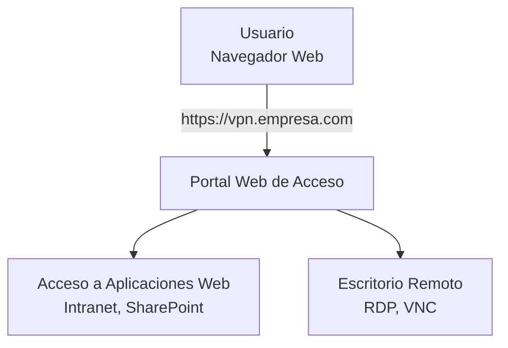
- Acceso desde navegador sin instalar nada
- Limitado a aplicaciones web y protocolos específicos
- Ideal para accesos puntuales o equipos no gestionados

*Modo Túnel (Cliente)*:

- Cliente ligero instalable
- Acceso completo a red (igual que IPSec)
- Mejor rendimiento que modo portal

**Ventajas**:
- ✅ Funciona en casi cualquier red (puerto 443 raramente bloqueado)
- ✅ Fácil de usar para usuarios finales
- ✅ Sin problemas con NAT/PAT
- ✅ Opción clientless disponible
- ✅ Autenticación flexible (usuario/contraseña, certificados, MFA)

**Desventajas**:
- ❌ Menor rendimiento que IPSec (overhead SSL)
- ❌ Modo clientless limitado en funcionalidad
- ❌ Más vulnerable a ataques de capa aplicación

**Tecnologías**:
- **OpenVPN**: Solución open source muy popular
- **Cisco AnyConnect**: Cliente comercial de Cisco
- **Fortinet SSL VPN**: Integrado en FortiGate
- **Pulse Secure**: Antes Juniper SSL VPN

**Ejemplo de conexión OpenVPN**:
```bash
# Archivo de configuración cliente.ovpn
client
dev tun
proto tcp
remote vpn.empresa.com 443
resolv-retry infinite
nobind
persist-key
persist-tun
ca ca.crt
cert cliente.crt
key cliente.key
remote-cert-tls server
cipher AES-256-GCM
auth SHA256
comp-lzo
verb 3

# Conectar
sudo openvpn --config cliente.ovpn
```

#### 2. VPN IPSec (Internet Protocol Security)

**Descripción**:
Suite de protocolos que proporciona seguridad a nivel de capa de red (capa 3 OSI). Es el estándar de facto para VPN site-to-site y también ampliamente usado para acceso remoto.

**Protocolos que componen IPSec**:

1. **AH (Authentication Header)**:
   - Proporciona autenticación e integridad
   - No cifra datos (obsoleto en uso moderno)
   - Protege header IP

2. **ESP (Encapsulating Security Payload)**:
   - Proporciona cifrado, autenticación e integridad
   - Más usado que AH
   - Protege payload del paquete

3. **IKE (Internet Key Exchange)**:
   - Negocia parámetros de seguridad
   - Establece Security Associations (SA)
   - Dos fases: IKEv1 o IKEv2 (moderno)

**Modos de operación**:

*Modo Transporte*:

- Solo cifra el payload, no el header IP
- IPs origen/destino visibles
- Usado para host-to-host
- Menor overhead

*Modo Túnel*:

- Cifra paquete IP completo
- IPs reales ocultas
- Usado para site-to-site y remote access
- Mayor overhead pero más seguro

**Fases de establecimiento**:

*Fase 1 (IKE Phase 1 / Main Mode)*:
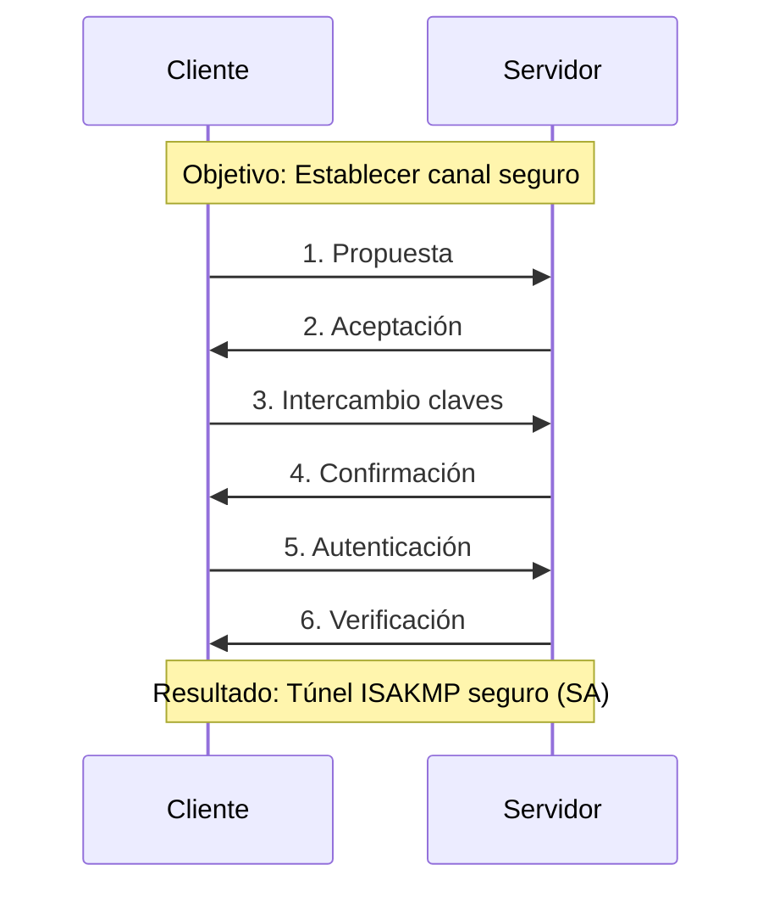

*Fase 2 (IKE Phase 2 / Quick Mode)*:
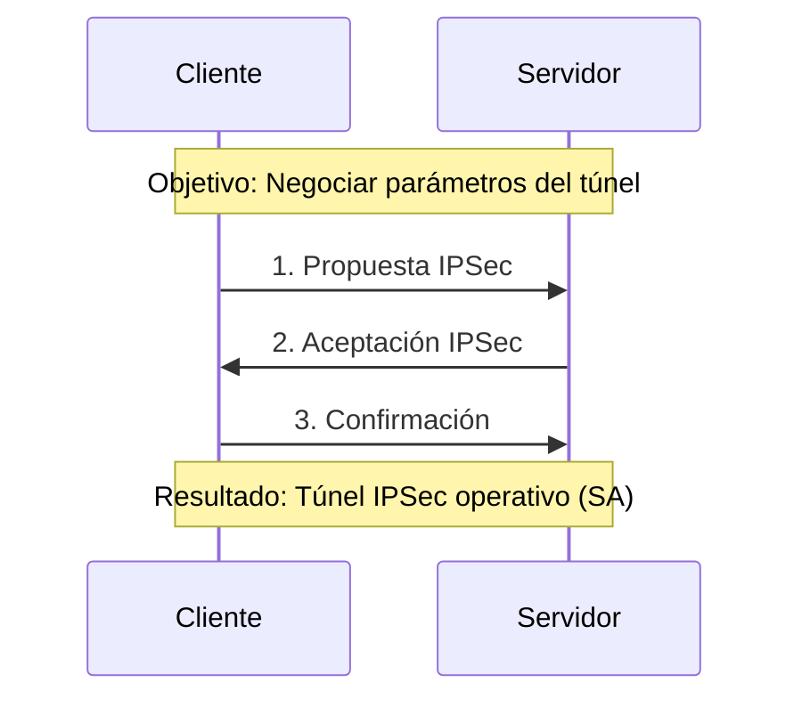

**Ventajas**:
- ✅ Estándar abierto (RFC), interoperable entre fabricantes
- ✅ Excelente rendimiento (capa 3, hardware acceleration)
- ✅ Muy seguro (algoritmos modernos)
- ✅ Soportado nativamente en muchos SO (Windows, macOS, iOS)
- ✅ Ideal para site-to-site (always-on)

**Desventajas**:
- ❌ Configuración compleja (muchos parámetros)
- ❌ Problemas con NAT (requiere NAT-T)
- ❌ Puertos UDP 500, 4500 pueden estar bloqueados
- ❌ Menos flexible que SSL VPN
- ❌ Troubleshooting más difícil

**Puertos utilizados**:
- **UDP 500**: IKE (negociación)
- **UDP 4500**: NAT-T (NAT traversal)
- **IP Protocol 50**: ESP (datos cifrados)
- **IP Protocol 51**: AH (raramente usado)

#### 3. VPN MPLS (Multiprotocol Label Switching)

**Descripción**:
VPN proporcionada por proveedores de servicios (ISP) que utiliza etiquetas MPLS para segregar tráfico de diferentes clientes en una infraestructura compartida.

**Arquitectura**:
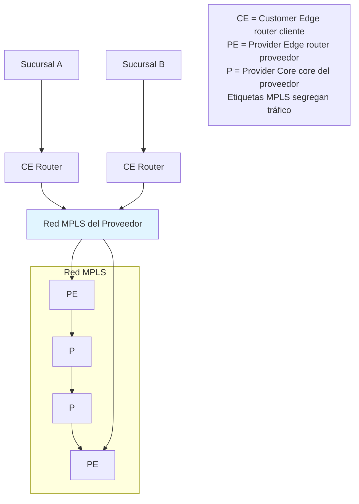

**Características**:
- **Gestionado por ISP**: Cliente no configura ni mantiene VPN
- **QoS garantizado**: SLA con ancho de banda y latencia
- **Any-to-any**: Todas las sedes se comunican directamente (full mesh)
- **Segregación por etiquetas**: VRF (Virtual Routing and Forwarding)
- **Escalable**: Añadir sedes sin reconfigurar existentes

**Ventajas**:
- ✅ Rendimiento predecible (SLA)
- ✅ Baja latencia
- ✅ QoS nativo
- ✅ Sin overhead de cifrado (privado del proveedor)
- ✅ Sin gestión técnica por parte del cliente
- ✅ Escalabilidad sin complejidad

**Desventajas**:
- ❌ Coste elevado (más que VPN sobre Internet)
- ❌ Dependencia del proveedor (vendor lock-in)
- ❌ Tiempo de provisión (semanas/meses)
- ❌ Menor flexibilidad geográfica
- ❌ No cifra por defecto (aunque se puede añadir)

**Comparativa MPLS vs IPSec**:
| Aspecto | MPLS VPN | IPSec VPN |
|---------|----------|-----------|
| **Coste** | Alto | Bajo |
| **Rendimiento** | Excelente | Bueno |
| **Latencia** | Baja (< 30ms) | Variable |
| **QoS** | Garantizado | Best-effort |
| **Seguridad** | Privado del proveedor | Cifrado end-to-end |
| **Gestión** | Por proveedor | Cliente |
| **Tiempo provisión** | Semanas | Horas/días |
| **Flexibilidad** | Baja | Alta |

**Caso de uso ideal**:
- Grandes empresas con múltiples sedes permanentes
- Aplicaciones críticas sensibles a latencia (VoIP, videoconferencia, ERP)
- Necesidad de SLA estricto
- Presupuesto para solución premium

#### 4. VPN Híbrida

**Descripción**:
Combinación de múltiples tecnologías VPN para optimizar coste, rendimiento y flexibilidad.

**Arquitectura típica**:
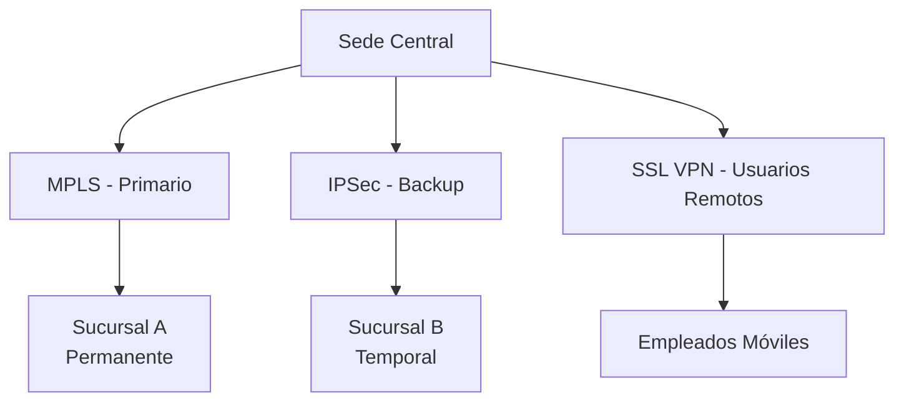

**Estrategias comunes**:

*MPLS + IPSec Backup*:
- MPLS para tráfico principal (bajo latencia, QoS)
- IPSec sobre Internet como respaldo (si MPLS falla)
- Conmutación automática (failover)

*IPSec Site-to-Site + SSL VPN Remote Access*:
- IPSec conecta oficinas permanentes
- SSL VPN para usuarios móviles/remotos
- Dos sistemas optimizados para cada necesidad

*SD-WAN (Software-Defined WAN)*:
```
Tecnología moderna que combina múltiples enlaces:
├─ MPLS (para tráfico crítico)
├─ Internet Banda Ancha 1 (IPSec)
├─ Internet Banda Ancha 2 (IPSec)
└─ 4G/5G (Backup)

Inteligencia de enrutamiento:
- Tráfico VoIP → MPLS (baja latencia)
- Tráfico Office 365 → Internet directo (optimizado)
- Tráfico ERP → IPSec sobre Internet (cifrado)
- Backup automático si enlace falla
```

**Ventajas**:
- ✅ Optimización coste/rendimiento
- ✅ Alta disponibilidad (múltiples rutas)
- ✅ Flexibilidad para diferentes necesidades
- ✅ Mejor experiencia de usuario

**Desventajas**:
- ❌ Mayor complejidad de gestión
- ❌ Requiere equipamiento compatible
- ❌ Más puntos de fallo potenciales
- ❌ Necesita personal especializado

---

:::tip Elección del Tipo de VPN
**Para acceso remoto**:
- Usuarios no técnicos, acceso puntual → **SSL VPN (modo portal)**
- Usuarios técnicos, acceso frecuente → **SSL VPN (modo túnel)** o **IPSec**
- Máxima compatibilidad → **SSL VPN (OpenVPN)**
- Máximo rendimiento → **IPSec** o **WireGuard**

**Para site-to-site**:
- Presupuesto limitado → **IPSec sobre Internet**
- Aplicaciones críticas, presupuesto amplio → **MPLS**
- Empresas en crecimiento → **SD-WAN (híbrido)**
- Oficinas temporales → **IPSec dinámico**

**Para conexiones con partners**:
- Control y auditoría estrictos → **IPSec con certificados**
- Acceso web limitado → **SSL VPN clientless**
:::

## Protocolos de VPN

Los protocolos VPN definen cómo se establece, mantiene y cifra la conexión entre cliente y servidor. Cada protocolo tiene características específicas en términos de seguridad, rendimiento, compatibilidad y casos de uso. A continuación, se detallan los principales protocolos utilizados en VPN modernas.

### PPTP (Point-to-Point Tunneling Protocol)

**Descripción**:
PPTP fue uno de los primeros protocolos VPN, desarrollado por Microsoft en los años 90. Crea un túnel y encapsula paquetes PPP (Point-to-Point Protocol) sobre una red IP.

**Características técnicas**:
- **Capa OSI**: Capa 2 (Enlace de datos)
- **Puerto**: TCP 1723 para control, IP Protocol 47 (GRE) para datos
- **Cifrado**: MPPE (Microsoft Point-to-Point Encryption) con RC4
- **Autenticación**: MS-CHAPv2, EAP
- **Overhead**: Bajo (~10%)

**Arquitectura**:
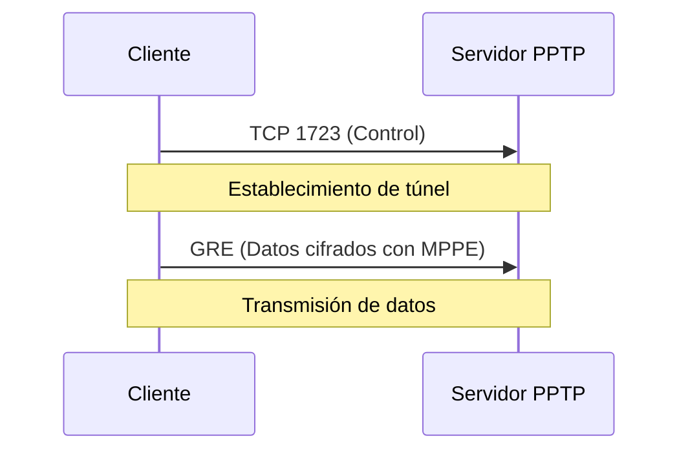

**Proceso de conexión**:
1. Cliente inicia conexión TCP al puerto 1723 del servidor
2. Negociación de parámetros de túnel (control channel)
3. Establecimiento de túnel GRE para datos
4. Autenticación de usuario (MS-CHAPv2)
5. Asignación de IP y establecimiento de sesión PPP
6. Transmisión de datos cifrados

**Ventajas**:
- ✅ Configuración extremadamente simple
- ✅ Soportado nativamente en Windows (desde Windows 95)
- ✅ Bajo overhead (mejor rendimiento que IPSec)
- ✅ Compatible con NAT (con algunos problemas)
- ✅ Requiere pocos recursos

**Desventajas**:
- ❌ **Severamente inseguro**: Múltiples vulnerabilidades conocidas
- ❌ Cifrado débil (RC4 de 128 bits, rompible)
- ❌ MS-CHAPv2 vulnerable a ataques de diccionario
- ❌ NSA puede descifrar tráfico PPTP en tiempo real (revelaciones Snowden)
- ❌ No soporta cifrado AES
- ❌ Problemas con firewalls (GRE no siempre permitido)

**Ejemplo de configuración (Windows Server)**:
```powershell
# Instalar rol PPTP
Install-WindowsFeature RemoteAccess -IncludeManagementTools
Install-WindowsFeature RSAT-RemoteAccess-PowerShell
Install-RemoteAccess -VpnType Vpn

# Configurar pool de direcciones
Set-VpnS2SInterface -Name "PPTP" -Protocol PPTP -Destination 0.0.0.0
Set-VpnServerIPsecConfiguration -PassThru

# Añadir usuario VPN
Add-VpnUser -Username "usuario" -Password "ContraseñaSegura123!"
```

**Estado actual**:
```
⛔ PPTP está OFICIALMENTE DEPRECADO
- Microsoft recomienda NO usarlo desde 2012
- Removido por defecto en macOS Sierra (2016)
- Bloqueado en iOS 10+ y Android 10+
- No cumple estándares de seguridad modernos
```

:::warning PPTP: No Usar en Producción
**PPTP NO DEBE USARSE** en entornos de producción modernos:

1. **Vulnerabilidades críticas**: MS-CHAPv2 puede crackearse en 23 horas
2. **Cifrado obsoleto**: RC4 tiene vulnerabilidades conocidas desde 2013
3. **No cumple normativas**: GDPR, PCI DSS, HIPAA prohíben cifrado débil
4. **Alternativas superiores**: L2TP/IPSec, OpenVPN, WireGuard son más seguros

**Único caso aceptable**: Laboratorios de prueba o redes sin datos sensibles.
:::

---

### L2TP/IPSec (Layer 2 Tunneling Protocol over IPSec)

**Descripción**:
L2TP es un protocolo de túnel (sin cifrado propio) que se combina con IPSec para proporcionar seguridad. L2TP crea el túnel y IPSec lo cifra. Es la evolución de PPTP y L2F (Layer 2 Forwarding de Cisco).

**Características técnicas**:
- **Capa OSI**: Capa 2 (L2TP) + Capa 3 (IPSec)
- **Puertos**: 
  - UDP 1701 (L2TP)
  - UDP 500 (IKE para IPSec)
  - UDP 4500 (NAT-T para IPSec)
  - IP Protocol 50 (ESP)
- **Cifrado**: IPSec con AES-128/256, 3DES
- **Autenticación**: PSK (Pre-Shared Key) o certificados X.509
- **Overhead**: Alto (~20-30% debido a doble encapsulación)

**Arquitectura de doble encapsulación**:
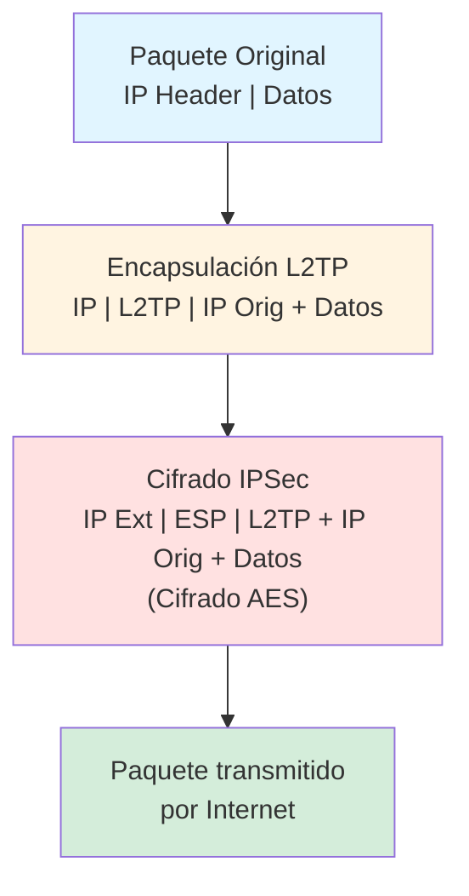

**Proceso de establecimiento**:
1. **Fase IPSec (IKE)**:
   - Negociación de parámetros de seguridad
   - Autenticación (PSK o certificados)
   - Establecimiento de SA (Security Association)
   - Generación de claves de cifrado

2. **Fase L2TP**:
   - Establecimiento de túnel L2TP (UDP 1701)
   - Negociación de sesión PPP
   - Autenticación de usuario (MS-CHAPv2, EAP)
   - Asignación de dirección IP al cliente

**Ventajas**:
- ✅ Muy seguro (IPSec con AES-256)
- ✅ Soportado nativamente en la mayoría de sistemas operativos
- ✅ Windows (nativo), macOS (nativo), iOS (nativo), Android (nativo)
- ✅ Estándar abierto (RFC 3193)
- ✅ Más seguro que PPTP (sin comparación)
- ✅ Autenticación robusta

**Desventajas**:
- ❌ Doble encapsulación reduce rendimiento (20-30% overhead)
- ❌ Problemas con NAT (requiere NAT-T)
- ❌ Configuración más compleja que PPTP
- ❌ Puede ser bloqueado por firewalls estrictos
- ❌ Más lento que OpenVPN o WireGuard
- ❌ IPSec tiene configuración compleja (muchos parámetros)

**Ejemplo de configuración (Linux strongSwan)**:
```bash
# Instalar strongSwan
sudo apt install strongswan strongswan-pki libcharon-extra-plugins

# Generar certificados
ipsec pki --gen --type rsa --size 4096 --outform pem > server-key.pem
ipsec pki --self --ca --lifetime 3650 \
  --in server-key.pem --type rsa \
  --dn "CN=VPN Server CA" --outform pem > server-cert.pem

# Configurar /etc/ipsec.conf
cat > /etc/ipsec.conf << 'EOF'
config setup
    charondebug="ike 2, knl 2, cfg 2"
    uniqueids=never

conn L2TP-PSK
    type=transport
    authby=secret
    left=%any
    leftprotoport=udp/l2tp
    right=%any
    rightprotoport=udp/%any
    auto=add
    keyexchange=ikev1
    ike=aes256-sha2_256-modp2048!
    esp=aes256-sha2_256!
EOF

# Configurar PSK en /etc/ipsec.secrets
echo "203.0.113.10 %any : PSK \"ClaveSecretaCompartida123!\"" > /etc/ipsec.secrets

# Configurar xl2tpd
sudo apt install xl2tpd
cat > /etc/xl2tpd/xl2tpd.conf << 'EOF'
[global]
port = 1701

[lns default]
ip range = 10.8.0.100-10.8.0.200
local ip = 10.8.0.1
require chap = yes
refuse pap = yes
require authentication = yes
name = L2TPServer
pppoptfile = /etc/ppp/options.xl2tpd
length bit = yes
EOF

# Iniciar servicios
sudo systemctl restart strongswan
sudo systemctl restart xl2tpd
```

**Configuración cliente Windows**:
```
1. Panel de Control → Redes e Internet → Centro de redes
2. Configurar nueva conexión → VPN
3. Tipo de VPN: L2TP/IPSec con clave precompartida
4. Dirección servidor: vpn.empresa.com
5. Clave precompartida: ClaveSecretaCompartida123!
6. Credenciales: usuario / contraseña
```

**Estado actual**:
- ✅ Ampliamente usado en empresas tradicionales
- ✅ Buena opción cuando OpenVPN no es viable
- ⚠️ En declive frente a protocolos más modernos
- ⚠️ Rendimiento inferior a alternativas modernas

:::info L2TP/IPSec vs IPSec Puro
**¿Por qué L2TP sobre IPSec y no IPSec solo?**

- **IPSec puro**: Más eficiente, menor overhead, usado en site-to-site
- **L2TP/IPSec**: Mejor soporte en clientes nativos, más fácil para usuarios finales

L2TP añade la capa de túnel PPP que:
- Facilita asignación de IPs dinámicas
- Permite autenticación de usuario (no solo de dispositivo)
- Compatible con sistemas legacy
- Interfaz de configuración más simple en SO de escritorio

**Para site-to-site**: Usar IPSec puro
**Para remote access**: L2TP/IPSec o alternativas modernas
:::

---

### IPSec (Internet Protocol Security)

**Descripción**:
IPSec es una suite de protocolos que proporciona seguridad a nivel de capa de red (capa 3). A diferencia de L2TP/IPSec, aquí hablamos de IPSec utilizado directamente sin L2TP, típicamente en configuraciones site-to-site.

**Componentes de IPSec**:

#### 1. Protocolos de Seguridad

**AH (Authentication Header) - IP Protocol 51**:
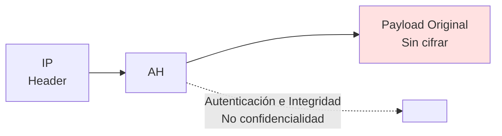
- Proporciona: Autenticación, Integridad, Anti-replay
- No proporciona: Confidencialidad (no cifra)
- Protege: Header IP + Payload
- Uso actual: Obsoleto, reemplazado por ESP

**ESP (Encapsulating Security Payload) - IP Protocol 50**:
```mermaid
graph LR
    A[IP<br/>Header] --> B[ESP<br/>Header]
    B --> C[Payload<br/>Cifrado AES]
    C --> D[ESP<br/>Trailer]
    B -.->|Cifrado, Autenticación<br/>e Integridad| E[ ]
    
    style C fill:#ffe1e1
```
- Proporciona: Confidencialidad, Autenticación, Integridad, Anti-replay
- Protege: Payload (y opcionalmente header en modo túnel)
- Uso actual: **Estándar de facto**

#### 2. Modos de Operación

**Modo Transporte**:
```
Original:  [IP Header][TCP Header][Datos]
                ↓
IPSec:     [IP Header][ESP Header][TCP Header + Datos (Cifrado)][ESP Trailer]
           └─────────┘└────────────────────────────────────────────────────┘
           Visible              Protegido por IPSec
```
- Solo protege el payload, no el header IP original
- IPs origen/destino visibles
- Menor overhead
- **Uso típico**: Host-to-host, L2TP/IPSec

**Modo Túnel**:
```
Original:  [IP Header Orig][TCP Header][Datos]
                ↓
IPSec:     [Nuevo IP Header][ESP Header][IP+TCP+Datos (Todo Cifrado)][ESP Trailer]
           └────────────────┘└──────────────────────────────────────────────────┘
           Gateway IPs       Paquete original completo protegido
```
- Cifra paquete IP completo (header + payload)
- IPs originales ocultas
- Mayor overhead pero más seguro
- **Uso típico**: Site-to-site VPN, Remote access VPN

#### 3. IKE (Internet Key Exchange)

**IKEv1 (RFC 2409)**:
```mermaid
sequenceDiagram
    participant I as Iniciador
    participant R as Responder
    Note over I,R: Fase 1 - ISAKMP SA (Main Mode)
    I->>R: 1. SA Proposal (algoritmos)
    R->>I: 2. SA Accept
    I->>R: 3. Key Exchange (DH public key)
    R->>I: 4. Key Exchange (DH public key)
    I->>R: 5. Identity + Auth (cifrado)
    R->>I: 6. Verificación
    Note over I,R: Túnel ISAKMP establecido (Protege Fase 2)
    I->>R: 7. IPSec Proposal (transform sets)
    R->>I: 8. IPSec Accept
    I->>R: 9. Confirm
    Note over I,R: Túnel IPSec operativo para datos
```

**IKEv2 (RFC 7296)** - Versión moderna:
```mermaid
sequenceDiagram
    participant I as Iniciador
    participant R as Responder
    Note over I,R: Simplificación: Solo 4 mensajes (vs 6-9 en IKEv1)
    I->>R: IKE_SA_INIT (SA, KE, Nonce)
    R->>I: IKE_SA_INIT (SA, KE, Nonce)
    I->>R: IKE_AUTH (IDi, AUTH, SAi2, TSi, TSr)
    R->>I: IKE_AUTH (IDr, AUTH, SAr2, TSi, TSr)
    Note over I,R: Túnel completo en 2 round-trips
```

**Ventajas IKEv2 sobre IKEv1**:
- ✅ Menos mensajes (más rápido, menos overhead)
- ✅ Soporte nativo para movilidad (MOBIKE - cambio de IP sin reconectar)
- ✅ Detección de NAT automática mejorada
- ✅ Resistencia a ataques DoS
- ✅ EAP integrado (autenticación flexible)
- ✅ Menos vulnerable a ataques
- ✅ Mejor rendimiento en redes inestables

#### 4. Algoritmos de Cifrado y Autenticación

**Cifrado (ESP)**:
| Algoritmo | Longitud Clave | Seguridad | Rendimiento | Recomendación |
|-----------|----------------|-----------|-------------|---------------|
| **DES** | 56 bits | ❌ Inseguro | Alto | ❌ No usar |
| **3DES** | 168 bits | ⚠️ Obsolescente | Medio | ⚠️ Migrar |
| **AES-128** | 128 bits | ✅ Seguro | Alto | ✅ Mínimo |
| **AES-256** | 256 bits | ✅ Muy seguro | Alto | ✅ Recomendado |
| **AES-GCM** | 128/256 bits | ✅ Muy seguro | Muy alto | ✅ Óptimo |
| **ChaCha20** | 256 bits | ✅ Muy seguro | Muy alto | ✅ Móviles |

**Autenticación/Integridad**:
| Algoritmo | Longitud Hash | Seguridad | Recomendación |
|-----------|---------------|-----------|---------------|
| **MD5** | 128 bits | ❌ Roto | ❌ No usar |
| **SHA-1** | 160 bits | ⚠️ Débil | ⚠️ Deprecado |
| **SHA-256** | 256 bits | ✅ Seguro | ✅ Mínimo |
| **SHA-384** | 384 bits | ✅ Muy seguro | ✅ Alta seguridad |
| **SHA-512** | 512 bits | ✅ Muy seguro | ✅ Máxima seguridad |

**Diffie-Hellman Groups**:
| Grupo | Tipo | Longitud | Seguridad | Uso |
|-------|------|----------|-----------|-----|
| **Grupo 1** | MODP | 768 bits | ❌ Inseguro | ❌ No usar |
| **Grupo 2** | MODP | 1024 bits | ⚠️ Débil | ⚠️ Legacy |
| **Grupo 5** | MODP | 1536 bits | ⚠️ Débil | ⚠️ Mínimo |
| **Grupo 14** | MODP | 2048 bits | ✅ Seguro | ✅ Estándar |
| **Grupo 19** | ECP | 256 bits | ✅ Muy seguro | ✅ Moderno |
| **Grupo 20** | ECP | 384 bits | ✅ Muy seguro | ✅ Alta seg. |

:::tip Configuración IPSec Recomendada (2025)
**Configuración mínima segura**:
```
IKE Phase 1:
- Versión: IKEv2
- Cifrado: AES-256-GCM
- Integridad: SHA-256
- DH Group: 14 (2048-bit) o superior
- Lifetime: 28800 segundos (8 horas)

IKE Phase 2 (IPSec):
- Protocolo: ESP
- Cifrado: AES-256-GCM
- Integridad: SHA-256 (si no se usa GCM)
- PFS (Perfect Forward Secrecy): Grupo 14 o 19
- Lifetime: 3600 segundos (1 hora)
```

**Configuración para alta seguridad** (gobierno, finanzas):
```
IKE Phase 1:
- Cifrado: AES-256-GCM
- Integridad: SHA-384
- DH Group: 20 (ECC 384-bit)
- Autenticación: Certificados X.509 (no PSK)

IKE Phase 2:
- Cifrado: AES-256-GCM
- PFS: Grupo 20
- Rekeying frecuente (cada 30 minutos)
```
:::

**Ejemplo de configuración IPSec site-to-site (strongSwan)**:
```bash
# /etc/ipsec.conf - Sede A (Iniciador)
conn sede-a-to-sede-b
    type=tunnel
    auto=start
    keyexchange=ikev2
    
    # IKE Phase 1
    ike=aes256gcm16-sha384-ecp384!
    ikelifetime=8h
    
    # IKE Phase 2 (IPSec)
    esp=aes256gcm16-sha384-ecp384!
    lifetime=1h
    
    # Perfect Forward Secrecy
    pfs=yes
    
    # Redes locales y remotas
    left=203.0.113.10
    leftsubnet=10.0.0.0/24
    leftid=@sede-a.empresa.com
    leftcert=sede-a-cert.pem
    
    right=198.51.100.20
    rightsubnet=10.1.0.0/24
    rightid=@sede-b.empresa.com
    
    # Opciones de seguridad
    dpdaction=restart
    dpddelay=30s
    dpdtimeout=120s
    
    # Compresión deshabilitada (problema de seguridad)
    compress=no
```

**Ventajas de IPSec**:
- ✅ Estándar abierto (RFC), interoperabilidad entre fabricantes
- ✅ Muy seguro con configuración correcta
- ✅ Excelente rendimiento (capa 3, aceleración hardware)
- ✅ Soporte nativo en múltiples plataformas
- ✅ Perfecto para site-to-site
- ✅ Transparente para aplicaciones

**Desventajas de IPSec**:
- ❌ Configuración compleja (muchos parámetros)
- ❌ Troubleshooting difícil
- ❌ Problemas con NAT (requiere NAT-T)
- ❌ Puertos UDP pueden estar bloqueados
- ❌ Curva de aprendizaje pronunciada

**Casos de uso ideales**:
- ✅ VPN site-to-site entre oficinas
- ✅ Conexiones permanentes (always-on)
- ✅ Entornos homogéneos (mismo fabricante)
- ✅ Requieren máximo rendimiento
- ✅ Infraestructura gestionada por profesionales

---

### OpenVPN

**Descripción**:
OpenVPN es una solución VPN open-source basada en SSL/TLS que utiliza la biblioteca OpenSSL para cifrado. Es altamente configurable, portable y se ha convertido en el estándar de facto para VPN de acceso remoto en entornos heterogéneos.

**Características técnicas**:
- **Capa OSI**: Capa 4 (Transporte) y Capa 5 (Sesión)
- **Protocolo de transporte**: TCP o UDP (configurable)
- **Puerto por defecto**: 1194 (UDP), pero puede usar cualquier puerto (incluso 443)
- **Cifrado**: OpenSSL (AES-256-GCM, ChaCha20-Poly1305)
- **Autenticación**: TLS (certificados X.509), usuario/contraseña, MFA
- **Interfaz de red**: TUN (capa 3) o TAP (capa 2)

**Arquitectura**:
```mermaid
graph TB
    subgraph "Cliente OpenVPN"
        A[Aplicación<br/>SSH, HTTP, etc.]
        A --> B[Interfaz Virtual<br/>tun0 / 10.8.0.2]
        B --> C[OpenVPN Process<br/>- Cifra AES-256-GCM<br/>- Encapsula SSL/TLS<br/>- Envuelve UDP/TCP]
    end
    
    C <-->|Internet| D
    
    subgraph "Servidor OpenVPN"
        D[OpenVPN Process<br/>- Descifra<br/>- Desencapsula<br/>- Rutea a red interna]
        D --> E[Interfaz Virtual<br/>tun0 / 10.8.0.1]
        E --> F[Red Interna LAN]
    end
```

**Modos de operación**:

**1. Modo TUN (túnel de capa 3 - IP)**:
```
# Interfaz virtual de capa 3
ip addr show tun0
tun0: <POINTOPOINT,MULTICAST,NOARP,UP,LOWER_UP> mtu 1500
    inet 10.8.0.2/24 scope global tun0

# Enruta paquetes IP
# Más eficiente (menos overhead)
# Uso típico: VPN de acceso remoto
```

**2. Modo TAP (túnel de capa 2 - Ethernet)**:
```
# Interfaz virtual de capa 2
ip addr show tap0
tap0: <BROADCAST,MULTICAST,UP,LOWER_UP> mtu 1500
    ether 00:ff:xx:xx:xx:xx
    inet 10.8.0.2/24 scope global tap0

# Transporta tramas Ethernet completas
# Soporta broadcasts (NetBIOS, DHCP)
# Uso típico: Bridging, acceso a recursos Windows legacy
```

**Protocolos de transporte**:

**UDP (por defecto - recomendado)**:
- ✅ Menor latencia
- ✅ Mejor rendimiento
- ✅ Ideal para streaming, VoIP, juegos
- ❌ Menos confiable (sin garantía de entrega)
- ❌ Puede ser bloqueado por firewalls

**TCP**:
- ✅ Atraviesa firewalls más fácilmente (especialmente en puerto 443)
- ✅ Garantiza entrega de paquetes
- ✅ Funciona en redes con alta pérdida de paquetes
- ❌ Mayor latencia (overhead TCP sobre túnel TCP = "TCP meltdown")
- ❌ Menor rendimiento

:::warning TCP sobre TCP: Problema de Rendimiento
Usar OpenVPN con **TCP como transporte** crea un escenario "TCP sobre TCP":

```
Aplicación (navegador)
    │
    └─> Genera tráfico TCP (HTTP)
            │
            └─> OpenVPN lo encapsula en TCP
                    │
                    └─> Doble control de flujo y retransmisión
```

**Problema**: Si se pierden paquetes:
1. La capa TCP interna detecta pérdida → retransmite
2. La capa TCP externa detecta pérdida → retransmite
3. Doble retransmisión → congestión → más pérdidas → rendimiento colapsa

**Solución**: Usar **UDP como transporte** siempre que sea posible. Solo usar TCP si UDP está bloqueado.
:::

**Autenticación y cifrado**:

OpenVPN utiliza un sistema de **autenticación dual**:

1. **Autenticación de canal (TLS)**:
   ```
   - Certificados X.509 (servidor y cliente)
   - Validación mutua (servidor valida cliente y viceversa)
   - Protege contra ataques man-in-the-middle
   - Establece canal cifrado para intercambio de claves
   ```

2. **Autenticación de usuario (opcional)**:
   ```
   - Usuario/contraseña adicional
   - Integración con LDAP/Active Directory/RADIUS
   - MFA (Google Authenticator, Duo, etc.)
   - Scripts personalizados de autenticación
   ```

**Ejemplo de configuración servidor**:
```bash
# Instalar OpenVPN
sudo apt update
sudo apt install openvpn easy-rsa

# Crear PKI (Public Key Infrastructure)
make-cadir ~/openvpn-ca
cd ~/openvpn-ca
./easyrsa init-pki
./easyrsa build-ca nopass
./easyrsa gen-req server nopass
./easyrsa sign-req server server
./easyrsa gen-dh
openvpn --genkey --secret ta.key

# Archivo de configuración /etc/openvpn/server.conf
port 1194
proto udp
dev tun

# Certificados y claves
ca /etc/openvpn/ca.crt
cert /etc/openvpn/server.crt
key /etc/openvpn/server.key
dh /etc/openvpn/dh2048.pem
tls-auth /etc/openvpn/ta.key 0

# Red VPN
server 10.8.0.0 255.255.255.0
ifconfig-pool-persist /var/log/openvpn/ipp.txt

# Rutas a clientes (push)
push "route 192.168.1.0 255.255.255.0"
push "redirect-gateway def1 bypass-dhcp"
push "dhcp-option DNS 8.8.8.8"
push "dhcp-option DNS 8.8.4.4"

# Seguridad
cipher AES-256-GCM
auth SHA256
tls-version-min 1.2
tls-cipher TLS-ECDHE-RSA-WITH-AES-256-GCM-SHA384

# Compresión (deshabilitada por seguridad - VORACLE attack)
;compress lz4

# Keepalive
keepalive 10 120

# Privilegios reducidos
user nobody
group nogroup
persist-key
persist-tun

# Logs
status /var/log/openvpn/openvpn-status.log
log-append /var/log/openvpn/openvpn.log
verb 3

# Máximo de clientes
max-clients 100
```

**Ejemplo de configuración cliente**:
```bash
# Archivo cliente.ovpn
client
dev tun
proto udp

# Servidor
remote vpn.empresa.com 1194
resolv-retry infinite

# No bind a puerto local específico
nobind

# Mantener estados
persist-key
persist-tun

# Certificados
ca ca.crt
cert cliente1.crt
key cliente1.key
tls-auth ta.key 1

# Cifrado (debe coincidir con servidor)
cipher AES-256-GCM
auth SHA256

# Compresión deshabilitada
;compress lz4

# Verificar certificado servidor
remote-cert-tls server

# Verbosidad
verb 3

# Autenticación adicional (usuario/contraseña)
auth-user-pass

# Conectar
sudo openvpn --config cliente.ovpn
```

**Características avanzadas**:

**1. Split-tunneling**:
```bash
# Servidor: No enviar "redirect-gateway"
# Solo rutas específicas
push "route 192.168.1.0 255.255.255.0"
push "route 10.10.0.0 255.255.0.0"

# Cliente puede acceder:
# - 192.168.1.0/24 y 10.10.0.0/16 por VPN
# - Resto de Internet directo (sin VPN)
```

**2. Configuraciones específicas por cliente (CCD)**:
```bash
# /etc/openvpn/ccd/cliente1
# Asignar IP estática
ifconfig-push 10.8.0.100 10.8.0.101

# Rutas específicas para este cliente
iroute 10.20.0.0 255.255.255.0

# DNS específico
push "dhcp-option DNS 192.168.1.10"
```

**3. Multifactor Authentication (MFA)**:
```bash
# Integración con Google Authenticator
plugin /usr/lib/openvpn/openvpn-plugin-auth-pam.so openvpn

# En el cliente
auth-user-pass
# Usuario: juan
# Password: contraseña + código6dígitos
```

**Ventajas de OpenVPN**:
- ✅ Open source y gratuito (Community Edition)
- ✅ Altamente configurable y flexible
- ✅ Multiplataforma (Windows, macOS, Linux, iOS, Android, BSD)
- ✅ Usa puerto 443 (TCP) → atraviesa cualquier firewall
- ✅ Cifrado fuerte (AES-256, ChaCha20)
- ✅ Soporte para autenticación multifactor
- ✅ Activamente mantenido y auditado
- ✅ Gran comunidad y documentación extensa
- ✅ No requiere drivers especiales en el kernel

**Desventajas de OpenVPN**:
- ❌ Rendimiento inferior a IPSec o WireGuard
- ❌ Configuración inicial compleja (PKI, certificados)
- ❌ Requiere instalación de cliente (no nativo en SO)
- ❌ Mayor consumo de CPU que protocolos nativos
- ❌ Código extenso (más superficie de ataque que WireGuard)

**Casos de uso ideales**:
- ✅ VPN de acceso remoto multiplataforma
- ✅ Entornos con firewalls restrictivos
- ✅ Necesidad de autenticación flexible (MFA, LDAP)
- ✅ Configuraciones personalizadas por usuario
- ✅ Organizaciones que priorizan open source

**Versiones de OpenVPN**:
- **OpenVPN Community**: Gratis, open source
- **OpenVPN Access Server**: Comercial, GUI web, gestión centralizada, soporte

---

### WireGuard

**Descripción**:
WireGuard es un protocolo VPN moderno, extremadamente rápido y simple, desarrollado por Jason A. Donenfeld. Integrado en el kernel de Linux desde la versión 5.6 (2020), representa una revolución en el diseño de VPN con solo ~4,000 líneas de código (vs ~100,000 de OpenVPN).

**Características técnicas**:
- **Capa OSI**: Capa 3 (Red)
- **Protocolo de transporte**: UDP
- **Puerto por defecto**: 51820 (configurable)
- **Cifrado**: ChaCha20 (cifrado), Poly1305 (autenticación), Curve25519 (intercambio de claves)
- **Autenticación**: Claves públicas/privadas (como SSH)
- **Interfaz**: Interfaz de red virtual (wg0)

**Filosofía de diseño**:
```
Principios de WireGuard:
1. Simplicidad: Código mínimo y auditable
2. Criptografía moderna: Solo algoritmos state-of-the-art
3. Rendimiento: Diseñado para velocidad desde el inicio
4. Sin opciones: No hay "suites criptográficas" para elegir
5. Stealth: Silencioso, no responde a escaneos de puertos
```

**Criptografía (no configurable)**:
```
- Cifrado: ChaCha20
- Autenticación: Poly1305
- Intercambio de claves: Curve25519 (ECDH)
- Hash: BLAKE2s
- Key derivation: HKDF
- Construcción: Noise protocol framework
```

:::info ¿Por qué WireGuard no permite elegir algoritmos?
A diferencia de OpenVPN o IPSec que tienen docenas de opciones criptográficas, **WireGuard usa un único conjunto fijo de algoritmos modernos**.

**Ventajas**:
- ✅ No hay configuraciones débiles posibles
- ✅ Código más simple y auditable
- ✅ Algoritmos elegidos por expertos (investigación actual)
- ✅ Facilita actualizaciones (cambiar todo el protocolo, no parámetros)

**Filosofía**: "Opinions, not options" - Los expertos deciden, usuarios confían

Si los algoritmos quedan obsoletos (muy improbable antes de 2030+), se lanzará WireGuard v2 con nuevos algoritmos.
:::

**Arquitectura**:
```mermaid
graph TB
    subgraph "Peer A - Cliente<br/>wg0: 10.0.0.2/24"
        A[Private Key: aaaa...<br/>Public Key: AAAA...]
        A --> B[peer config:<br/>PublicKey = BBBB...<br/>Endpoint = 203.0.113.50:51820<br/>AllowedIPs = 10.0.0.0/24, 192.168.1.0/24]
    end
    
    B <-->|Internet| C
    
    subgraph "Peer B - Servidor<br/>wg0: 10.0.0.1/24"
        C[peer config:<br/>PublicKey = AAAA...<br/>AllowedIPs = 10.0.0.2/32]
        C --> D[Private Key: bbbb...<br/>Public Key: BBBB...]
    end
```

**Conceptos clave de WireGuard**:

**1. Peers (no "cliente" y "servidor")**:
- WireGuard es peer-to-peer por naturaleza
- No hay distinción inherente entre "cliente" y "servidor"
- Cualquier peer puede iniciar conexión
- Configuración simétrica

**2. Cryptokey Routing**:
```
Peer con PublicKey AAAA... está autorizado para usar:
- 10.0.0.2/32 (IP del túnel)
- 192.168.1.0/24 (red detrás del peer)

Paquetes con destino a esas IPs:
→ Se cifran con la clave pública AAAA...
→ Se envían al endpoint del peer (203.0.113.50:51820)

Paquetes desde esas IPs origen:
→ Solo se aceptan si están cifrados con clave privada de AAAA...
```

**3. Silent Protocol**:
```
# Escaneo de puerto normal
$ nmap -sU -p 51820 203.0.113.50
PORT      STATE         SERVICE
51820/udp open|filtered unknown

# WireGuard NO responde a paquetes no autenticados
# Parece que el puerto está cerrado o filtrado
# Solo peers con claves válidas pueden comunicarse
```

**Instalación y configuración**:

**Instalación (Ubuntu/Debian)**:
```bash
# Instalar WireGuard
sudo apt update
sudo apt install wireguard

# Habilitar IP forwarding
echo "net.ipv4.ip_forward=1" | sudo tee -a /etc/sysctl.conf
sudo sysctl -p
```

**Generar claves**:
```bash
# Generar par de claves (privada/pública)
wg genkey | tee privatekey | wg pubkey > publickey

# Ver claves
cat privatekey
4K3xYZ...  # 44 caracteres base64

cat publickey
8F9kLM...  # 44 caracteres base64

# ⚠️ La clave privada NUNCA se comparte
# Solo la pública se intercambia con peers
```

**Configuración servidor (/etc/wireguard/wg0.conf)**:
```ini
[Interface]
# Dirección IP del túnel
Address = 10.0.0.1/24

# Clave privada del servidor
PrivateKey = SERVER_PRIVATE_KEY_HERE

# Puerto de escucha
ListenPort = 51820

# Comandos post-up (NAT para acceso a Internet)
PostUp = iptables -A FORWARD -i wg0 -j ACCEPT; iptables -t nat -A POSTROUTING -o eth0 -j MASQUERADE
PostDown = iptables -D FORWARD -i wg0 -j ACCEPT; iptables -t nat -D POSTROUTING -o eth0 -j MASQUERADE

# Peer 1 (Cliente 1)
[Peer]
# Clave pública del cliente
PublicKey = CLIENT1_PUBLIC_KEY_HERE

# IPs permitidas (qué tráfico aceptar de este peer)
AllowedIPs = 10.0.0.2/32

# Peer 2 (Cliente 2)
[Peer]
PublicKey = CLIENT2_PUBLIC_KEY_HERE
AllowedIPs = 10.0.0.3/32

# Peer 3 (Sucursal remota con red 192.168.10.0/24)
[Peer]
PublicKey = BRANCH_PUBLIC_KEY_HERE
AllowedIPs = 10.0.0.4/32, 192.168.10.0/24
Endpoint = 198.51.100.50:51820
PersistentKeepalive = 25
```

**Configuración cliente (/etc/wireguard/wg0.conf)**:
```ini
[Interface]
# IP del cliente en el túnel
Address = 10.0.0.2/24

# Clave privada del cliente
PrivateKey = CLIENT_PRIVATE_KEY_HERE

# DNS (opcional)
DNS = 8.8.8.8, 8.8.4.4

[Peer]
# Clave pública del servidor
PublicKey = SERVER_PUBLIC_KEY_HERE

# Endpoint del servidor (IP:Puerto)
Endpoint = vpn.empresa.com:51820

# AllowedIPs: qué tráfico enviar por VPN
# 0.0.0.0/0 = todo el tráfico (túnel completo)
# 192.168.1.0/24 = solo red corporativa (split-tunnel)
AllowedIPs = 0.0.0.0/0

# Mantener conexión activa (atravesar NAT)
PersistentKeepalive = 25
```

**Gestión del túnel**:
```bash
# Iniciar túnel
sudo wg-quick up wg0

# Detener túnel
sudo wg-quick down wg0

# Ver estado
sudo wg show

# Output ejemplo:
interface: wg0
  public key: 8F9kLM...
  private key: (hidden)
  listening port: 51820

peer: CLIENT1_PUBLIC_KEY
  endpoint: 203.0.113.100:45678
  allowed ips: 10.0.0.2/32
  latest handshake: 1 minute, 23 seconds ago
  transfer: 50.34 MiB received, 120.67 MiB sent
  persistent keepalive: every 25 seconds

# Habilitar al inicio
sudo systemctl enable wg-quick@wg0
```

**Características avanzadas**:

**1. PersistentKeepalive**:
```ini
# Problema: NAT cierra conexiones UDP inactivas (30-300 segundos)
# Solución: Enviar keepalive cada X segundos

[Peer]
PersistentKeepalive = 25  # Enviar paquete cada 25 segundos

# Uso típico:
# - Clientes detrás de NAT: 25 segundos
# - Servidores con IP pública: No necesario
```

**2. Roaming (cambio de IP)**:
```
Usuario con laptop se mueve:
1. Café (WiFi pública 192.168.1.100)
   └─> Túnel activo con servidor

2. Se mueve a oficina (Ethernet 10.10.0.50)
   └─> WireGuard detecta cambio de IP automáticamente
   └─> Renegocia túnel SIN desconectar
   └─> Aplicaciones no notan la transición

# Zero-latency roaming: SSH, VoIP continúan sin interrupciones
```

**3. Site-to-Site con WireGuard**:
```bash
# Oficina A (wg0.conf)
[Interface]
Address = 10.99.0.1/24
PrivateKey = OFFICE_A_PRIVATE

PostUp = iptables -A FORWARD -i wg0 -j ACCEPT; iptables -A FORWARD -o wg0 -j ACCEPT
PostUp = iptables -t nat -A POSTROUTING -s 10.99.0.0/24 -o eth0 -j MASQUERADE

[Peer]
PublicKey = OFFICE_B_PUBLIC
Endpoint = office-b.empresa.com:51820
AllowedIPs = 10.99.0.2/32, 192.168.2.0/24  # IP túnel + red remota
PersistentKeepalive = 25

# Oficina B (wg0.conf)
[Interface]
Address = 10.99.0.2/24
PrivateKey = OFFICE_B_PRIVATE

PostUp = iptables -A FORWARD -i wg0 -j ACCEPT; iptables -A FORWARD -o wg0 -j ACCEPT
PostUp = iptables -t nat -A POSTROUTING -s 10.99.0.0/24 -o eth0 -j MASQUERADE

[Peer]
PublicKey = OFFICE_A_PUBLIC
Endpoint = office-a.empresa.com:51820
AllowedIPs = 10.99.0.1/32, 192.168.1.0/24  # IP túnel + red remota
PersistentKeepalive = 25
```

**Rendimiento (comparativa)**:
```
Benchmark en el mismo hardware (CPU moderna con AES-NI):

Throughput (Gbps):
├─ WireGuard:  ~1.0 Gbps  ██████████████████████ 100%
├─ IPSec:      ~0.8 Gbps  ████████████████ 80%
└─ OpenVPN:    ~0.3 Gbps  ██████ 30%

Latencia adicional (ms):
├─ WireGuard:  ~0.5 ms   █ Excelente
├─ IPSec:      ~1.0 ms   ██ Muy bueno
└─ OpenVPN:    ~3.0 ms   ██████ Aceptable

CPU Usage (% para 500 Mbps):
├─ WireGuard:  ~5%   █ Muy eficiente
├─ IPSec:      ~15%  ███ Eficiente
└─ OpenVPN:    ~35%  ███████ Intensivo
```

**Ventajas de WireGuard**:
- ✅ **Extremadamente rápido**: 3-4x más rápido que OpenVPN
- ✅ **Código mínimo**: ~4,000 líneas (fácil de auditar)
- ✅ **Configuración simple**: Archivos .conf minimalistas
- ✅ **Batería friendly**: Bajo consumo en móviles
- ✅ **Roaming perfecto**: Cambio de red sin desconectar
- ✅ **Criptografía moderna**: Solo algoritmos state-of-the-art
- ✅ **Integrado en Linux kernel**: Rendimiento óptimo
- ✅ **Cross-platform**: Windows, macOS, iOS, Android, BSD, etc.
- ✅ **Stealth**: No responde a escaneos

**Desventajas de WireGuard**:
- ❌ **No anonimiza**: Registra IP real en memoria (problema para VPN comerciales)
- ❌ **Sin soporte enterprise maduro**: No hay gestión centralizada nativa
- ❌ **Autenticación básica**: Solo claves (no MFA, LDAP nativo)
- ❌ **Configuración manual**: Añadir peers es manual (no push de configuración)
- ❌ **Relativamente nuevo**: Menos probado que OpenVPN/IPSec (aunque muy auditado)
- ❌ **Requiere Linux 5.6+**: En kernels antiguos usa módulo externo (menor rendimiento)

**Casos de uso ideales**:
- ✅ VPN de acceso remoto para usuarios móviles
- ✅ Site-to-site con cambio frecuente de IP
- ✅ Dispositivos IoT y embebidos (bajo overhead)
- ✅ Conexiones desde redes inestables (4G/5G)
- ✅ Usuarios que priorizan rendimiento y simplicidad

**Herramientas de gestión**:
- **wg-easy**: Interfaz web para gestionar peers
- **Netmaker**: Gestión de redes WireGuard mesh
- **Tailscale**: Servicio comercial basado en WireGuard (NAT traversal automático)
- **Firezone**: Alternativa open-source a Tailscale

---

### Comparativa de Protocolos VPN

| Protocolo | Seguridad | Velocidad | Facilidad Config. | Compatibilidad | Uso Recomendado |
|-----------|-----------|-----------|-------------------|----------------|-----------------|
| **PPTP** | ❌ Inseguro | ⭐⭐⭐⭐⭐ | ⭐⭐⭐⭐⭐ | ⭐⭐⭐⭐⭐ | ❌ **No usar** |
| **L2TP/IPSec** | ⭐⭐⭐⭐ | ⭐⭐⭐ | ⭐⭐⭐ | ⭐⭐⭐⭐⭐ | Acceso remoto (legacy) |
| **IPSec** | ⭐⭐⭐⭐⭐ | ⭐⭐⭐⭐ | ⭐⭐ | ⭐⭐⭐⭐ | ✅ Site-to-site |
| **OpenVPN** | ⭐⭐⭐⭐⭐ | ⭐⭐⭐ | ⭐⭐ | ⭐⭐⭐ | ✅ Acceso remoto universal |
| **WireGuard** | ⭐⭐⭐⭐⭐ | ⭐⭐⭐⭐⭐ | ⭐⭐⭐⭐ | ⭐⭐⭐⭐ | ✅ Moderno, alto rendimiento |

**Matriz de decisión**:
```
┌─────────────────────────────────────────────────────────────┐
│  Escenario                  │  Protocolo Recomendado        │
├─────────────────────────────┼───────────────────────────────┤
│ Site-to-Site permanente     │ IPSec (IKEv2)                 │
│ Acceso remoto tradicional   │ OpenVPN (UDP)                 │
│ Acceso desde móviles        │ WireGuard                     │
│ Firewall muy restrictivo    │ OpenVPN (TCP 443)             │
│ Máximo rendimiento          │ WireGuard                     │
│ Entorno homogéneo (Apple)   │ IKEv2/IPSec (nativo iOS/macOS)│
│ Máxima compatibilidad       │ L2TP/IPSec                    │
│ Simplicidad operacional     │ WireGuard                     │
│ Requerimientos compliance   │ IPSec o OpenVPN               │
│ IoT / dispositivos limitados│ WireGuard                     │
└─────────────────────────────┴───────────────────────────────┘
```

:::tip Recomendación 2025
**Para nuevas implementaciones**:

1. **Primera opción**: **WireGuard**
   - Rendimiento superior
   - Configuración simple
   - Criptografía moderna
   - Perfecto para acceso remoto y site-to-site

2. **Segunda opción**: **OpenVPN**
   - Si necesitas autenticación compleja (MFA, LDAP)
   - Configuración por usuario muy granular
   - Máxima compatibilidad multiplataforma
   - Cliente maduro y funcional

3. **Tercera opción**: **IPSec (IKEv2)**
   - Site-to-site entre equipos enterprise
   - Clientes nativos en iOS/macOS/Windows
   - Interoperabilidad entre fabricantes

**Evitar**:
- ❌ PPTP: Nunca, bajo ninguna circunstancia
- ⚠️ L2TP/IPSec: Solo si obligado por legacy
:::

## Configuración de una VPN

En esta sección veremos ejemplos prácticos y completos de configuración de VPN utilizando diferentes tecnologías. Cubriremos tanto escenarios de acceso remoto como site-to-site, con todos los pasos necesarios desde la instalación hasta la verificación.

### Escenario 1: OpenVPN - Servidor de Acceso Remoto

**Objetivo**: Configurar un servidor OpenVPN para acceso remoto de empleados, con autenticación mediante certificados y usuario/contraseña.

**Arquitectura**:
```mermaid
graph TB
    subgraph "Empleado Remoto"
        A[Laptop<br/>Cliente VPN<br/>Certificado]
    end
    
    A <-->|Internet<br/>Túnel Cifrado<br/>AES-256-GCM| B
    
    subgraph "Servidor OpenVPN<br/>Ubuntu 22.04<br/>IP: 203.0.113.10<br/>Puerto: 1194/UDP"
        B[OpenVPN Server]
    end
    
    B --> C
    
    subgraph "Red Corporativa<br/>192.168.1.0/24"
        C[Recursos]
        D[Servidores]
        E[Bases de Datos]
        C --- D
        D --- E
    end
```

#### Paso 1: Instalación del Servidor

```bash
# Actualizar sistema
sudo apt update && sudo apt upgrade -y

# Instalar OpenVPN y Easy-RSA
sudo apt install openvpn easy-rsa -y

# Crear directorio para PKI
mkdir -p ~/openvpn-ca
cd ~/openvpn-ca

# Copiar scripts de Easy-RSA
cp -r /usr/share/easy-rsa/* .

# Crear archivo de variables
cat > vars << 'EOF'
set_var EASYRSA_REQ_COUNTRY    "ES"
set_var EASYRSA_REQ_PROVINCE   "Vigo"
set_var EASYRSA_REQ_CITY       "Vigo"
set_var EASYRSA_REQ_ORG        "Mi Empresa SA"
set_var EASYRSA_REQ_EMAIL      "admin@empresa.com"
set_var EASYRSA_REQ_OU         "IT Department"
set_var EASYRSA_ALGO           "ec"
set_var EASYRSA_DIGEST         "sha512"
EOF
```

#### Paso 2: Crear Infraestructura PKI

```bash
# Inicializar PKI
./easyrsa init-pki

# Crear CA (Certificate Authority)
./easyrsa build-ca nopass
# Nombre CN: Mi-Empresa-VPN-CA

# Generar certificado y clave del servidor
./easyrsa build-server-full server nopass

# Generar parámetros Diffie-Hellman
./easyrsa gen-dh

# Generar clave TLS-Auth (extra seguridad)
openvpn --genkey secret pki/ta.key

# Copiar archivos al directorio OpenVPN
sudo cp pki/ca.crt pki/issued/server.crt pki/private/server.key \
        pki/dh.pem pki/ta.key /etc/openvpn/server/
```

#### Paso 3: Configurar el Servidor

```bash
# Crear archivo de configuración
sudo nano /etc/openvpn/server/server.conf
```

```ini
#############################
# Configuración del Servidor
#############################

# Puerto y protocolo
port 1194
proto udp
dev tun

# Certificados y claves
ca ca.crt
cert server.crt
key server.key
dh dh.pem
tls-auth ta.key 0

# Red VPN
server 10.8.0.0 255.255.255.0
ifconfig-pool-persist /var/log/openvpn/ipp.txt

# Configuración de red a empujar a clientes
push "route 192.168.1.0 255.255.255.0"
push "dhcp-option DNS 192.168.1.10"
push "dhcp-option DNS 8.8.8.8"

# Permitir comunicación entre clientes (opcional)
;client-to-client

# Mantener conexión
keepalive 10 120

# Seguridad: Cifrado y autenticación
cipher AES-256-GCM
auth SHA512
tls-version-min 1.2
tls-cipher TLS-ECDHE-ECDSA-WITH-AES-256-GCM-SHA384

# Comprimir (deshabilitado por seguridad)
;compress lz4-v2
;push "compress lz4-v2"

# Máximo de clientes
max-clients 100

# Ejecutar con privilegios reducidos
user nobody
group nogroup

# Mantener estados tras perder privilegios
persist-key
persist-tun

# Logs
status /var/log/openvpn/openvpn-status.log
log-append /var/log/openvpn/openvpn.log
verb 3
mute 20

# Notificar clientes al reiniciar
explicit-exit-notify 1

# Autenticación adicional con usuario/contraseña
plugin /usr/lib/x86_64-linux-gnu/openvpn/plugins/openvpn-plugin-auth-pam.so login

# Script de verificación de usuario (opcional)
;script-security 2
;auth-user-pass-verify /etc/openvpn/server/verify-user.sh via-env
```

#### Paso 4: Configurar Firewall y NAT

```bash
# Habilitar IP forwarding
echo 'net.ipv4.ip_forward=1' | sudo tee -a /etc/sysctl.conf
sudo sysctl -p

# Obtener interfaz de red principal
ip route | grep default
# Supongamos que es eth0

# Configurar iptables para NAT
sudo iptables -t nat -A POSTROUTING -s 10.8.0.0/24 -o eth0 -j MASQUERADE

# Permitir tráfico VPN en firewall
sudo ufw allow 1194/udp
sudo ufw allow OpenSSH

# Persistir reglas iptables
sudo apt install iptables-persistent -y
sudo netfilter-persistent save
```

#### Paso 5: Iniciar el Servidor

```bash
# Crear directorio de logs
sudo mkdir -p /var/log/openvpn

# Iniciar servicio
sudo systemctl start openvpn-server@server

# Verificar estado
sudo systemctl status openvpn-server@server

# Ver logs en tiempo real
sudo tail -f /var/log/openvpn/openvpn.log

# Habilitar inicio automático
sudo systemctl enable openvpn-server@server

# Verificar interfaz tun0 creada
ip addr show tun0
```

#### Paso 6: Generar Certificados de Cliente

```bash
cd ~/openvpn-ca

# Generar certificado para cliente1
./easyrsa build-client-full cliente1 nopass

# Generar certificado para cliente2 (con contraseña)
./easyrsa build-client-full cliente2

# Para más clientes, repetir el comando
```

#### Paso 7: Crear Archivo de Configuración del Cliente

```bash
# Crear directorio para configuraciones de clientes
mkdir -p ~/openvpn-clients

# Script para generar .ovpn (todo en uno)
cat > ~/openvpn-ca/make-config.sh << 'EOFSCRIPT'
#!/bin/bash
# Script para generar archivo .ovpn con certificados embebidos

CLIENT=$1
SERVER_IP=$2

if [ -z "$CLIENT" ] || [ -z "$SERVER_IP" ]; then
    echo "Uso: $0 <nombre_cliente> <ip_servidor>"
    exit 1
fi

KEY_DIR=~/openvpn-ca/pki
OUTPUT_DIR=~/openvpn-clients
BASE_CONFIG=~/openvpn-ca/base-client.conf

cat ${BASE_CONFIG} \
    <(echo -e '<ca>') \
    ${KEY_DIR}/ca.crt \
    <(echo -e '</ca>\n<cert>') \
    ${KEY_DIR}/issued/${CLIENT}.crt \
    <(echo -e '</cert>\n<key>') \
    ${KEY_DIR}/private/${CLIENT}.key \
    <(echo -e '</key>\n<tls-auth>') \
    ${KEY_DIR}/ta.key \
    <(echo -e '</tls-auth>') \
    > ${OUTPUT_DIR}/${CLIENT}.ovpn

sed -i "s/SERVER_IP/${SERVER_IP}/" ${OUTPUT_DIR}/${CLIENT}.ovpn

echo "Archivo generado: ${OUTPUT_DIR}/${CLIENT}.ovpn"
EOFSCRIPT

chmod +x ~/openvpn-ca/make-config.sh

# Crear configuración base del cliente
cat > ~/openvpn-ca/base-client.conf << 'EOF'
client
dev tun
proto udp
remote SERVER_IP 1194
resolv-retry infinite
nobind
persist-key
persist-tun

remote-cert-tls server
cipher AES-256-GCM
auth SHA512
tls-version-min 1.2

key-direction 1

verb 3
mute 20

# Autenticación con usuario/contraseña
auth-user-pass

# Deshabilitar compresión
;compress lz4-v2
EOF

# Generar archivo .ovpn para cliente1
~/openvpn-ca/make-config.sh cliente1 vpn.empresa.com
```

#### Paso 8: Configuración del Cliente (Linux)

```bash
# Instalar cliente OpenVPN
sudo apt install openvpn -y

# Copiar archivo .ovpn (transferido desde servidor)
cp cliente1.ovpn ~/

# Conectar a VPN
sudo openvpn --config ~/cliente1.ovpn
# Introducir usuario/contraseña cuando se solicite

# Para segundo plano y gestión con systemd
sudo cp cliente1.ovpn /etc/openvpn/client/empresa.conf
sudo systemctl start openvpn-client@empresa
sudo systemctl enable openvpn-client@empresa
```

#### Paso 9: Configuración del Cliente (Windows)

```
1. Descargar OpenVPN GUI:
   https://openvpn.net/community-downloads/

2. Instalar OpenVPN GUI (requiere permisos de administrador)

3. Copiar archivo cliente1.ovpn a:
   C:\Program Files\OpenVPN\config\

4. Ejecutar OpenVPN GUI como Administrador

5. Clic derecho en icono de la bandeja → Conectar

6. Introducir usuario y contraseña

7. Verificar conexión:
   - Icono verde = Conectado
   - ipconfig → Adaptador Ethernet (OpenVPN)
```

#### Paso 10: Verificación y Troubleshooting

```bash
# En el servidor: Ver clientes conectados
sudo cat /var/log/openvpn/openvpn-status.log

# Output ejemplo:
CLIENT_LIST,cliente1,10.8.0.6,203.0.113.100:54321,11223344,11223344,Sun Oct 26 10:30:00 2025
ROUTING_TABLE,10.8.0.6,cliente1,203.0.113.100:54321,Sun Oct 26 10:30:00 2025

# Ver estadísticas en tiempo real
watch -n 1 'sudo cat /var/log/openvpn/openvpn-status.log'

# En el cliente: Verificar conexión
ip addr show tun0
# Debería mostrar IP 10.8.0.X

# Probar conectividad a red interna
ping 192.168.1.1

# Traceroute para verificar ruta
traceroute 192.168.1.10

# Ver rutas
ip route

# Verificar DNS
nslookup servidor.empresa.local

# Troubleshooting: Ver logs del cliente
sudo journalctl -u openvpn-client@empresa -f

# Troubleshooting: Capturar tráfico
sudo tcpdump -i tun0 -n
```

#### Configuraciones Adicionales

**Split-tunneling (opcional)**:
```bash
# Modificar /etc/openvpn/server/server.conf
# Comentar esta línea si existe:
;push "redirect-gateway def1 bypass-dhcp"

# Solo empujar rutas específicas
push "route 192.168.1.0 255.255.255.0"
push "route 10.10.0.0 255.255.0.0"

# Reiniciar servidor
sudo systemctl restart openvpn-server@server
```

**Autenticación LDAP/Active Directory**:
```bash
# Instalar plugin LDAP
sudo apt install openvpn-auth-ldap -y

# Configurar /etc/openvpn/auth/ldap.conf
<LDAP>
    URL             ldap://dc.empresa.com
    BindDN          cn=openvpn,ou=services,dc=empresa,dc=com
    Password        PasswordDelServicio
    Timeout         15
    TLSEnable       yes
    FollowReferrals yes
</LDAP>

<Authorization>
    BaseDN          "ou=users,dc=empresa,dc=com"
    SearchFilter    "(sAMAccountName=%u)"
    RequireGroup    false
</Authorization>

# Modificar server.conf
plugin /usr/lib/openvpn/openvpn-auth-ldap.so /etc/openvpn/auth/ldap.conf
```

---

### Escenario 2: WireGuard - VPN Site-to-Site

**Objetivo**: Conectar dos oficinas mediante WireGuard, permitiendo comunicación transparente entre sus redes locales.

**Arquitectura**:
```mermaid
graph TB
    subgraph "Oficina Central - Vigo<br/>Red LAN: 192.168.1.0/24"
        A[Servidores, PCs<br/>Impresoras] --> B[Switch]
        B --> C[Gateway WireGuard<br/>wg0: 10.99.0.1/24<br/>eth0: 192.168.1.1<br/>IP Pública: 203.0.113.10]
    end
    
    C <-->|Internet<br/>Túnel WireGuard Cifrado<br/>ChaCha20-Poly1305<br/>Puerto UDP 51820| D
    
    subgraph "Sucursal Remota - Ourense<br/>Red LAN: 192.168.2.0/24"
        D[Gateway WireGuard<br/>wg0: 10.99.0.2/24<br/>eth0: 192.168.2.1<br/>IP Pública: 198.51.100.20]
        D --> E[Switch]
        E --> F[PCs<br/>Impresoras]
    end
```

#### Paso 1: Instalación en Ambos Gateways

```bash
# En ambos gateways (Vigo y Ourense)
sudo apt update
sudo apt install wireguard wireguard-tools -y

# Habilitar IP forwarding
echo "net.ipv4.ip_forward=1" | sudo tee -a /etc/sysctl.conf
sudo sysctl -p

# Verificar
sysctl net.ipv4.ip_forward
```

#### Paso 2: Generar Claves en Cada Gateway

**Gateway Vigo**:
```bash
# Crear directorio
sudo mkdir -p /etc/wireguard
cd /etc/wireguard

# Generar claves
wg genkey | sudo tee privatekey-vigo | wg pubkey | sudo tee publickey-vigo

# Proteger clave privada
sudo chmod 600 privatekey-vigo

# Ver claves
cat privatekey-vigo  # Guardar para configuración
cat publickey-vigo   # Compartir con Ourense
```

**Gateway Ourense**:
```bash
cd /etc/wireguard

# Generar claves
wg genkey | sudo tee privatekey-bcn | wg pubkey | sudo tee publickey-bcn

# Proteger
sudo chmod 600 privatekey-bcn

# Ver claves
cat privatekey-bcn
cat publickey-bcn  # Compartir con Vigo
```

#### Paso 3: Configurar Gateway Vigo

```bash
sudo nano /etc/wireguard/wg0.conf
```

```ini
[Interface]
# IP del túnel para Vigo
Address = 10.99.0.1/24

# Clave privada de Vigo
PrivateKey = <CLAVE_PRIVADA_VIGO>

# Puerto de escucha
ListenPort = 51820

# Reglas de firewall al activar/desactivar
PostUp = iptables -A FORWARD -i wg0 -j ACCEPT; iptables -A FORWARD -o wg0 -j ACCEPT; iptables -t nat -A POSTROUTING -o eth0 -j MASQUERADE
PostDown = iptables -D FORWARD -i wg0 -j ACCEPT; iptables -D FORWARD -o wg0 -j ACCEPT; iptables -t nat -D POSTROUTING -o eth0 -j MASQUERADE

# Configuración del peer (Ourense)
[Peer]
# Clave pública de Ourense
PublicKey = <CLAVE_PUBLICA_OURENSE>

# Endpoint (IP pública de Ourense)
Endpoint = 198.51.100.20:51820

# IPs permitidas: IP túnel + red LAN de Ourense
AllowedIPs = 10.99.0.2/32, 192.168.2.0/24

# Mantener conexión viva (atravesar NAT)
PersistentKeepalive = 25
```

#### Paso 4: Configurar Gateway Ourense

```bash
sudo nano /etc/wireguard/wg0.conf
```

```ini
[Interface]
# IP del túnel para Ourense
Address = 10.99.0.2/24

# Clave privada de Ourense
PrivateKey = <CLAVE_PRIVADA_OURENSE>

# Puerto de escucha
ListenPort = 51820

# Reglas de firewall
PostUp = iptables -A FORWARD -i wg0 -j ACCEPT; iptables -A FORWARD -o wg0 -j ACCEPT; iptables -t nat -A POSTROUTING -o eth0 -j MASQUERADE
PostDown = iptables -D FORWARD -i wg0 -j ACCEPT; iptables -D FORWARD -o wg0 -j ACCEPT; iptables -t nat -D POSTROUTING -o eth0 -j MASQUERADE

# Configuración del peer (Vigo)
[Peer]
# Clave pública de Vigo
PublicKey = <CLAVE_PUBLICA_VIGO>

# Endpoint (IP pública de Vigo)
Endpoint = 203.0.113.10:51820

# IPs permitidas: IP túnel + red LAN de Vigo
AllowedIPs = 10.99.0.1/32, 192.168.1.0/24

# Keepalive
PersistentKeepalive = 25
```

#### Paso 5: Configurar Firewall en Ambos Gateways

```bash
# Permitir puerto WireGuard
sudo ufw allow 51820/udp

# Permitir forwarding
sudo ufw default allow routed

# Si UFW no está activo, activar
sudo ufw enable
```

#### Paso 6: Iniciar Túnel en Ambos Gateways

```bash
# Iniciar WireGuard
sudo wg-quick up wg0

# Ver estado
sudo wg show

# Output ejemplo en Vigo:
interface: wg0
  public key: <CLAVE_PUBLICA_VIGO>
  private key: (hidden)
  listening port: 51820

peer: <CLAVE_PUBLICA_OURENSE>
  endpoint: 198.51.100.20:51820
  allowed ips: 10.99.0.2/32, 192.168.2.0/24
  latest handshake: 32 seconds ago
  transfer: 1.20 KiB received, 2.50 KiB sent
  persistent keepalive: every 25 seconds

# Habilitar inicio automático
sudo systemctl enable wg-quick@wg0
```

#### Paso 7: Configurar Rutas en los Clientes

**Opción A: Rutas estáticas en PCs**

En los PCs de cada oficina, añadir ruta hacia la otra red:

```bash
# En PCs de Vigo (Linux):
sudo ip route add 192.168.2.0/24 via 192.168.1.1

# En PCs de Vigo (Windows):
route add 192.168.2.0 mask 255.255.255.0 192.168.1.1 -p

# En PCs de Ourense (Linux):
sudo ip route add 192.168.1.0/24 via 192.168.2.1

# En PCs de Ourense (Windows):
route add 192.168.1.0 mask 255.255.255.0 192.168.2.1 -p
```

**Opción B: DHCP con ruta automática**

Configurar servidor DHCP en cada gateway para enviar ruta:

```bash
# /etc/dhcp/dhcpd.conf en Vigo
option classless-static-routes code 121 = array of integer 8;
option classless-static-routes 24, 192, 168, 2, 192, 168, 1, 1;

# En Ourense
option classless-static-routes 24, 192, 168, 1, 192, 168, 2, 1;
```

#### Paso 8: Verificación de Conectividad

**Desde Gateway Vigo**:
```bash
# Ping a IP túnel de Ourense
ping 10.99.0.2

# Ping a LAN de Ourense
ping 192.168.2.10

# Traceroute
traceroute 192.168.2.10
# Debería mostrar: 192.168.1.1 → 10.99.0.2 → 192.168.2.10

# Ver estadísticas WireGuard
sudo wg show wg0

# Monitorizar en tiempo real
watch -n 1 sudo wg show
```

**Desde PC en Vigo**:
```bash
# Ping a PC en Ourense
ping 192.168.2.15

# Traceroute
traceroute 192.168.2.15

# Acceso a recursos
# Servidor de archivos SMB en Ourense
smbclient //192.168.2.50/compartido -U usuario

# SSH a servidor en Ourense
ssh usuario@192.168.2.100
```

**Desde PC en Ourense**:
```bash
# Ping a servidores en Vigo
ping 192.168.1.10

# Acceso a aplicaciones web internas
curl http://192.168.1.20/intranet
```

#### Paso 9: Monitorización y Troubleshooting

```bash
# Ver logs del sistema
sudo journalctl -u wg-quick@wg0 -f

# Troubleshooting: Verificar interfaz wg0
ip addr show wg0
# Debería mostrar: inet 10.99.0.1/24

# Verificar rutas
ip route | grep wg0

# Capturar tráfico WireGuard (antes del cifrado)
sudo tcpdump -i wg0 -n

# Capturar tráfico cifrado (después del cifrado)
sudo tcpdump -i eth0 udp port 51820

# Verificar firewall
sudo iptables -L -n -v | grep wg0

# Probar conectividad sin cifrado (debug)
sudo wg set wg0 peer <PEER_PUBKEY> allowed-ips 0.0.0.0/0
ping 10.99.0.2

# Reiniciar túnel
sudo wg-quick down wg0
sudo wg-quick up wg0

# Ver configuración activa
sudo wg showconf wg0
```

#### Configuraciones Avanzadas

**1. Alta Disponibilidad con Failover**:

```bash
# Vigo: Añadir segundo gateway backup
[Peer]
PublicKey = <BACKUP_PUBKEY>
Endpoint = 198.51.100.21:51820
AllowedIPs = 10.99.0.3/32
```

**2. QoS para priorizar tráfico**:

```bash
# Priorizar VoIP sobre WireGuard
sudo tc qdisc add dev wg0 root handle 1: htb default 30
sudo tc class add dev wg0 parent 1: classid 1:1 htb rate 100mbit
sudo tc class add dev wg0 parent 1:1 classid 1:10 htb rate 10mbit prio 1  # VoIP
sudo tc filter add dev wg0 protocol ip parent 1:0 prio 1 u32 \
    match ip dport 5060 0xffff flowid 1:10
```

**3. Conectar tercera oficina (Vilagarcía)**:

```bash
# En Vigo y Ourense: Añadir peer Vilagarcía
[Peer]
PublicKey = <VILAGARCIA_PUBKEY>
Endpoint = 198.51.100.30:51820
AllowedIPs = 10.99.0.3/32, 192.168.3.0/24
PersistentKeepalive = 25

# En Vilagarcía: Configurar peers Vigo y Ourense
# Resultado: Mesh completo (todas las oficinas conectadas)
```

---

### Escenario 3: IPSec Site-to-Site con strongSwan

**Objetivo**: Conectar sede central con sucursal usando IPSec IKEv2, autenticación con certificados.

**Arquitectura**:
```mermaid
graph LR
    subgraph "Sede Central<br/>10.0.0.0/24"
        A[Gateway strongSwan<br/>eth0: 203.0.113.10<br/>eth1: 10.0.0.1]
    end
    
    A <-->|Internet<br/>IPSec Túnel<br/>AES-256, SHA-384| B
    
    subgraph "Sucursal<br/>10.1.0.0/24"
        B[Gateway strongSwan<br/>eth0: 198.51.100.20<br/>eth1: 10.1.0.1]
    end
```

#### Paso 1: Instalación en Ambos Gateways

```bash
# Instalar strongSwan
sudo apt update
sudo apt install strongswan strongswan-pki libcharon-extra-plugins -y

# Habilitar IP forwarding
echo "net.ipv4.ip_forward=1" | sudo tee -a /etc/sysctl.conf
echo "net.ipv4.conf.all.accept_redirects=0" | sudo tee -a /etc/sysctl.conf
echo "net.ipv4.conf.all.send_redirects=0" | sudo tee -a /etc/sysctl.conf
sudo sysctl -p
```

#### Paso 2: Generar Certificados (en Sede Central)

```bash
# Crear directorio PKI
mkdir -p ~/ipsec-pki && cd ~/ipsec-pki

# Generar clave privada CA
ipsec pki --gen --type ecdsa --size 384 --outform pem > ca-key.pem

# Generar certificado CA
ipsec pki --self --ca --lifetime 3650 --in ca-key.pem \
    --type ecdsa --dn "CN=Mi Empresa VPN CA" --outform pem > ca-cert.pem

# Certificado para Sede Central
ipsec pki --gen --type ecdsa --size 384 --outform pem > central-key.pem
ipsec pki --req --type priv --in central-key.pem \
    --dn "CN=central.empresa.com" --san central.empresa.com \
    --san 203.0.113.10 --outform pem > central-req.pem
ipsec pki --issue --cacert ca-cert.pem --cakey ca-key.pem \
    --type pkcs10 --in central-req.pem --serial 01 --lifetime 1825 \
    --outform pem > central-cert.pem

# Certificado para Sucursal
ipsec pki --gen --type ecdsa --size 384 --outform pem > sucursal-key.pem
ipsec pki --req --type priv --in sucursal-key.pem \
    --dn "CN=sucursal.empresa.com" --san sucursal.empresa.com \
    --san 198.51.100.20 --outform pem > sucursal-req.pem
ipsec pki --issue --cacert ca-cert.pem --cakey ca-key.pem \
    --type pkcs10 --in sucursal-req.pem --serial 02 --lifetime 1825 \
    --outform pem > sucursal-cert.pem

# Copiar certificados a directorios strongSwan
sudo cp ca-cert.pem /etc/ipsec.d/cacerts/
sudo cp central-cert.pem /etc/ipsec.d/certs/
sudo cp central-key.pem /etc/ipsec.d/private/
sudo chmod 600 /etc/ipsec.d/private/central-key.pem

# Transferir certificados a Sucursal (por SCP seguro)
scp ca-cert.pem sucursal-cert.pem sucursal-key.pem usuario@198.51.100.20:~/
```

#### Paso 3: Instalar Certificados en Sucursal

```bash
# En gateway Sucursal
sudo cp ca-cert.pem /etc/ipsec.d/cacerts/
sudo cp sucursal-cert.pem /etc/ipsec.d/certs/
sudo cp sucursal-key.pem /etc/ipsec.d/private/
sudo chmod 600 /etc/ipsec.d/private/sucursal-key.pem
```

#### Paso 4: Configurar Sede Central

```bash
sudo nano /etc/ipsec.conf
```

```
config setup
    charondebug="ike 2, knl 2, cfg 2, net 2, esp 2, dmn 2, mgr 2"
    strictcrlpolicy=no
    uniqueids=yes

conn central-to-sucursal
    # Tipo de conexión
    type=tunnel
    auto=start
    keyexchange=ikev2
    
    # Algoritmos IKE Phase 1
    ike=aes256gcm16-sha384-ecp384!
    ikelifetime=28800s
    
    # Algoritmos IPSec Phase 2
    esp=aes256gcm16-sha384-ecp384!
    lifetime=3600s
    
    # Perfect Forward Secrecy
    rekey=yes
    
    # Configuración local (Sede Central)
    left=%defaultroute
    leftid=@central.empresa.com
    leftcert=central-cert.pem
    leftsubnet=10.0.0.0/24
    leftfirewall=yes
    
    # Configuración remota (Sucursal)
    right=198.51.100.20
    rightid=@sucursal.empresa.com
    rightsubnet=10.1.0.0/24
    
    # Dead Peer Detection
    dpdaction=restart
    dpddelay=30s
    dpdtimeout=120s
    
    # Compresión deshabilitada
    compress=no
```

#### Paso 5: Configurar Sucursal

```bash
sudo nano /etc/ipsec.conf
```

```
config setup
    charondebug="ike 2, knl 2, cfg 2, net 2, esp 2, dmn 2, mgr 2"
    strictcrlpolicy=no
    uniqueids=yes

conn sucursal-to-central
    type=tunnel
    auto=start
    keyexchange=ikev2
    
    # Mismos algoritmos que Central
    ike=aes256gcm16-sha384-ecp384!
    ikelifetime=28800s
    esp=aes256gcm16-sha384-ecp384!
    lifetime=3600s
    rekey=yes
    
    # Configuración local (Sucursal)
    left=%defaultroute
    leftid=@sucursal.empresa.com
    leftcert=sucursal-cert.pem
    leftsubnet=10.1.0.0/24
    leftfirewall=yes
    
    # Configuración remota (Central)
    right=203.0.113.10
    rightid=@central.empresa.com
    rightsubnet=10.0.0.0/24
    
    # DPD
    dpdaction=restart
    dpddelay=30s
    dpdtimeout=120s
    
    compress=no
```

#### Paso 6: Configurar Firewall en Ambos Gateways

```bash
# Permitir puertos IPSec
sudo ufw allow 500/udp   # IKE
sudo ufw allow 4500/udp  # NAT-T
sudo ufw allow esp       # ESP (protocolo 50)

# Regla para forwarding
sudo iptables -A FORWARD -s 10.0.0.0/24 -d 10.1.0.0/24 -j ACCEPT
sudo iptables -A FORWARD -s 10.1.0.0/24 -d 10.0.0.0/24 -j ACCEPT

# Persistir
sudo netfilter-persistent save
```

#### Paso 7: Iniciar IPSec en Ambos Gateways

```bash
# Reiniciar strongSwan
sudo systemctl restart strongswan-starter

# Verificar estado
sudo ipsec status

# Ver detalles de la conexión
sudo ipsec statusall

# Output esperado:
Security Associations (1 up, 0 connecting):
central-to-sucursal[1]: ESTABLISHED 2 minutes ago, 203.0.113.10[central.empresa.com]...198.51.100.20[sucursal.empresa.com]
central-to-sucursal{1}:  INSTALLED, TUNNEL, reqid 1, ESP SPIs: c12a3456_i c78b9012_o
central-to-sucursal{1}:   10.0.0.0/24 === 10.1.0.0/24

# Ver logs en tiempo real
sudo journalctl -u strongswan-starter -f
```

#### Paso 8: Verificación

```bash
# Desde Sede Central: Ping a Sucursal
ping 10.1.0.10

# Ver estadísticas del túnel
sudo ipsec trafficstatus

# Capturar tráfico IPSec
sudo tcpdump -i eth0 esp -n

# Ver SAs (Security Associations)
sudo ip xfrm state
sudo ip xfrm policy

# Reiniciar túnel manualmente
sudo ipsec down central-to-sucursal
sudo ipsec up central-to-sucursal
```

---

### Mejores Prácticas de Configuración VPN

#### 1. Seguridad

```bash
# ✅ Usar algoritmos modernos
- Cifrado: AES-256-GCM, ChaCha20-Poly1305
- Hash: SHA-256, SHA-384, SHA-512
- DH: Grupo 14+ (2048-bit), preferir ECC (Grupo 19, 20)

# ✅ Autenticación fuerte
- Certificados > PSK
- MFA cuando sea posible
- Rotación periódica de claves

# ✅ Deshabilitar protocolos débiles
- No PPTP, nunca
- No DES, 3DES, MD5, SHA-1
- No DH Grupo 1, 2, 5

# ✅ Actualizaciones
sudo apt update && sudo apt upgrade
# Suscribirse a listas de seguridad
```

#### 2. Rendimiento

```bash
# ✅ Habilitar aceleración hardware
# Verificar soporte AES-NI
grep aes /proc/cpuinfo

# ✅ Ajustar MTU
# WireGuard
sudo ip link set mtu 1420 dev wg0

# OpenVPN
tun-mtu 1400

# ✅ Usar UDP en lugar de TCP
# OpenVPN: proto udp
# WireGuard: Siempre UDP
```

#### 3. Monitorización

```bash
# ✅ Logs centralizados
# Enviar logs a SIEM (Splunk, ELK, Graylog)

# OpenVPN
log-append /var/log/openvpn/openvpn.log
status /var/log/openvpn/status.log 10

# WireGuard con prometheus
curl http://localhost:9586/metrics

# ✅ Alertas automáticas
# Notificar si túnel cae
```

#### 4. Backup y Recuperación

```bash
# ✅ Backup de configuraciones
sudo tar -czf vpn-backup-$(date +%F).tar.gz \
    /etc/openvpn/ \
    /etc/wireguard/ \
    /etc/ipsec.conf \
    /etc/ipsec.d/

# ✅ Documentar configuraciones
# Mantener diagrama de red actualizado
# Procedimientos de recuperación

# ✅ Probar restauración periódicamente
```

#### 5. Auditoría y Compliance

```bash
# ✅ Logs de auditoría
# Registrar:
- Intentos de conexión (éxito/fallo)
- Autenticaciones
- Cambios de configuración
- Transferencias de datos (volumen)

# ✅ Revisión periódica
- Usuarios activos vs inactivos
- Certificados próximos a expirar
- Algoritmos criptográficos obsoletos
- Actualizaciones pendientes

# ✅ Cumplimiento normativo
# GDPR: Registrar accesos a datos personales
# PCI DSS: Cifrado obligatorio, logs 1 año
# HIPAA: Autenticación fuerte, auditoría
```

---

## Resumen sección VPN

Las VPN son una herramienta esencial en la infraestructura de seguridad moderna, permitiendo conexiones seguras y privadas a través de redes no confiables. A lo largo de este tema hemos cubierto:

### Puntos Clave

1. **Concepto y Fundamentos**:
   - Las VPN crean túneles cifrados sobre redes públicas
   - Pilares: Túnel, Cifrado, Autenticación, Integridad
   - Componentes: Cliente, Servidor, Túnel, Autenticación, PKI

2. **Beneficios**:
   - Seguridad y privacidad en comunicaciones
   - Acceso remoto seguro para teletrabajo
   - Conectividad entre sedes (alternativa económica a MPLS)
   - Cumplimiento normativo (GDPR, PCI DSS, HIPAA)

3. **Limitaciones**:
   - Impacto en rendimiento y latencia
   - Complejidad de configuración y gestión
   - Punto único de fallo (requiere redundancia)
   - Seguridad del endpoint crítica

4. **Tipos de VPN**:
   - **Remote Access**: Usuarios móviles
   - **Site-to-Site**: Conexión de oficinas
   - **Extranet**: Integración B2B con partners
   - **Híbridas**: Combinación de tecnologías (SD-WAN)

5. **Protocolos**:
   - **PPTP**: ❌ Obsoleto e inseguro (no usar)
   - **L2TP/IPSec**: Seguro pero con overhead
   - **IPSec**: Estándar para site-to-site
   - **OpenVPN**: Versátil, máxima compatibilidad
   - **WireGuard**: Moderno, rápido, simple

6. **Configuración Práctica**:
   - OpenVPN: Acceso remoto con certificados y MFA
   - WireGuard: Site-to-site de alto rendimiento
   - IPSec: Conexión enterprise con strongSwan

### Recomendaciones Finales

**Para implementaciones nuevas en 2025**:

1. **WireGuard como primera opción**:
   - Rendimiento superior (3-4x más rápido que OpenVPN)
   - Simplicidad operacional (menos mantenimiento)
   - Criptografía moderna (sin opciones débiles)
   - Ideal para usuarios móviles y site-to-site

2. **OpenVPN para casos complejos**:
   - Autenticación avanzada (MFA, LDAP, RADIUS)
   - Políticas granulares por usuario
   - Máxima compatibilidad (todas las plataformas)
   - Configuración altamente personalizable

3. **IPSec para enterprise site-to-site**:
   - Interoperabilidad entre fabricantes
   - Clientes nativos en dispositivos corporativos
   - Soporte maduro en equipos de red (Cisco, Fortinet, etc.)
   - Requisitos de compliance específicos

**Evitar absolutamente**:
- ❌ **PPTP**: Inseguro, múltiples vulnerabilidades críticas
- ⚠️ **L2TP/IPSec**: Solo si obligado por sistemas legacy

### Tendencias Futuras

**Evolución hacia Zero Trust**:
- VPN tradicional asume "confianza dentro del perímetro"
- Zero Trust verifica cada acceso, independientemente del origen
- Soluciones emergentes: Tailscale, Cloudflare Access, Zscaler
- VPN sigue siendo relevante, pero como una capa más, no la única

**SD-WAN y VPN híbridas**:
- Combinación inteligente de múltiples enlaces (MPLS + Internet)
- Enrutamiento dinámico basado en tipo de tráfico
- Mejor rendimiento y disponibilidad
- Reducción de costes vs MPLS puro

**Post-Quantum Cryptography**:
- Computación cuántica amenaza algoritmos actuales (RSA, ECC)
- WireGuard y protocolos modernos preparados para migración
- NIST publicando estándares post-cuánticos (2024-2025)
- Implementaciones híbridas (clásico + post-cuántico)

### Recursos Adicionales

Para profundizar en VPN, consultar:
- **Documentación oficial**: OpenVPN, WireGuard, strongSwan
- **RFCs**: IPSec (RFC 4301-4309), IKEv2 (RFC 7296), L2TP (RFC 2661)
- **Libros**: "Network Security with OpenVPN" - Jan Just Keijser
- **Cursos**: "Implementing and Configuring Cisco VPN Solutions" (CCNP Security)
- **Laboratorios**: GNS3, EVE-NG para practicar configuraciones

La seguridad es un proceso continuo. Una VPN bien configurada es solo una parte de una estrategia de seguridad integral que debe incluir firewalls, IDS/IPS, gestión de endpoints, políticas de seguridad y concienciación de usuarios.

---

## Referencias y Recursos

### Documentación Técnica Oficial

- **OpenVPN**
    - https://openvpn.net/community-resources/
    - Documentación oficial, guías de configuración, foros

- **WireGuard**
    - https://www.wireguard.com/
    - Whitepaper técnico, instalación, ejemplos

- **strongSwan (IPSec)**
    - https://docs.strongswan.org/
    - Guías de configuración IKEv1/IKEv2

- **RFC Standards**
    - RFC 4301-4309: IPSec Architecture
    - RFC 7296: IKEv2 Protocol
    - RFC 2661: L2TP
    - RFC 3193: Securing L2TP using IPSec

### Herramientas y Software

- **pfSense / OPNsense**
    - https://www.pfsense.org/
    - https://opnsense.org/
    - Firewalls open source con soporte VPN completo

- **Tailscale**
    - https://tailscale.com/
    - VPN moderna basada en WireGuard con gestión simplificada

- **Firezone**
    - https://www.firezone.dev/
    - Alternativa open source a Tailscale

- **Algo VPN**
    - https://github.com/trailofbits/algo
    - Despliegue automatizado de VPN personal en cloud

### Seguridad y Auditoría

- **NIST Special Publications**
    - NIST SP 800-77: Guide to IPsec VPNs
    - NIST SP 800-113: Guide to SSL VPNs
    - https://csrc.nist.gov/publications

- **OWASP VPN Guide**
    - https://owasp.org/www-community/
    - Mejores prácticas de seguridad para VPN

- **CIS Benchmarks**
    - https://www.cisecurity.org/cis-benchmarks/
    - Configuraciones de seguridad recomendadas

### Cursos y Certificaciones

- **Implementing Cisco VPN Solutions (VPN)**
    - https://www.cisco.com/c/en/us/training-events/training-certifications/
    - Certificación CCNP Security

- **CompTIA Security+**
    - https://www.comptia.org/certifications/security
    - Incluye fundamentos de VPN

- **Linux Foundation - Networking Course**
    - https://training.linuxfoundation.org/
    - Configuración de VPN en Linux

### Comunidades y Foros

- **r/VPN - Reddit**
    - https://www.reddit.com/r/VPN/
    - Comunidad activa sobre VPN

- **r/WireGuard - Reddit**
    - https://www.reddit.com/r/WireGuard/
    - Específico para WireGuard

- **OpenVPN Forum**
    - https://forums.openvpn.net/
    - Soporte oficial de OpenVPN

### Herramientas de Testing

- **iperf3**
    - https://iperf.fr/
    - Medir rendimiento de túneles VPN

- **Wireshark**
    - https://www.wireshark.org/
    - Análisis de tráfico VPN (cifrado y sin cifrar)

- **MTR (My Traceroute)**
    - Diagnóstico de latencia y pérdida de paquetes en VPN

### Laboratorios y Práctica

- **GNS3**
    - https://www.gns3.com/
    - Simulador de redes para practicar VPN

- **EVE-NG**
    - https://www.eve-ng.net/
    - Emulador de redes con soporte para múltiples vendors

- **Hack The Box / TryHackMe**
    - Laboratorios con escenarios de VPN reales

### Blogs y Recursos Educativos

- **Cloudflare Learning Center**
    - https://www.cloudflare.com/learning/access-management/what-is-a-vpn/
    - Conceptos de VPN explicados visualmente

- **DigitalOcean Tutorials**
    - https://www.digitalocean.com/community/tags/vpn
    - Tutoriales paso a paso de OpenVPN y WireGuard

- **Linux Academy / A Cloud Guru**
    - Cursos en video sobre VPN en Linux

- **YouTube Channels**
    - NetworkChuck: Tutoriales visuales de WireGuard
    - Lawrence Systems: Configuraciones pfSense/OPNsense VPN
