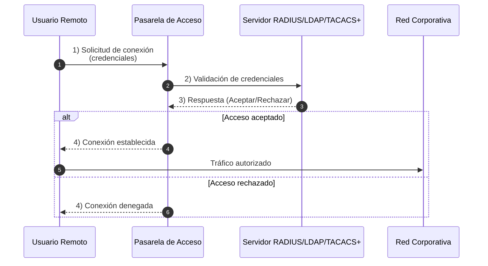
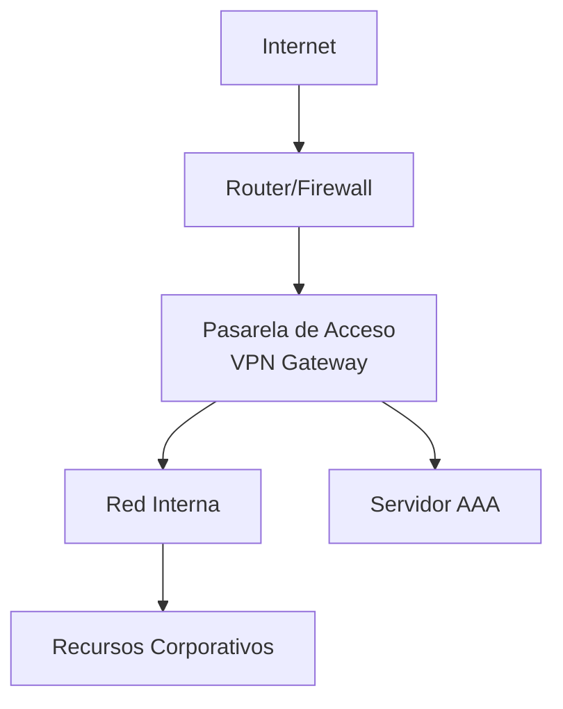
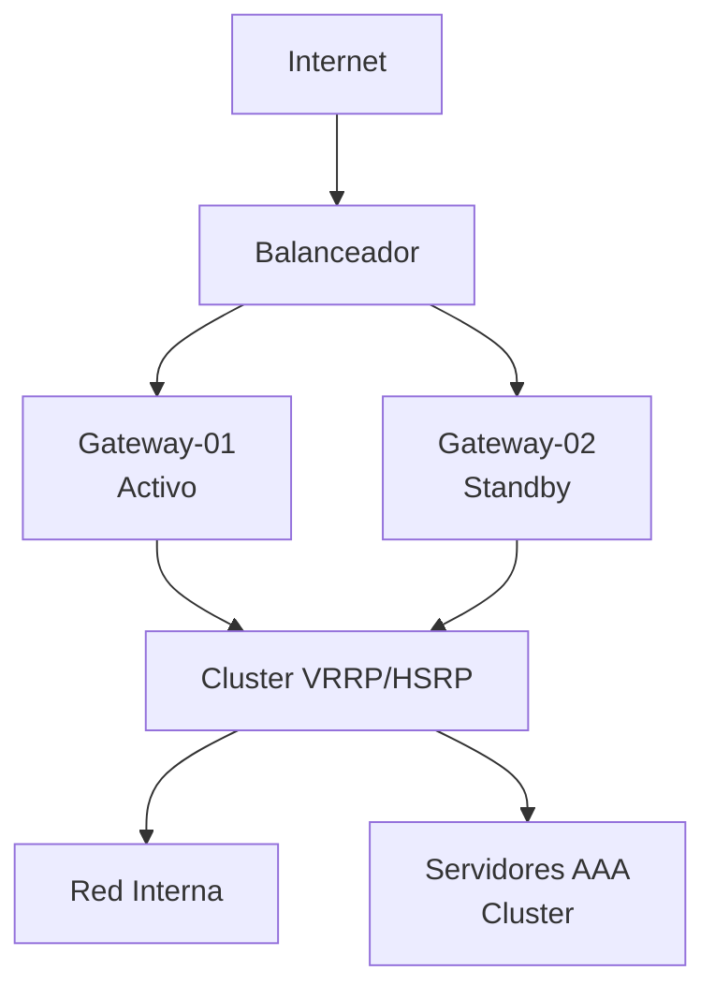
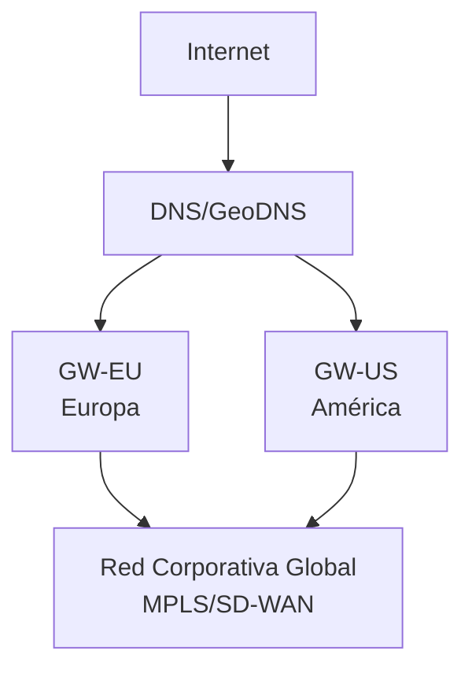
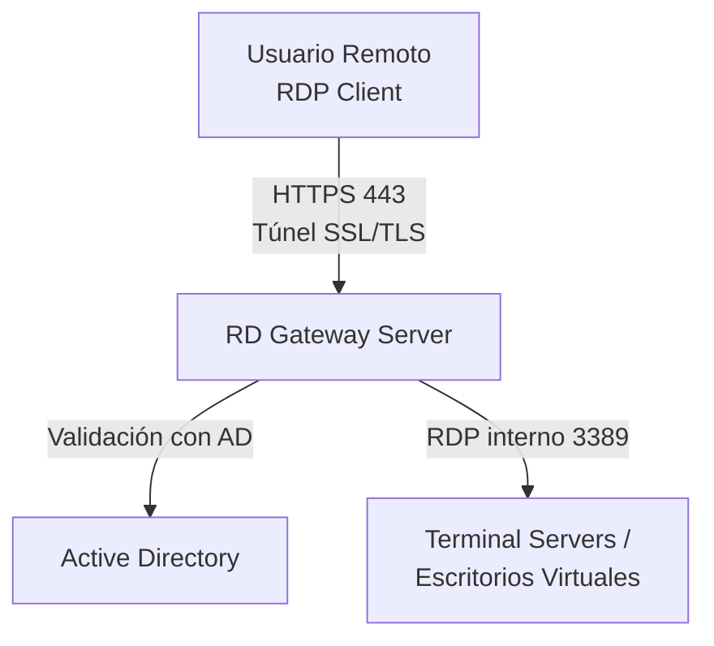
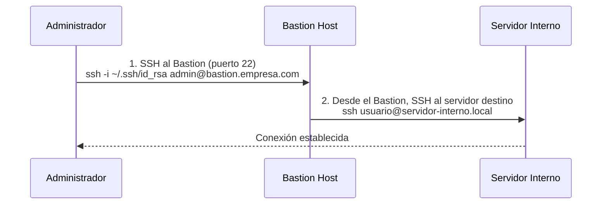
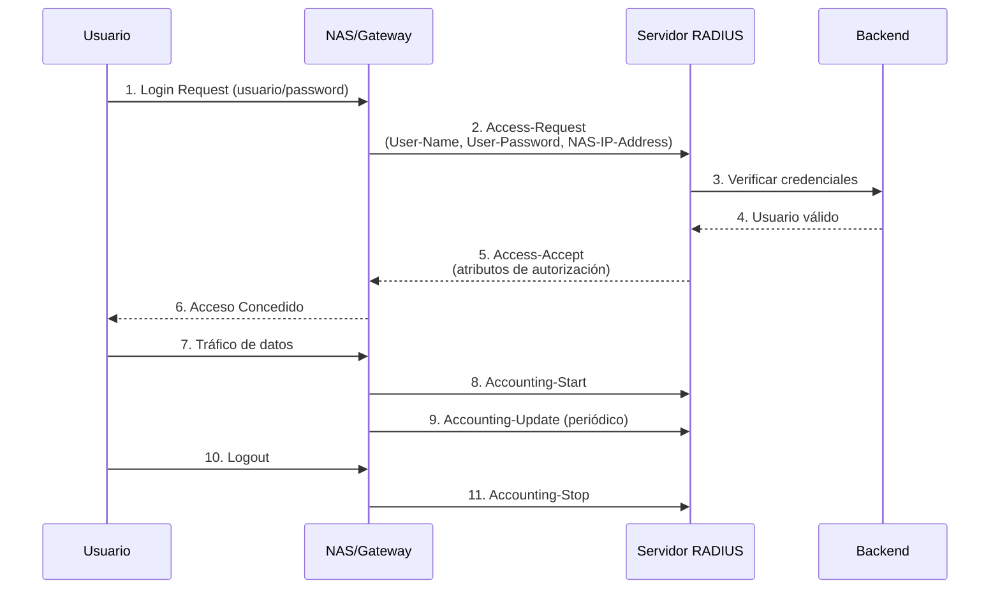
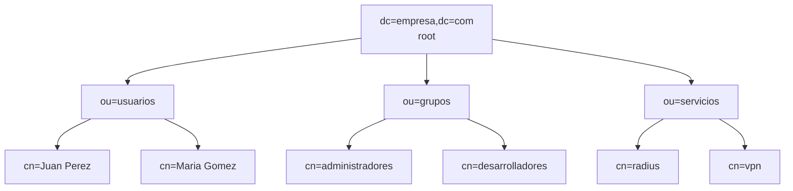
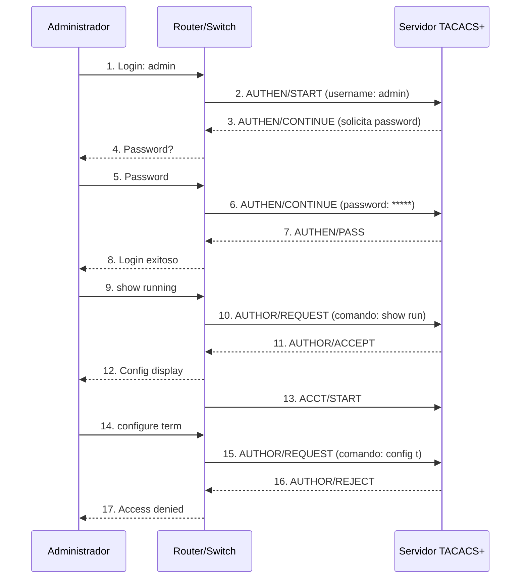
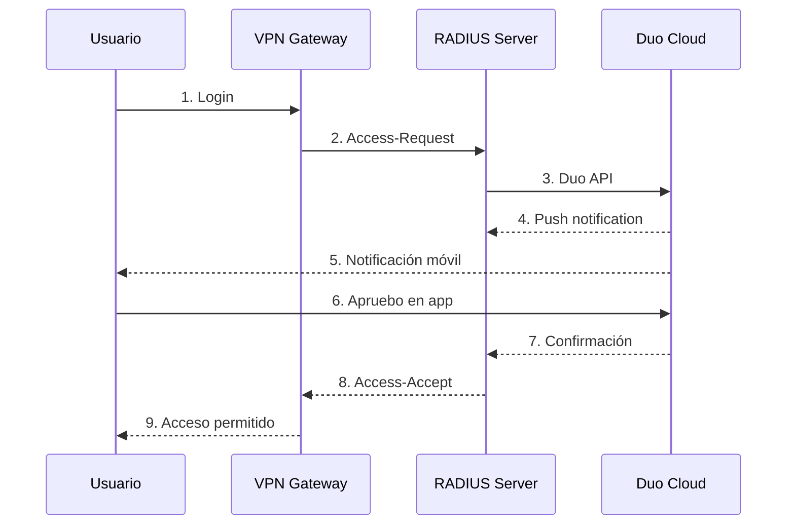

# Servidores de Acceso Remoto

Los **servidores de acceso remoto** son componentes esenciales en la arquitectura de seguridad de red moderna, actuando como **pasarelas de acceso** que permiten a usuarios autorizados conectarse de forma segura a los recursos de la red corporativa desde ubicaciones remotas. Estos servidores no solo facilitan la conectividad, sino que también implementan políticas de autenticación, autorización y auditoría (AAA - Authentication, Authorization, Accounting) para garantizar que solo usuarios legítimos accedan a recursos específicos.

En un entorno donde el trabajo remoto, la movilidad y el acceso a servicios en la nube son fundamentales, los servidores de acceso remoto se convierten en la primera línea de defensa, asegurando que cada conexión entrante sea verificada, controlada y registrada.

## Implementación de Pasarelas de Acceso

Las **pasarelas de acceso** (Access Gateways) son puntos de entrada controlados que median entre usuarios remotos y los recursos internos de la red. Funcionan como "aduanas digitales" que inspeccionan, validan y permiten o deniegan el tráfico basándose en políticas de seguridad predefinidas.

### Funciones Principales de una Pasarela de Acceso

#### 1. Autenticación Centralizada

Verificar la identidad del usuario antes de permitir el acceso:



**Métodos de autenticación soportados**:
- **Usuario/Contraseña**: Método básico, debe combinarse con MFA
- **Certificados digitales**: Autenticación mutua basada en PKI
- **Tokens de hardware**: RSA SecurID, YubiKey
- **Autenticación multifactor (MFA)**: Combinación de contraseña + OTP/biometría
- **Single Sign-On (SSO)**: Integración con SAML, OAuth2, OpenID Connect

#### 2. Autorización Granular

Una vez autenticado, determinar qué recursos puede acceder el usuario:

- **Control de acceso basado en roles (RBAC)**: Los permisos se asignan según el rol del usuario
- **Listas de control de acceso (ACL)**: Reglas específicas por usuario o grupo
- **Políticas dinámicas**: Basadas en contexto (ubicación, hora, dispositivo)
- **Micro-segmentación**: Limitar el acceso solo a servicios específicos necesarios

**Ejemplo de políticas**:
```
Rol: Administrador de Sistemas
- Permitir: SSH a todos los servidores Linux/Unix
- Permitir: RDP a servidores Windows
- Permitir: Acceso completo a sistemas de monitorización
- Denegar: Acceso a servidores de producción de BD sin aprobación

Rol: Desarrollador
- Permitir: Acceso a repositorios Git
- Permitir: Conexión a entornos de desarrollo/staging
- Permitir: VPN con split-tunneling (solo tráfico corporativo)
- Denegar: Acceso a sistemas de producción
- Denegar: Modificación de configuraciones de red

Rol: Soporte Técnico
- Permitir: RDP a estaciones de trabajo
- Permitir: Acceso a sistema de tickets
- Permitir: VPN horario laboral únicamente
- Denegar: Acceso a servidores backend
```

#### 3. Auditoría y Registro (Accounting)

Registrar todas las actividades para cumplimiento normativo y análisis forense:

- **Inicio/fin de sesiones**: Quién se conectó, cuándo y desde dónde
- **Comandos ejecutados**: En sesiones administrativas (SSH, Telnet)
- **Recursos accedidos**: Archivos, bases de datos, aplicaciones
- **Intentos fallidos**: Detección de ataques de fuerza bruta
- **Datos transferidos**: Volumen de información (detectar exfiltración)

**Formato de logs típico**:
```log
2025-10-27 14:23:15 | INFO | User: juan.perez | IP: 203.0.113.45 
  | Action: LOGIN_SUCCESS | Gateway: vpn-gw-01 | Protocol: IPsec
2025-10-27 14:23:18 | INFO | User: juan.perez | Resource: srv-web-prod 
  | Action: SSH_CONNECT | Port: 22
2025-10-27 14:45:32 | WARN | User: maria.gomez | IP: 198.51.100.67 
  | Action: LOGIN_FAILED | Reason: Invalid_Password | Attempts: 3
2025-10-27 15:10:05 | INFO | User: juan.perez | Action: LOGOUT 
  | Duration: 47min | Data_Transferred: 145MB
```

#### 4. Aplicación de Políticas de Seguridad

- **Evaluación de postura del dispositivo**: Verificar que el dispositivo remoto cumple con requisitos de seguridad
  - Antivirus actualizado
  - Sistema operativo parcheado
  - Firewall activado
  - Ausencia de software no autorizado

- **Control de acceso basado en ubicación**: Restringir conexiones desde países específicos

- **Cifrado obligatorio**: Forzar el uso de protocolos seguros (TLS 1.3, SSH v2)

- **Límites de sesión**: 
  - Tiempo máximo de conexión
  - Desconexión por inactividad
  - Número máximo de sesiones concurrentes por usuario

### Arquitecturas de Pasarelas de Acceso

#### Arquitectura Básica - Gateway Único



**Características**:
- Punto único de entrada
- Simplicidad de configuración
- Menor costo inicial

**Limitaciones**:
- Punto único de fallo
- Cuello de botella en rendimiento
- Sin alta disponibilidad

#### Arquitectura Redundante - Alta Disponibilidad



**Características**:
- Redundancia activo-pasivo o activo-activo
- Balanceo de carga
- Failover automático
- Sin interrupción de servicio

**Protocolos de alta disponibilidad**:
- **VRRP (Virtual Router Redundancy Protocol)**: RFC 5798
- **HSRP (Hot Standby Router Protocol)**: Cisco propietario
- **CARP (Common Address Redundancy Protocol)**: BSD/pfSense

#### Arquitectura Distribuida Geográficamente



**Ventajas**:
- Menor latencia (usuarios se conectan al gateway más cercano)
- Distribución de carga geográfica
- Resiliencia ante fallos regionales
- Cumplimiento de normativas de residencia de datos

### Tipos de Pasarelas de Acceso

#### 1. VPN Gateway

Proporciona acceso remoto mediante túneles VPN cifrados:

**Protocolos soportados**:
- **IPsec VPN**: Para site-to-site y remote access
- **SSL/TLS VPN**: Acceso vía navegador web o cliente ligero
- **OpenVPN**: Solución open source versátil
- **WireGuard**: Protocolo moderno, rápido y eficiente

**Casos de uso**:
- Empleados remotos accediendo a recursos internos
- Conexión de sucursales a la oficina central
- Acceso seguro desde dispositivos móviles

**Ejemplo de configuración IPsec (conceptual)**:
```
# Fase 1 (IKE - Internet Key Exchange)
Authentication: Pre-Shared Key (PSK) o Certificados RSA
Encryption: AES-256-CBC
Hash: SHA-256
DH Group: 14 (2048-bit MODP)
Lifetime: 28800 segundos (8 horas)

# Fase 2 (IPsec)
Protocol: ESP (Encapsulating Security Payload)
Encryption: AES-256-GCM
PFS (Perfect Forward Secrecy): DH Group 14
Lifetime: 3600 segundos (1 hora)

# Políticas de acceso
Redes locales: 192.168.1.0/24, 10.0.0.0/8
Redes remotas (usuarios): 172.16.0.0/12
Split-tunneling: Habilitado (solo tráfico corporativo por VPN)
DNS interno: 10.0.1.10, 10.0.1.11
```

#### 2. Remote Desktop Gateway (RD Gateway)

Pasarela específica para acceso RDP (Remote Desktop Protocol) en entornos Windows:

**Características**:
- Encapsula RDP sobre HTTPS (puerto 443)
- Atraviesa firewalls fácilmente
- Integración nativa con Active Directory
- Políticas de autorización granulares (RD CAP y RD RAP)

**Políticas de conexión (RD CAP - Connection Authorization Policies)**:
- Quién puede conectarse (usuarios/grupos)
- Desde dónde (direcciones IP permitidas)
- Método de autenticación requerido
- Requisitos del dispositivo cliente

**Políticas de recursos (RD RAP - Resource Authorization Policies)**:
- A qué servidores puede conectarse cada usuario
- Puertos permitidos
- Redirección de dispositivos (impresoras, unidades, portapapeles)

**Arquitectura RD Gateway**:


#### 3. SSH Bastion Host / Jump Server

Servidor fortificado que actúa como punto de entrada único para acceso SSH a servidores internos:

**Principios de diseño**:
- **Hardening extremo**: Solo servicios esenciales (SSH)
- **Autenticación fuerte**: Claves SSH + MFA obligatorio
- **Registro exhaustivo**: Todas las sesiones grabadas
- **Sin acceso directo**: No contiene datos sensibles, solo redirecciona conexiones

**Flujo de conexión**:


**Configuración de seguridad (sshd_config)**:
```bash
# Autenticación
PubkeyAuthentication yes
PasswordAuthentication no
ChallengeResponseAuthentication yes  # Para MFA
PermitRootLogin no
MaxAuthTries 3

# Restricciones
AllowUsers admin-grupo
AllowGroups sysadmins
DenyUsers root
DenyGroups guest

# Forwarding controlado
AllowTcpForwarding yes
X11Forwarding no
AllowAgentForwarding yes

# Logging
SyslogFacility AUTH
LogLevel VERBOSE

# Hardening
Protocol 2
Ciphers aes256-gcm@openssh.com,chacha20-poly1305@openssh.com
MACs hmac-sha2-512-etm@openssh.com,hmac-sha2-256-etm@openssh.com
KexAlgorithms curve25519-sha256,diffie-hellman-group-exchange-sha256
```

**SSH Jump Host con ProxyJump**:
```bash
# Configuración ~/.ssh/config
Host bastion
    HostName bastion.empresa.com
    User admin
    IdentityFile ~/.ssh/id_rsa_bastion
    Port 22

Host servidor-interno
    HostName 10.0.1.50
    User sysadmin
    IdentityFile ~/.ssh/id_rsa_internal
    ProxyJump bastion
    
# Conexión directa (automáticamente vía bastion)
ssh servidor-interno
```

#### 4. Web Application Gateway / Reverse Proxy

Pasarela para aplicaciones web que proporciona acceso seguro a aplicaciones internas:

**Soluciones comunes**:
- **Nginx**: Reverse proxy de alto rendimiento
- **Apache con mod_proxy**: Flexible y extensible
- **HAProxy**: Balanceador de carga especializado
- **F5 BIG-IP**: Solución empresarial avanzada
- **Citrix ADC / NetScaler**: Para entornos Citrix

**Funcionalidades**:
- **SSL Offloading**: Descifrado de HTTPS en el gateway
- **Autenticación previa**: SAML, OAuth2, LDAP antes de acceder a la app
- **Protección WAF**: Web Application Firewall integrado
- **Balanceo de carga**: Distribución entre múltiples servidores backend
- **Compresión**: Optimización del ancho de banda
- **Caché**: Reducción de carga en servidores backend

**Ejemplo Nginx Reverse Proxy**:
```nginx
# Configuración de pasarela segura
server {
    listen 443 ssl http2;
    server_name app.empresa.com;

    # Certificados SSL
    ssl_certificate /etc/nginx/ssl/cert.pem;
    ssl_certificate_key /etc/nginx/ssl/key.pem;
    ssl_protocols TLSv1.2 TLSv1.3;
    ssl_ciphers HIGH:!aNULL:!MD5;

    # Autenticación básica (o integrar con LDAP/SAML)
    auth_basic "Área Restringida";
    auth_basic_user_file /etc/nginx/.htpasswd;

    # Cabeceras de seguridad
    add_header Strict-Transport-Security "max-age=31536000" always;
    add_header X-Frame-Options "SAMEORIGIN" always;
    add_header X-Content-Type-Options "nosniff" always;

    # Proxy a aplicación interna
    location / {
        proxy_pass http://app-interno:8080;
        proxy_set_header Host $host;
        proxy_set_header X-Real-IP $remote_addr;
        proxy_set_header X-Forwarded-For $proxy_add_x_forwarded_for;
        proxy_set_header X-Forwarded-Proto $scheme;
        
        # Timeouts
        proxy_connect_timeout 60s;
        proxy_send_timeout 60s;
        proxy_read_timeout 60s;
    }

    # Logging detallado
    access_log /var/log/nginx/app_access.log combined;
    error_log /var/log/nginx/app_error.log warn;
}
```

## Protocolos y Métodos de Autenticación

Los protocolos de autenticación centralizada permiten que las pasarelas de acceso deleguen la verificación de credenciales a servidores especializados, facilitando la gestión, auditoría y aplicación de políticas de seguridad en entornos empresariales.

### RADIUS (Remote Authentication Dial-In User Service)

**RADIUS** es el protocolo de autenticación, autorización y contabilidad (AAA) más utilizado en redes empresariales. Diseñado originalmente para acceso telefónico (dial-up), actualmente se usa para VPN, WiFi, switches, routers y otros dispositivos de red.

#### Características Principales

- **Puerto UDP**: 1812 (autenticación), 1813 (accounting)
- **Cifrado parcial**: Solo la contraseña se cifra con MD5 y un shared secret
- **Arquitectura cliente-servidor**: El NAS (Network Access Server) actúa como cliente RADIUS
- **Extensible**: Soporta atributos personalizados (VSA - Vendor Specific Attributes)

#### Funcionamiento del Protocolo RADIUS



**Tipos de mensajes RADIUS**:

1. **Access-Request**: Cliente solicita autenticación
2. **Access-Accept**: Autenticación exitosa (incluye atributos de autorización)
3. **Access-Reject**: Autenticación fallida
4. **Access-Challenge**: Servidor solicita información adicional (ej: OTP)
5. **Accounting-Request**: Información de contabilidad (Start, Stop, Update)
6. **Accounting-Response**: Confirmación de recepción

#### Atributos RADIUS Comunes

```
# Atributos de autenticación
User-Name (1): Identificador del usuario
User-Password (2): Contraseña cifrada con MD5
NAS-IP-Address (4): IP del dispositivo de acceso
NAS-Port (5): Puerto físico del NAS
Service-Type (6): Tipo de servicio (Login, Framed, etc.)

# Atributos de autorización
Framed-IP-Address (8): IP asignada al usuario
Framed-IP-Netmask (9): Máscara de red
Filter-Id (11): ACL a aplicar
Session-Timeout (27): Tiempo máximo de sesión
Idle-Timeout (28): Tiempo de inactividad permitido

# Atributos de accounting
Acct-Status-Type (40): Start, Stop, Update
Acct-Session-Id (44): ID único de sesión
Acct-Session-Time (46): Duración de la sesión
Acct-Input-Octets (42): Bytes recibidos
Acct-Output-Octets (43): Bytes enviados
```

#### Implementación de RADIUS

**Servidores RADIUS populares**:
- **FreeRADIUS**: Open source, más completo y flexible
- **Microsoft NPS (Network Policy Server)**: Integrado con Active Directory
- **Cisco ISE (Identity Services Engine)**: Solución empresarial avanzada
- **Aruba ClearPass**: Para redes WiFi empresariales

**Ejemplo de configuración FreeRADIUS (clients.conf)**:
```conf
# Definición de clientes RADIUS (NAS)
client vpn-gateway {
    ipaddr = 10.0.1.50
    secret = SuperSecretSharedKey2024!
    require_message_authenticator = yes
    nas_type = other
}

client firewall-asa {
    ipaddr = 10.0.1.60
    secret = AnotherSharedSecret2024!
    shortname = fw-asa
    nas_type = cisco
}

client wifi-controller {
    ipaddr = 10.0.2.0/24
    secret = WiFiControllerSecret!
    shortname = wifi-ctrl
}
```

**Ejemplo de usuarios (users file - autenticación local)**:
```conf
# Usuario con contraseña simple
juan.perez Cleartext-Password := "Password123!"
    Framed-IP-Address = 172.16.100.10,
    Session-Timeout = 28800,
    Reply-Message = "Bienvenido Juan"

# Usuario con verificación adicional
admin-sistemas Cleartext-Password := "AdminPass456!"
    Filter-Id = "admin-acl",
    Framed-IP-Netmask = 255.255.255.0,
    Service-Type = Administrative-User
```

#### Integración RADIUS con LDAP/Active Directory

```conf
# modules/ldap (en FreeRADIUS)
ldap {
    server = "ldap.empresa.com"
    port = 389
    identity = "cn=radius,ou=services,dc=empresa,dc=com"
    password = "LdapBindPassword"
    base_dn = "ou=usuarios,dc=empresa,dc=com"
    
    filter = "(uid=%{%{Stripped-User-Name}:-%{User-Name}})"
    
    # Mapeo de atributos LDAP a RADIUS
    update {
        control:Password-With-Header += 'userPassword'
        reply:Framed-IP-Address := 'radiusFramedIPAddress'
        reply:Session-Timeout := 'radiusSessionTimeout'
    }
}
```

### LDAP (Lightweight Directory Access Protocol)

**LDAP** es un protocolo para acceder y mantener servicios de directorio distribuidos. Aunque no es específicamente un protocolo AAA, se utiliza ampliamente para autenticación centralizada.

#### Características Principales

- **Puerto TCP**: 389 (sin cifrar), 636 (LDAPS - cifrado SSL/TLS)
- **Estructura jerárquica**: Árbol de directorios (DIT - Directory Information Tree)
- **Basado en X.500**: Estándar de directorios
- **Multiplataforma**: Implementaciones para todos los sistemas operativos

#### Estructura LDAP



**Ejemplo de entrada de usuario LDAP (formato LDIF)**:
```ldif
dn: cn=Juan Perez,ou=usuarios,dc=empresa,dc=com
objectClass: inetOrgPerson
objectClass: posixAccount
cn: Juan Perez
sn: Perez
givenName: Juan
uid: juan.perez
uidNumber: 1001
gidNumber: 1001
homeDirectory: /home/juan.perez
loginShell: /bin/bash
mail: juan.perez@empresa.com
userPassword: {SSHA}K3jkdf83jkdfjkDFJK8fjkdjfKJDKF
memberOf: cn=administradores,ou=grupos,dc=empresa,dc=com
```

#### Operaciones LDAP Básicas

**1. Bind (Autenticación)**:
```
ldapsearch -x -H ldap://ldap.empresa.com \
  -D "cn=Juan Perez,ou=usuarios,dc=empresa,dc=com" \
  -W \
  -b "dc=empresa,dc=com" \
  "(uid=juan.perez)"
```

**2. Search (Búsqueda)**:
```python
# Python con python-ldap
import ldap

# Conexión al servidor LDAP
conn = ldap.initialize('ldap://ldap.empresa.com')
conn.simple_bind_s('cn=admin,dc=empresa,dc=com', 'admin_password')

# Búsqueda de usuario
base_dn = 'ou=usuarios,dc=empresa,dc=com'
search_filter = '(uid=juan.perez)'
attrs = ['cn', 'mail', 'memberOf']

results = conn.search_s(base_dn, ldap.SCOPE_SUBTREE, search_filter, attrs)

for dn, entry in results:
    print(f"DN: {dn}")
    print(f"Nombre: {entry['cn'][0]}")
    print(f"Email: {entry['mail'][0]}")
```

#### Autenticación con LDAP en Aplicaciones

**Ejemplo PAM (Pluggable Authentication Modules) en Linux**:
```conf
# /etc/pam.d/common-auth
auth    sufficient  pam_ldap.so
auth    required    pam_unix.so nullok_secure use_first_pass

# /etc/ldap.conf
uri ldap://ldap.empresa.com
base dc=empresa,dc=com
binddn cn=pam,ou=services,dc=empresa,dc=com
bindpw PamServicePassword
pam_password md5
```

**Ventajas de LDAP**:
- ✅ Directorio centralizado de usuarios
- ✅ Escalable y distribuido (replicación)
- ✅ Estándar abierto, ampliamente soportado
- ✅ Integración con múltiples aplicaciones

**Limitaciones de LDAP para AAA**:
- ❌ No incluye autorización ni accounting (solo autenticación)
- ❌ Menos adecuado para dispositivos de red (switches, routers)
- ❌ Tráfico sin cifrar por defecto (usar LDAPS o StartTLS)

### TACACS+ (Terminal Access Controller Access-Control System Plus)

**TACACS+** es un protocolo AAA desarrollado por Cisco (aunque es un estándar abierto desde 2020 - RFC 8907) diseñado específicamente para la administración de dispositivos de red como routers, switches y firewalls.

#### Características Principales

- **Puerto TCP**: 49 (más confiable que UDP)
- **Cifrado completo**: Todo el payload se cifra, no solo la contraseña
- **Separación AAA**: Autenticación, autorización y accounting como procesos independientes
- **Granularidad**: Control de comandos individuales que puede ejecutar un usuario

#### TACACS+ vs RADIUS

| Característica | TACACS+ | RADIUS |
|---|---|---|
| **Transporte** | TCP (49) | UDP (1812/1813) |
| **Cifrado** | Paquete completo | Solo contraseña |
| **AAA** | Separado | Combinado |
| **Uso principal** | Dispositivos de red | Acceso de usuarios |
| **Autorización** | Por comando | Por servicio |
| **Accounting** | Granular | Basado en sesión |
| **Propietario** | Cisco (ahora RFC) | IETF (estándar abierto) |

#### Funcionamiento de TACACS+



#### Configuración de TACACS+ en Dispositivo Cisco

```cisco
! Configuración del servidor TACACS+
tacacs-server host 10.0.1.100 key SecretKey2024!
tacacs-server timeout 5
tacacs-server directed-request

! Configurar AAA
aaa new-model
aaa authentication login default group tacacs+ local
aaa authorization exec default group tacacs+ local
aaa authorization commands 15 default group tacacs+ local
aaa accounting exec default start-stop group tacacs+
aaa accounting commands 15 default start-stop group tacacs+

! Usuario local de respaldo
username admin-local privilege 15 secret BackupPassword!

! Configurar VTY (líneas de terminal virtual)
line vty 0 4
 transport input ssh
 login authentication default
 authorization exec default
 accounting exec default
```

#### Configuración de Servidor TACACS+ (tac_plus)

```conf
# /etc/tacacs+/tac_plus.conf

# Clave compartida con los dispositivos
key = SecretKey2024!

# Definición de grupos
group = administradores {
    default service = permit
    service = exec {
        priv-lvl = 15
    }
    cmd = configure {
        permit .*
    }
    cmd = show {
        permit .*
    }
}

group = operadores {
    default service = deny
    service = exec {
        priv-lvl = 5
    }
    cmd = show {
        permit "show.*"
    }
    cmd = configure {
        deny .*
    }
}

# Usuarios
user = admin-sistemas {
    login = cleartext AdminPass123!
    member = administradores
}

user = operador-red {
    login = cleartext OperadorPass456!
    member = operadores
}

# ACLs por dispositivo
host = router-core-01 {
    address = 10.0.1.1
    key = RouterCore01Key!
}
```

### Comparativa y Casos de Uso

#### Cuándo usar RADIUS

- ✅ Acceso WiFi (WPA2-Enterprise, WPA3-Enterprise)
- ✅ Autenticación VPN (IPsec, SSL VPN)
- ✅ Switches con autenticación 802.1X
- ✅ Servicios de acceso remoto (RAS, DSL, cable modem)
- ✅ Integración con Active Directory para usuarios finales

#### Cuándo usar LDAP

- ✅ Autenticación de aplicaciones web y servicios
- ✅ Directorio corporativo centralizado
- ✅ Single Sign-On (SSO) como backend
- ✅ Autenticación Linux/Unix (SSSD, NSS)
- ✅ Correo electrónico y servicios de mensajería

#### Cuándo usar TACACS+

- ✅ Administración de routers, switches, firewalls
- ✅ Control granular de comandos CLI
- ✅ Auditoría detallada de acciones administrativas
- ✅ Entornos 100% Cisco (aunque funciona con otros vendors)
- ✅ Seguridad máxima (cifrado completo del tráfico AAA)

### Autenticación Multifactor (MFA) en Pasarelas de Acceso

La autenticación multifactor añade capas adicionales de seguridad combinando:

1. **Algo que sabes**: Contraseña, PIN
2. **Algo que tienes**: Token hardware, smartphone, tarjeta inteligente
3. **Algo que eres**: Huella dactilar, reconocimiento facial

#### Implementación de MFA con RADIUS

**Soluciones populares**:
- **Duo Security**: Integración sencilla, notificaciones push
- **Google Authenticator**: TOTP (Time-based OTP)
- **Microsoft Authenticator**: Integración con Azure AD
- **RSA SecurID**: Tokens hardware/software
- **YubiKey**: Tokens USB/NFC con FIDO2/U2F

**Flujo MFA con Duo + RADIUS**:


## Referencias y Recursos Adicionales

### Documentación Oficial y RFCs

1. **RADIUS**:
   - RFC 2865 - Remote Authentication Dial In User Service (RADIUS)
   - RFC 2866 - RADIUS Accounting
   - RFC 5176 - Dynamic Authorization Extensions to RADIUS
   - RFC 6614 - Transport Layer Security (TLS) Encryption for RADIUS

2. **LDAP**:
   - RFC 4510 - Lightweight Directory Access Protocol (LDAP): Technical Specification Road Map
   - RFC 4511 - Lightweight Directory Access Protocol (LDAP): The Protocol
   - RFC 4513 - Lightweight Directory Access Protocol (LDAP): Authentication Methods

3. **TACACS+**:
   - RFC 8907 - The Terminal Access Controller Access-Control System Plus (TACACS+) Protocol
   - Cisco TACACS+ Protocol Documentation

### Recursos Online

1. **FreeRADIUS**: https://freeradius.org/documentation/
   - Configuración detallada, módulos, casos de uso
   
2. **OpenLDAP**: https://www.openldap.org/doc/
   - Guías de administración, esquemas LDAP

3. **Cisco AAA Documentation**: https://www.cisco.com/c/en/us/support/security/
   - Configuración TACACS+, RADIUS en dispositivos Cisco

4. **Microsoft NPS**: https://learn.microsoft.com/en-us/windows-server/networking/technologies/nps/
   - Network Policy Server con Active Directory

5. **NIST Special Publications**:
   - SP 800-63B - Digital Identity Guidelines (Autenticación)
   - SP 800-53 - Security and Privacy Controls

### Herramientas y Software

- **FreeRADIUS**: Servidor RADIUS open source completo
- **OpenLDAP**: Implementación open source de LDAP
- **tac_plus**: Servidor TACACS+ open source
- **Daloradius**: Interface web para administración de FreeRADIUS
- **phpLDAPadmin**: Administración web de directorios LDAP
- **Wireshark**: Análisis de tráfico RADIUS/TACACS+ (para debugging)

---

**Nota**: Este contenido ha sido elaborado con fines educativos para el módulo de Seguridad y Alta Disponibilidad (SAD - ASIR). Las configuraciones mostradas son ejemplos didácticos que deben adaptarse a cada entorno específico de producción, siguiendo siempre las mejores prácticas de seguridad y las políticas corporativas correspondientes.